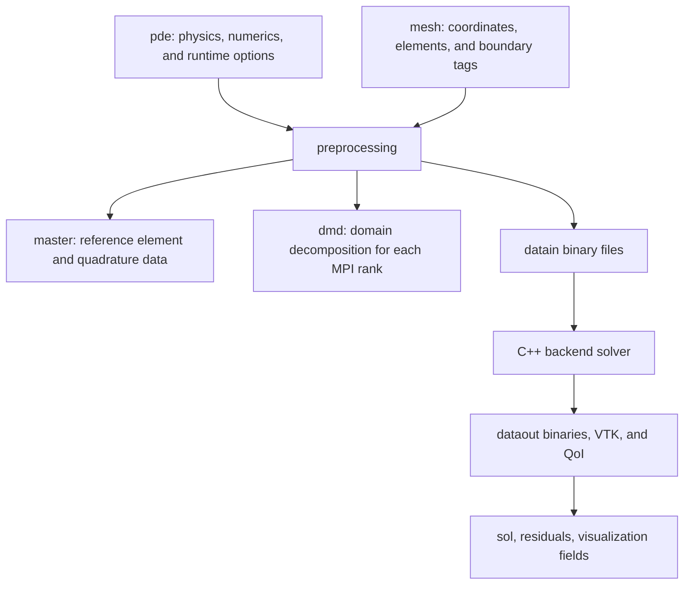

# Core Data Structures

The frontend data structures describe the mathematical problem, mesh, reference
element, parallel decomposition, and returned solution. They are language-native
containers, but the fields are designed to map to the same backend input files.

## Structure Relationships



## `pde`

`pde` is the main application configuration object. It is a MATLAB `struct`, a
Python `dict`, and a Julia `PDEStruct`.

Common field groups:

| Group | Representative fields | Purpose |
| --- | --- | --- |
| Model selection | `model`, `modelfile`, `modelnumber`, `builtinmodelID` | Select generated, built-in, or external model paths. |
| Dimensions | `nd`, `ncu`, `nc`, `ncq`, `nco`, `ncw`, `nch`, `ncx`, `nce` | Define the size of state, gradient, auxiliary, trace, coordinate, and output fields. |
| Discretization | `porder`, `pgauss`, `hybrid`, `elemtype`, `nodetype` | Control polynomial order, quadrature, HDG/LDG choices, and element type. |
| Physics data | `physicsparam`, `tau`, `uinf`, `externalparam`, `factor` | Runtime numeric parameters passed into model callbacks. |
| Solver controls | `NLiter`, `NLtol`, `linearsolveriter`, `linearsolvertol`, `GMRESrestart`, `preconditioner` | Nonlinear and linear solver limits and tolerances. |
| Time integration | `tdep`, `time`, `dt`, `temporalscheme`, `torder`, `nstage`, `timestepOffset` | Steady or time-dependent execution settings. |
| Runtime/build | `platform`, `mpiprocs`, `datapath`, `builddir`, `buildpath`, `exasimpath` | Select CPU/GPU/MPI behavior and artifact locations. |
| Output/postprocess | `saveSolFreq`, `saveSolOpt`, `saveResNorm`, `saveParaview`, `nsca`, `nvec`, `nten`, `nvqoi`, `nbqoi` | Configure binary outputs, residual histories, VTK output, and derived fields. |
| Sweeps | `physicsparamsweep`, `physicsparamwarmstart`, `dataoutpath` | Configure frontend and standalone parameter sweeps. |

Example:

```matlab
pde.physicsparam = [1.4, 0.72, 1000.0];
pde.NLiter = 20;
pde.linearsolvertol = 1e-6;
pde.saveResNorm = 1;
```

## `mesh`

`mesh` contains the physical mesh and boundary metadata. Common fields include:

| Field | Meaning |
| --- | --- |
| `p` | Node coordinates. |
| `t` | Element connectivity. |
| `boundaryexpr` | Boundary classification expressions or functions. |
| `boundarycondition` | Boundary-condition IDs assigned to boundary groups. |
| `dgnodes` | Curved or high-order element nodes when present. |
| `periodicexpr` / periodic fields | Periodic boundary mapping when used by an example. |

Boundary-condition IDs in `mesh.boundarycondition` must match the cases handled
by the model boundary functions such as `ubou`, `fbou`, or `fbouhdg`.

Example:

```matlab
mesh.boundarycondition = [1; 2; 2; 1];
mesh.boundaryexpr = {@(p) abs(p(:,2)) < 1e-8, ...
                     @(p) abs(p(:,1)-1) < 1e-8};
```

## `master`

`master` is created by preprocessing. It stores reference-element data such as
shape functions, quadrature rules, face permutations, and element-node layout.
Most users do not edit `master` directly; it is returned so postprocessing and
solution readers can interpret the backend output consistently.

Example use:

```matlab
U = fetchsolution(pde, master, dmd, pde.dataoutpath);
```

## `dmd`

`dmd` describes domain decomposition metadata for serial and MPI runs. It maps
global mesh entities to rank-local elements and provides the information needed
to gather per-rank binary outputs.

Assumption: for a fixed mesh and partition count, `master` and `dmd` do not
change across a `physicsparam` sweep. The sweep implementation reuses them and
only rewrites the runtime parameter data for each case.

## Returned Solution And Residuals

`exasim(...)` returns the solution in frontend-native arrays. The exact shape
depends on dimension, number of components, save options, time dependence, and
the frontend helper used to load it. Residual histories are available when
`pde.saveResNorm = 1`.

Example:

```python
pde["saveResNorm"] = 1
sol, pde, mesh = exasim(pde, mesh)
# Residual files are written under pde["dataoutpath"] or datapath/dataout.
```

## See Also

- [Configuration](configuration.md)
- [Preprocessing](preprocessing.md)
- [pdemodel abstraction](pdemodel.md)
- [Mesh and geometry](mesh-and-geometry.md)
- [pdeapp.txt fields](../reference/pdeapp.md)
