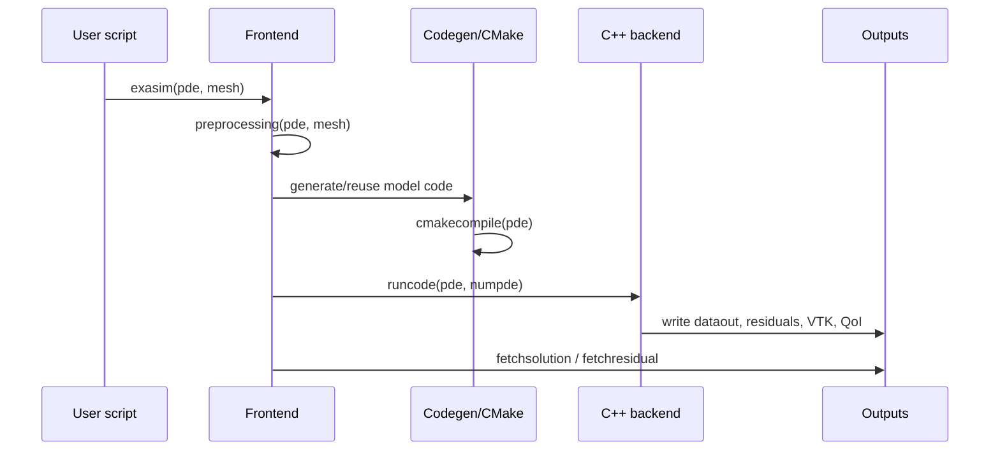

# Execution Workflow

This page describes what happens after a frontend script calls `exasim(...)` and
how to control compilation, runtime mode, CPU/GPU/MPI execution, exports, and
restart-like workflows.

## `exasim(...)` Pipeline



The frontends keep runtime data under `pde.datapath` and generated build
artifacts under `pde.builddir` / `pde.buildpath`. This avoids mixing generated
C++ build products with user-visible `datain` and `dataout` files.

See [Preprocessing](preprocessing.md) for the detailed conversion from `pde`,
`mesh`, and `pdemodel` into `app.bin`, `master.bin`, `mesh*.bin`, and
`sol*.bin`.

## Build And Cache Behavior

The generated model is compiled into a dynamic library or executable through
CMake. Unchanged generated models can be reused through the frontend build area
and per-user cache.

```matlab
pde.datapath = pwd();
pde.builddir = fullfile(pwd(), ".exasim");
pde.buildpath = pde.builddir;
```

If you change only runtime data such as `physicsparam`, Exasim should avoid
unnecessary recompilation when the generated model code is unchanged.

## CPU, GPU, And MPI

`pde.platform` selects CPU or GPU-oriented execution in frontend configuration.
The installed Exasim package and generated CMake project determine the concrete
backend libraries.

```julia
pde.platform = "gpu"
pde.mpiprocs = 4
```

MPI runs use `pde.mpiprocs` and the launcher discovered by CMake or specified in
`pde.mpirun`. Rank-local input/output paths are generated automatically.

## Execution Modes

`pde.executionmode` controls how `runcode(...)` launches the generated
executable.

| Value | Launch behavior | Typical use |
| --- | --- | --- |
| `0` | Solve mode. This is the default and preserves the historical command line. | Run a simulation and write solution output. |
| `1` | Postprocess mode. The frontend launches the executable with the `postprocess` subcommand. | Recompute visualization/QoI/output from existing `datain` and `dataout`. |

Example:

```python
pde["executionmode"] = 1
runstr = runcode(pde, 1)
```

Postprocess mode assumes compatible `datain` and saved solution files already
exist. See [Postprocessing](../usage-modes/postprocessing.md#frontend-pdeexecutionmode).

## Parameter Sweeps

Frontend sweeps run cases sequentially by default. Each row of
`physicsparamsweep` is one concrete `physicsparam` vector.

```matlab
pde.physicsparamsweep = [
    1.4 0.72 1000.0
    1.4 0.72 2000.0
];
pde.physicsparamwarmstart = 1;
[sol, pde, mesh, master, dmd] = exasim(pde, mesh);
```

Outputs are placed in deterministic case directories such as
`dataout/paramcase_0001/`. The standalone app generated by `exportapp` can read
the same sweep input and run the sweep without MATLAB, Python, or Julia.

## `exportapp`

`exportapp` packages generated model code, input data, a CMake project, and the
standalone app entry point for use outside the interactive frontend.

=== "MATLAB"

    ```matlab
    exportapp(pde, "exported_naca_sweep");
    ```

=== "Python"

    ```python
    from exasim import exportapp
    exportapp(pde, "exported_naca_sweep")
    ```

=== "Julia"

    ```julia
    Exasim.exportapp(pde, "exported_naca_sweep")
    ```

Use `exportapp` when moving a generated app to an HPC system or when you want a
frontend-free standalone executable.

## Restart And Postprocess-Oriented Runs

Restart behavior is controlled by saved solution files, time offsets, and
runtime options such as `timestepOffset`. Parameter-sweep warm starts reuse the
previous converged case as the next initial state; they do not imply a full mesh
or model rebuild when only `physicsparam` changes.

## See Also

- [Parameter sweeps](../usage-modes/parameter-sweeps.md)
- [Preprocessing](preprocessing.md)
- [pdemodel abstraction](pdemodel.md)
- [Postprocessing](../usage-modes/postprocessing.md)
- [Shared library mode](../usage-modes/shared-library.md)
- [CMake targets and options](../reference/cmake.md)
