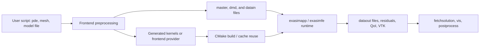

# Frontend Overview

Exasim frontends let users describe a PDE application in MATLAB, Python, or
Julia, then drive the same C++/Kokkos backend used by standalone Exasim
applications. A frontend run prepares the numerical problem, generates model
kernels when needed, compiles or reuses an executable, runs the solver, and
loads or visualizes the results.

Use this section as the practical guide for interactive Exasim workflows. Use
the [usage-mode pages](../usage-modes/index.md) when you need lower-level
details about built-in models, shared libraries, parameter sweeps, or
postprocessing.

## Supported Interfaces

| Interface | Primary use | User-facing object style |
| --- | --- | --- |
| MATLAB | Mature interactive workflow, mesh utilities, plotting, examples | MATLAB `struct` fields such as `pde.physicsparam` |
| Python | Scriptable workflows and integration with Python tools | Python `dict` keys such as `pde["physicsparam"]` |
| Julia | Julia-native scripts and package workflow | `PDEStruct` fields such as `pde.physicsparam` |
| `pdeapp.txt` / text2code | Frontend-free text input for standalone C++ apps | Text keys documented in [pdeapp.txt fields](../reference/pdeapp.md) |

The MATLAB, Python, and Julia frontends intentionally expose nearly the same
PDE fields. Syntax differs by language, but concepts such as `pde.model`,
`pde.physicsparam`, `pde.mpiprocs`, `pde.saveParaview`, and
`pde.physicsparamsweep` have the same meaning.

## Frontend Role In The Exasim Workflow



The frontend does not replace the backend solver. It supplies backend input
files, generated model code, launch commands, and postprocessing helpers.

## Documentation Roadmap

- [Getting started](getting-started.md): minimal MATLAB, Python, and Julia
  examples and the generated file layout.
- [Core data structures](data-structures.md): `pde`, `mesh`, `master`, `dmd`,
  solution arrays, residual histories, and their relationships.
- [Configuration](configuration.md): physics, boundary conditions, solvers,
  time integration, parameter sweeps, and postprocessing flags.
- [Physics Models](../physics-models/index.md): how `pde.model` selects
  `ModelC`, `ModelD`, or `ModelW`, and how `w`, `v`, EOS, AV, and coupling fit
  into the model.
- [Preprocessing](preprocessing.md): how frontend data become backend input
  files and decomposition metadata.
- [pdemodel abstraction](pdemodel.md): the callback interface between user
  physics and generated backend kernels.
- [Mesh and geometry](mesh-and-geometry.md): mesh generation, import, boundary
  tagging, curved meshes, and partitioning.
- [Execution workflow](execution.md): preprocessing, code generation,
  compilation, CPU/GPU/MPI execution, `exportapp`, restart, and execution modes.
- [Postprocessing and visualization](postprocessing.md): frontend result
  loading, MATLAB visualization, backend ParaView output, QoI, and derived
  fields.
- [API reference](api-reference.md): function and field reference for the
  MATLAB, Python, and Julia frontends.

## Common Workflow

Every language follows this pattern:

1. Initialize `pde` and `mesh`.
2. Define or load a mesh.
3. Set dimensions, model type, physical parameters, solver options, and output
   options.
4. Point `pde.modelfile` at the host-language PDE model implementation.
5. Call `exasim(...)`.
6. Inspect `sol`, residual histories, binary files, or visualization files.

=== "MATLAB"

    ```matlab
    run('/path/to/prefix/share/exasim/matlab/exasim_setup.m')
    [pde, mesh] = initializeexasim();
    pde.model = "ModelD";
    pde.modelfile = "pdemodel";
    pde.physicsparam = [1.0];
    [sol, pde, mesh, master, dmd] = exasim(pde, mesh);
    ```

=== "Python"

    ```python
    from exasim import initializeexasim, exasim

    pde, mesh = initializeexasim()
    pde["model"] = "ModelD"
    pde["modelfile"] = "pdemodel"
    pde["physicsparam"] = [1.0]
    sol, pde, mesh = exasim(pde, mesh)
    ```

=== "Julia"

    ```julia
    using Exasim

    pde, mesh = Exasim.initializeexasim()
    pde.model = "ModelD"
    pde.modelfile = "pdemodel"
    pde.physicsparam = [1.0]
    sol, pde, mesh = Exasim.exasim(pde, mesh)
    ```

## Relationship To Other Documentation

- Field names shared with text input are documented in
  [pdeapp.txt fields](../reference/pdeapp.md).
- The mathematical meaning of `pde.model`, `u`, `q`, `w`, `v`, EOS, and AV is
  documented in [Physics Models](../physics-models/index.md).
- Frontend preprocessing internals are documented in
  [Preprocessing](preprocessing.md).
- Host-language PDE model callbacks are documented in
  [pdemodel abstraction](pdemodel.md).
- PDE model callback names and signatures are documented in
  [Model contract](../reference/model-contract.md) and
  [pdemodel.txt syntax](../reference/pdemodel.md).
- Parameter sweeps are covered in
  [Parameter sweeps](../usage-modes/parameter-sweeps.md).
- Postprocessing and standalone replay are covered in
  [Postprocessing](../usage-modes/postprocessing.md).

## See Also

- [Quickstart](../getting-started/quickstart.md)
- [Shared library mode](../usage-modes/shared-library.md)
- [text2code reference](../reference/text2code.md)
