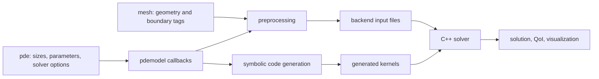
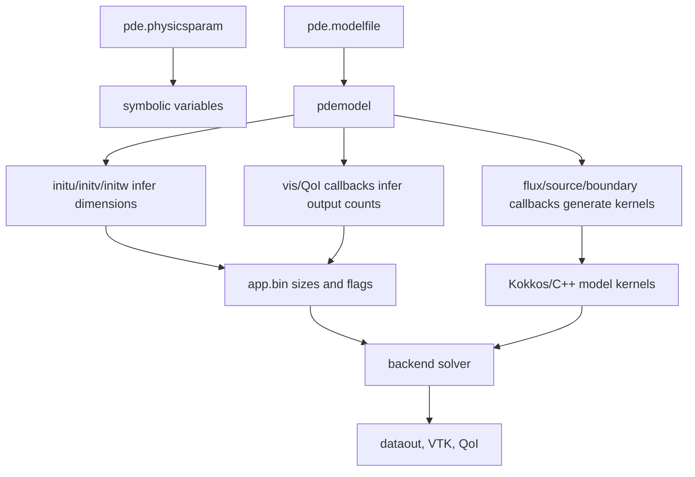

# The `pdemodel` Abstraction

`pdemodel` is the frontend abstraction that connects user-defined physics to
Exasim's numerical infrastructure. It contains symbolic callback functions for
the PDE, boundary terms, initial conditions, auxiliary variables, visualization
fields, and quantities of interest.

For the mathematical meaning of `ModelC`, `ModelD`, `ModelW`, `u`, `q`, `w`,
`v`, EOS, and artificial viscosity, see
[Physics Models](../physics-models/index.md).

The frontend evaluates these callbacks symbolically during preprocessing and
code generation. The generated C++ kernels are then called by the backend solver
on CPU or GPU.

## Architectural Role



The `pdemodel` file does not own the mesh or solver state. It defines local
mathematical expressions evaluated at quadrature points, face points, or
initialization points.

## Language Forms

=== "MATLAB"

    ```matlab
    function pde = pdemodel
    pde.flux = @flux;
    pde.source = @source;
    pde.fbou = @fbou;
    pde.fbouhdg = @fbouhdg;
    pde.ubou = @ubou;
    pde.initu = @initu;
    end
    ```

=== "Python"

    ```python
    from numpy import array

    def flux(u, q, w, v, x, t, mu, eta):
        return mu * q

    def initu(x, mu, eta):
        return array([0.0])
    ```

=== "Julia"

    ```julia
    function flux(u, q, w, v, x, t, mu, eta)
        return mu[1] * q
    end

    function initu(x, mu, eta)
        return 0.0
    end
    ```

In MATLAB, the model file returns a structure of function handles. In Python
and Julia, the frontend imports or looks up functions by name.

## Callback Arguments

Most callbacks use this argument pattern:

```text
u, q, w, v, x, t, param, uinf
```

Boundary callbacks also receive trace and normal data:

```text
u, q, w, v, x, t, param, uinf, uhat, n, tau
```

| Argument | Meaning |
| --- | --- |
| `u` | Primary unknowns. |
| `q` | Gradient/LDG auxiliary unknowns. |
| `w` | `wdg` auxiliary variables, often used for additional model state. |
| `v` | `odg` auxiliary variables. MATLAB examples often name this argument `v`; Python examples use `v`; some documentation calls it `odg`. |
| `x` | Physical coordinates. |
| `t` | Physical time. |
| `param` / named variables such as `mu` | Entries from `pde.physicsparam`. |
| `uinf` / named variables such as `eta` | Entries from `pde.externalparam` / freestream data. |
| `uhat` | HDG trace state on faces. |
| `n` | Unit normal on a face. |
| `tau` | Stabilization parameter vector. |

Python and Julia examples often expose `physicsparam` and `externalparam` as
positional symbols such as `mu, eta`; code generation maps those symbols back to
the backend `param` and `uinf` arrays.

## Core Components

| Component | Purpose | Used by |
| --- | --- | --- |
| `initu` | Initial primary state and `ncu` inference. | Preprocessing, initial solution construction. |
| `initv` / `initodg` | Initial `odg` auxiliary variables and `nco` inference. | Preprocessing, backend initialization. |
| `initw` | Initial `wdg` auxiliary variables and `ncw` inference. | Preprocessing, backend initialization. |
| `flux` | Physical flux for conservation laws or diffusive systems. | Residual/Jacobian assembly, postprocessing callbacks. |
| `source` | Volume source term. | Residual/Jacobian assembly. |
| `tdfunc` / `mass` | Time-derivative/mass contribution when required. | Time-dependent solves. |
| `ubou` | Boundary state prescription. | Boundary residuals and generated boundary kernels. |
| `fbou` | Boundary flux for LDG-like paths. | Boundary residuals and generated boundary kernels. |
| `fbouhdg` | HDG boundary flux. | HDG trace equations. |
| `fhat`, `uhat`, `stab` | Numerical flux, trace, and stabilization customization. | Advanced HDG/interface paths. |
| `sourcew` | Source/update equation for `wdg`. | Models with auxiliary `w` variables. |
| `visscalars`, `visvectors`, `vistensors` | Derived fields for visualization. | Preprocessing output-count inference and VTK/postprocessing. |
| `qoivolume`, `qoiboundary` | Volume and boundary quantities of interest. | QoI postprocessing. |

## Mathematical Meaning

For a conservation law, `flux` represents the physical flux tensor
\(F(u, q, w, v, x, t; \mu)\). `source` represents the volume source
\(S(u, q, w, v, x, t; \mu)\). Boundary callbacks define numerical boundary
states or fluxes depending on the discretization.

For an LDG diffusion model, a common pattern is:

```python
def flux(u, q, w, v, x, t, mu, eta):
    return mu * q
```

For HDG, the trace state `uhat` appears in boundary and numerical flux terms:

```python
def fbouhdg(u, q, w, v, x, t, mu, eta, uhat, n, tau):
    return array([tau[0] * (0.0 - uhat[0])])
```

## Data Flow Through `pdemodel`



## Creating A New Model

The steps below create a scalar Poisson-like LDG model.

### 1. Choose dimensions and parameters

```matlab
[pde, mesh] = initializeexasim();
pde.model = "ModelD";
pde.modelfile = "pdemodel";
pde.physicsparam = [1.0];   % diffusion coefficient
pde.tau = [1.0];
pde.porder = 2;
pde.saveParaview = 1;
```

For `ModelD` in 2D with one scalar unknown, preprocessing infers
`ncu = 1`, `ncq = 2`, and `nc = 3`.

### 2. Implement `initu`

```matlab
function u0 = initu(x, mu, eta)
x1 = x(1);
x2 = x(2);
u0 = 0*(x1*x1 + x2*x2);
end
```

`initu` must return the primary unknown vector. Preprocessing uses its length to
set `ncu`.

### 3. Implement volume terms

```matlab
function f = flux(u, q, w, v, x, t, mu, eta)
f = mu*q;
end

function s = source(u, q, w, v, x, t, mu, eta)
x1 = x(1);
x2 = x(2);
s = (2*pi*pi)*sin(pi*x1)*sin(pi*x2);
end
```

### 4. Implement boundary terms

```matlab
function fb = fbou(u, q, w, v, x, t, mu, eta, uhat, n, tau)
f = flux(u, q, w, v, x, t, mu, eta);
fb = f(1)*n(1) + f(2)*n(2) + tau*(u(1)-0.0);
end

function ub = ubou(u, q, w, v, x, t, mu, eta, uhat, n, tau)
ub = sym(0.0);
end
```

### 5. Add visualization or QoI callbacks

```matlab
function s = visscalars(u, q, w, v, x, t, mu, eta)
s(1) = u(1);
s(2) = q(1) + q(2);
end
```

Set `pde.saveParaview = 1` and define matching visualization callbacks when
backend VTK files are desired.

### 6. Run the simulation

```matlab
[sol, pde, mesh, master, dmd] = exasim(pde, mesh);
```

The same callback structure applies in Python and Julia, with language-specific
syntax shown in the existing `examples/Poisson/poisson2d/pdemodel.*` files.

## Parameterized Models And Sweeps

Use `pde.physicsparam` for numerical values that should change at runtime
without changing generated symbolic expressions. Use `pde.physicsparamsweep`
for multiple cases:

```python
pde["physicsparam"] = [1.0]
pde["physicsparamsweep"] = [[0.5], [1.0], [2.0]]
pde["physicsparamwarmstart"] = 1
```

Best practice: keep the length and meaning of `physicsparam` fixed across a
sweep. Changing the number of parameters or the model equations requires
regeneration.

## Advanced Topics

### Multi-physics and coupled systems

Represent coupled systems by increasing `ncu`, adding auxiliary variables
through `initw` or `initv`, and writing flux/source/boundary callbacks that
return all components consistently. Ensure the ordering of variables is
documented in the model file.

### Time-dependent models

Set `pde.tdep = 1` or provide positive `pde.dt` entries. Use `tdfunc` or mass
callbacks when the model requires custom time-derivative behavior.

### Auxiliary variables and material models

Use `w`/`wdg` and `v`/`odg` for auxiliary fields needed by closures, material
models, artificial viscosity, or multi-temperature/multi-species systems. Keep
auxiliary dimensions consistent with `initw` and `initv`.

### Maintainability practices

- Keep model callbacks local and side-effect free.
- Use `physicsparam` for runtime parameters and avoid hard-coded constants
  that should be swept.
- Keep variable ordering comments near `initu`, `flux`, and boundary callbacks.
- Validate boundary IDs against `mesh.boundarycondition`.
- Start with a single-rank CPU case before scaling to MPI/GPU.

## Common Mistakes

| Mistake | Consequence |
| --- | --- |
| Returning the wrong number of flux components | Residual assembly or generated code dimensions become inconsistent. |
| Omitting `initu` | Preprocessing cannot infer `ncu`. |
| Changing `physicsparam` length between sweep cases | Standalone and frontend sweep validation should fail. |
| Using boundary IDs not present in `mesh.boundarycondition` | Boundary callbacks are not applied as intended. |
| Defining visualization callbacks but leaving `saveParaview = 0` | No backend VTK files are written during solve mode. |

## See Also

- [Preprocessing](preprocessing.md)
- [Physics configuration](configuration.md)
- [Model contract](../reference/model-contract.md)
- [pdemodel.txt syntax](../reference/pdemodel.md)
- [Parameter sweeps](../usage-modes/parameter-sweeps.md)
- [Postprocessing and visualization](postprocessing.md)
