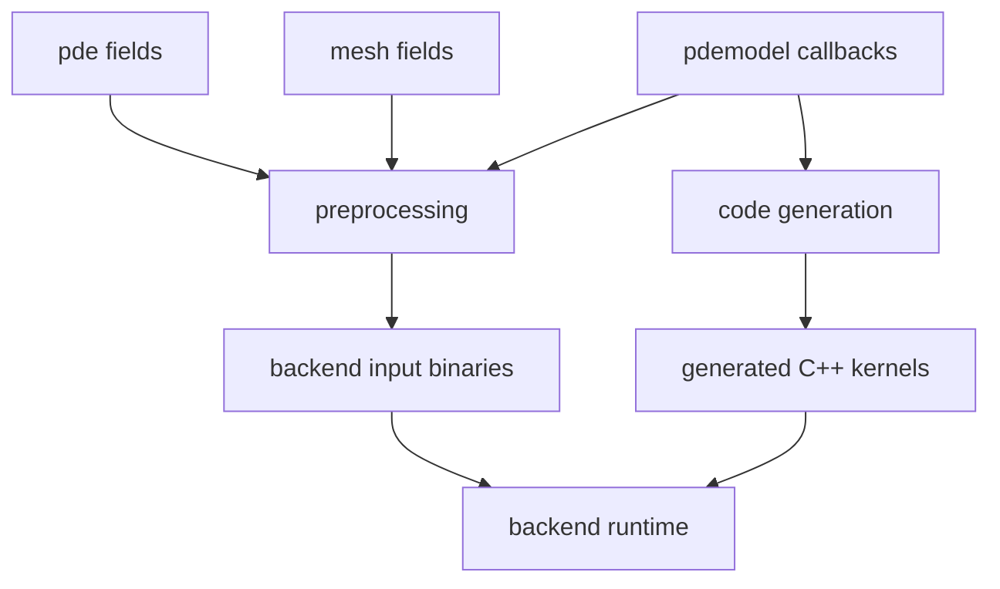

# Preprocessing

Preprocessing is the stage that converts user-level frontend objects into the
binary data and metadata consumed by the C++ backend. It is the bridge between a
mathematical problem description (`pde`, `mesh`, and `pdemodel`) and an
executable simulation.

## Workflow Position


The preprocessing output is reused by code generation, compilation, execution,
solution loading, parameter sweeps, and postprocessing. If only runtime
parameters such as `physicsparam` change, Exasim can often reuse the generated
model and compilation artifacts while updating backend input data.

## What Preprocessing Produces

For a normal frontend run, preprocessing creates or updates:

| Output | Purpose |
| --- | --- |
| `app.bin` | Serialized PDE, solver, runtime, physics, and output options. |
| `master.bin` | Reference element, quadrature, interpolation, and face permutation data. |
| `mesh.bin` or `mesh<N>.bin` | Rank-local mesh, partition, boundary, and connectivity data. |
| `sol.bin` or `sol<N>.bin` | Rank-local geometry nodes and optional initial `udg`, `odg`, `wdg`, and trace data. |
| `master` | Frontend reference-element structure returned to the user. |
| `dmd` | Domain-decomposition metadata returned to the user. |
| Updated `pde` / `app` | Inferred dimensions, output counts, time-dependence flags, and boundary metadata. |
| Updated `mesh` | Face numbering, DG nodes, and reference-element metadata. |

The exact filename suffix depends on `pde.modelnumber`, `pde.mpiprocs`, and
coupled-interface settings.

## Pipeline Summary

The MATLAB, Python, and Julia implementations follow the same high-level
pipeline:

1. Create `datain/` and `dataout/` directories.
2. Infer mesh dimension, element type, number of elements, and coordinate
   dimension.
3. Enforce a minimum quadrature order.
4. Build and write the `master` reference-element structure.
5. Load the `pdemodel` abstraction from `pde.modelfile`.
6. Infer model dimensions from `initu`, `initv`, and `initw`.
7. Infer visualization and QoI field counts from `visscalars`, `visvectors`,
   `vistensors`, `qoivolume`, and `qoiboundary`.
8. Process boundary-condition markers and wall-model metadata.
9. Generate face numbering and periodic face connectivity.
10. Partition the mesh into `dmd` data for serial or MPI execution.
11. Create or extract DG geometry and optional initial solution fields.
12. Write `sol*.bin`, `mesh*.bin`, `master.bin`, and `app.bin`.
13. Return updated frontend objects for code generation, execution, and output
    reconstruction.

## Detailed Stages

| Stage | Inputs | Outputs | Modified structures | Dependencies |
| --- | --- | --- | --- | --- |
| PDE initialization | `initializepde`, user script | Default `pde` fields | `pde` | None. |
| Mesh initialization | user mesh helpers or imported mesh | `mesh.p`, `mesh.t`, boundary fields | `mesh` | `pde.porder`, element type assumptions. |
| Directory setup | `pde.datapath`, `pde.modelnumber` | `datain`, `dataout` | filesystem | Runtime path configuration. |
| Mesh dimension inference | `mesh.p`, `mesh.t` | `nd`, `ncx`, `nve`, `ne`, `elemtype` | `pde` | Valid mesh arrays. |
| Master construction | `nd`, `porder`, `pgauss`, `elemtype`, `nodetype` | `master`, `master.bin` | `master`, `mesh.perm` | Mesh dimension and polynomial order. |
| `pdemodel` loading | `pde.modelfile` | callback namespace/object | local model handle | Model file on path/importable. |
| Model dimension inference | `initu`, `initv`, `initw`, `physicsparam`, `externalparam` | `ncu`, `nco`, `ncw`, `nc`, `ncq`, `nch` | `pde` | Symbolic callback evaluation. |
| Time-dependence inference | `pde.dt`, `pde.model` | `tdep`, `wave` | `pde` | Time-step vector and model family. |
| Output count inference | visualization/QoI callbacks | `nsca`, `nvec`, `nten`, `nvqoi`, `nbqoi` | `pde` | Model dimensions already known. |
| Boundary processing | `mesh.boundarycondition`, wall-model fields | backend boundary arrays | `pde` | Boundary markers consistent with mesh faces. |
| Connectivity generation | `mesh.p`, `mesh.t`, `boundaryexpr`, `periodicexpr` | `mesh.f`, `mesh.tprd`, `t2t` | `mesh` | Boundary/periodic expressions. |
| Domain decomposition | face connectivity, `mpiprocs`, `hybrid` | `dmd` | `dmd` | Connectivity and partitioner availability. |
| Initial data packaging | `mesh.dgnodes`, optional `mesh.udg/odg/wdg` | `sol*.bin` | filesystem, possibly `mesh.dgnodes` | `dmd`, `master`, curved-boundary metadata. |
| Mesh data packaging | `mesh`, `dmd`, `master`, boundary arrays | `mesh*.bin` | filesystem | Partitioning and face metadata. |
| App serialization | updated `pde` | `app.bin` | filesystem | All inferred fields finalized. |

## Inputs And Outputs By Structure

### `pde`

Important preprocessing inputs include dimensions and options supplied by the
user:

```matlab
pde.modelfile = "pdemodel";
pde.model = "ModelD";
pde.porder = 3;
pde.physicsparam = [1.0];
pde.mpiprocs = 4;
```

Preprocessing may update fields such as `nd`, `ncx`, `ncu`, `nc`, `ncq`,
`nco`, `ncw`, `nch`, `tdep`, `wave`, visualization counts, QoI counts, and
`boundaryconditions`.

### `mesh`

Required mesh inputs are node coordinates, element connectivity, and boundary
classification data:

```matlab
mesh.p = p;                         % coordinates
mesh.t = t;                         % connectivity
mesh.boundaryexpr = boundaryexpr;   % geometric predicates
mesh.boundarycondition = [1; 2; 3];
```

Preprocessing adds or updates face numbering, periodic connectivity, DG nodes,
and reference-element metadata used by postprocessing.

### `pdemodel`

Preprocessing uses `pdemodel` before code generation. It symbolically evaluates
initial-condition and postprocessing callbacks to infer dimensions and output
counts. It does not solve the PDE.

For example, `initu` determines `ncu`:

```python
def initu(x, mu, eta):
    return array([0.0])
```

## C++ Preprocessing Option

`pde.Cxxpreprocessing` controls how much connectivity work is prepared by the
frontend versus deferred to the backend. The default frontend paths still write
the backend input files, but some low-level block and connectivity data may be
omitted when C++ preprocessing is enabled.

Use the default unless you are debugging preprocessing internals or maintaining
backend input formats.

## Interaction With Code Generation

Preprocessing and code generation are separate but coupled:

- preprocessing infers sizes, writes input data, and validates mesh/model
  metadata;
- code generation reads `pde.modelfile`, calls the same `pdemodel` callbacks,
  and emits C++ kernels or a frontend provider;
- compilation builds the generated model/application;
- execution reads `app.bin`, `master.bin`, `mesh*.bin`, and `sol*.bin`.



## Parameter Sweeps

In frontend-driven parameter sweeps, the mesh, `master`, and `dmd` are reused
when the mesh and discretization are unchanged. Each case updates the concrete
`physicsparam`, writes the case-specific app data, and runs the same generated
executable into a deterministic output directory.

If `physicsparamwarmstart` is enabled, the first case uses normal initialization
and later cases initialize from the previous converged solution. See
[Parameter sweeps](../usage-modes/parameter-sweeps.md).

## Example: Inspect Preprocessing Outputs

```matlab
[pde, mesh] = initializeexasim();
pde.modelfile = "pdemodel";
pde.model = "ModelD";
pde.physicsparam = [1.0];

[pde, mesh, master, dmd] = preprocessing(pde, mesh);

disp(pde.ncu)
disp(master.npe)
disp(length(dmd))
```

Most users call `exasim(pde, mesh)` instead of `preprocessing(...)` directly.
Direct calls are useful when validating mesh partitioning, dimensions, or input
files before a full compile/run cycle.

## Common Failure Modes

| Symptom | Likely cause |
| --- | --- |
| `pde.initu is not defined` | `pde.modelfile` does not expose an `initu` callback. |
| Incorrect boundary behavior | `mesh.boundarycondition` does not match boundary cases in `ubou`/`fbou`. |
| Wrong number of solution components | `pde.model`, `initu`, `initv`, `initw`, or `nc` assumptions are inconsistent. |
| MPI output cannot be reconstructed | `mpiprocs`, `dmd`, or rank-local output files do not match. |
| Visualization fields missing | `saveParaview` or visualization callback/counts are not configured. |

## See Also

- [pdemodel abstraction](pdemodel.md)
- [Core data structures](data-structures.md)
- [Execution workflow](execution.md)
- [Mesh and geometry](mesh-and-geometry.md)
- [Postprocessing and visualization](postprocessing.md)
