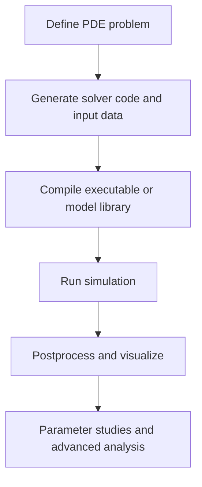

# Quick Start

This guide is the fastest path from a fresh Exasim checkout to a successful
simulation. You will install Exasim, build a small built-in application, run a
Poisson solve, inspect the generated files, and learn where to go next.

Expected background:

- basic command-line usage;
- CMake build basics;
- enough PDE/DG context to recognize mesh, solver, and model settings.

Time required:

- CPU build with existing dependencies: about 10-30 minutes;
- full dependency build or GPU/HPC build: longer, platform-dependent.

Recommended learning path:

1. Complete this Quick Start.
2. Read [Application Modes](../usage-modes/index.md).
3. Choose either [Frontends](../frontends/index.md) or
   [Text2Code Applications](../text2code-applications/index.md).
4. Use [Postprocessing](../usage-modes/postprocessing.md) and
   [Parameter Sweeps](../usage-modes/parameter-sweeps.md) once the first solve
   works.

## The Exasim Workflow

Every Exasim workflow follows the same high-level sequence:



The exact tools depend on the application mode:

| Workflow step | Common tools |
| --- | --- |
| Define PDE problem | `pdeapp.txt`, `pdemodel.txt`, MATLAB/Python/Julia `pde` and `pdemodel`, or built-in `builtinmodelID`. |
| Generate code/data | Text2Code, frontend preprocessing, or built-in provider dispatch. |
| Compile | CMake, Exasim package targets, generated app projects. |
| Run | `exasimapp`, frontend `exasim(...)`, MPI launchers, scheduler launchers. |
| Postprocess | Exasim postprocess mode, VTK/ParaView output, frontend visualization helpers. |
| Study parameters | `physicsparamcases`, frontend sweeps, standalone C++ sweeps, warm starts. |

## 1. Check Prerequisites

Supported environments include:

| Environment | Documentation |
| --- | --- |
| macOS CPU | [macOS install](../install/macos.md) |
| Linux CPU | [Linux CPU install](../install/linux-cpu.md) |
| Linux NVIDIA GPU | [Linux NVIDIA GPU install](../install/linux-nvidia.md) |
| Linux AMD GPU | [Linux AMD GPU install](../install/linux-amd.md) |
| HPC systems | [HPC build chain](../install/hpc.md), [Frontier](../install/frontier.md), [Tuolumne](../install/tuolumne.md) |

Minimum tools for the CPU quick start:

| Tool | Purpose |
| --- | --- |
| CMake | Configure Exasim and application builds. |
| C++ compiler with C++17/20 support | Build Exasim libraries and apps. |
| Make or Ninja | Native build backend selected by CMake. |
| MPI compiler/runtime | Required for MPI-enabled variants; the default quick-start consumer uses MPI. |
| Git | Source checkout and branch management. |

Optional tools:

| Tool | Purpose |
| --- | --- |
| CUDA toolkit | NVIDIA GPU backend. |
| ROCm/HIP | AMD GPU backend. |
| MATLAB, Python, Julia | Frontend workflows. |
| ParaView | Visual inspection of VTK output. |

!!! warning "Avoid whitespace in the Exasim path"
    Kokkos builds are sensitive to paths containing whitespace. Put the source
    and build directories under paths without spaces.

## 2. Install Exasim

Start from a parent directory that contains the `Exasim` source tree:

```bash
cd /path/to/workspace
cmake -S Exasim -B Exasim-build
cmake --build Exasim-build -j8
cmake --install Exasim-build --prefix /path/to/exasim-prefix
```

The install prefix should contain Exasim libraries, headers, CMake package
files, runtime data, and Text2Code:

```bash
ls /path/to/exasim-prefix
ls /path/to/exasim-prefix/bin/text2code
ls /path/to/exasim-prefix/lib/cmake/Exasim \
  || ls /path/to/exasim-prefix/lib64/cmake/Exasim
```

For GPU builds, configure the superbuild with the appropriate backend:

```bash
cmake -S Exasim -B Exasim-build-cuda -DEXASIM_CUDA=ON
cmake --build Exasim-build-cuda -j8
cmake --install Exasim-build-cuda --prefix /path/to/exasim-prefix
```

```bash
cmake -S Exasim -B Exasim-build-hip -DEXASIM_HIP=ON
cmake --build Exasim-build-hip -j8
cmake --install Exasim-build-hip --prefix /path/to/exasim-prefix
```

For detailed platform-specific compiler and dependency choices, use the
[Installation](../install/index.md) section.

### Installation Checks

Run these checks before building the first app:

```bash
cmake --version
/path/to/exasim-prefix/bin/text2code --help || true
find /path/to/exasim-prefix -name ExasimConfig.cmake
find /path/to/exasim-prefix -name "libbuiltinmodel*"
```

Expected result:

- `ExasimConfig.cmake` exists under `lib/cmake/Exasim` or
  `lib64/cmake/Exasim`;
- `text2code` exists if Text2Code support was built;
- at least one built-in model library exists, such as
  `libbuiltinmodelserial.a`, `libbuiltinmodelcuda.a`, or
  `libbuiltinmodelhip.a`.

### Common Installation Issues

| Symptom | Likely cause | Fix |
| --- | --- | --- |
| CMake tries to install under `/usr/local` | No install prefix was provided at install time. | Use `cmake --install Exasim-build --prefix /path/to/exasim-prefix`. |
| `find_package(Exasim)` fails | CMake cannot locate the installed package. | Pass `-DExasim_DIR=/path/to/exasim-prefix` or the exact `lib/cmake/Exasim` directory. |
| Kokkos build fails early | Unsupported compiler, whitespace in path, or missing GPU toolkit. | Move to a clean path and use the platform install guide. |
| MPI symbols fail at link time | App variant and MPI toolchain do not match. | Use the same MPI environment for Exasim and application builds. |
| GPU app links but fails at runtime | Wrong CUDA/HIP architecture or runtime environment. | Check `EXASIM_CUDA_ARCH`, `EXASIM_HIP_ARCH`, modules, and scheduler GPU allocation. |

## 3. First Simulation: Built-in Poisson 2D

This tutorial runs a built-in Poisson 2D application. It uses
`builtinmodelID = 1`, so you do not need to write PDE model code.

### Build The Built-in App Driver

```bash
cd /path/to/Exasim/apps/builtinlibrary
cmake -S . -B build -DExasim_DIR=/path/to/exasim-prefix
cmake --build build -j
```

What happens:

- CMake finds the installed Exasim package;
- the app links Exasim headers, preprocessing/solver libraries, and the
  built-in model provider;
- the executable is written to `apps/builtinlibrary/build/exasimapp`.

If you installed into a `lib64` layout, passing the install prefix as
`Exasim_DIR` is still supported by the app CMake logic.

### Run The Poisson 2D App

```bash
mpirun -np 2 build/exasimapp ../poisson/poisson2d/pdeapp.txt
```

For a non-MPI build, run:

```bash
build/exasimapp ../poisson/poisson2d/pdeapp.txt
```

What happens:

1. The executable reads `apps/poisson/poisson2d/pdeapp.txt`.
2. `builtinmodelID = 1` selects the installed Poisson model.
3. Exasim preprocesses the mesh and writes binary input data.
4. The solver advances the steady problem.
5. Output files are written under the app's output directory.

### Inspect The Input File

Open:

```bash
less ../poisson/poisson2d/pdeapp.txt
```

Look for:

| Field | Meaning |
| --- | --- |
| `builtinmodelID = 1` | Selects the built-in Poisson model. |
| `meshfile` | Mesh input file. |
| `discretization` | HDG or LDG-style discretization selection. |
| `porder`, `pgauss` | Polynomial and quadrature orders. |
| `NewtonIter`, `GMRESiter`, `preconditioner` | Nonlinear/linear solver controls. |
| `physicsparam` | Model parameters passed to the PDE kernels. |
| `boundaryconditions` | Boundary-condition IDs. |

See the [`pdeapp.txt` reference](../reference/pdeapp.md) for the complete field
list.

### Inspect The Outputs

After a successful run, inspect the application directory:

```bash
find ../poisson/poisson2d -maxdepth 3 -type f | sort | head -50
```

Typical generated artifacts include:

| Artifact | Meaning |
| --- | --- |
| `datain/*.bin` | Binary app, mesh, master, solution, and decomposition data. |
| `dataout/out*.bin` | Solver output, solution, residual, QoI, or auxiliary binary data depending on options. |
| `dataout/*.vtu` / `*.pvtu` | ParaView files when visualization output is enabled. |
| residual history files | Written when residual norm output is enabled. |

If no VTK files are written, check `saveParaview`, `nsca`, `nvec`, `nten`,
`nsurf`, and related postprocessing options in `pdeapp.txt`.

## 4. Directory Structure

| Directory | What it contains | When users interact with it |
| --- | --- | --- |
| `apps/` | Standalone C++ application cases and app drivers. | Running built-in, shared-library, or Text2Code-style apps. |
| `examples/` | MATLAB/Python/Julia frontend examples and exported app examples. | Learning frontend workflows and parameter sweeps. |
| `docs/` | MkDocs documentation source. | Reading or editing documentation. |
| `frontends/` | MATLAB, Python, and Julia frontend implementations. | High-level PDE setup, preprocessing, execution, and visualization. |
| `backend/` | C++ solver, discretization, preprocessing, postprocessing, and model provider code. | Backend development and debugging. |
| `install/` | CMake install/superbuild logic and platform install guides. | Installing Exasim and exported package targets. |
| `text2code/` | Text2Code parser, symbolic code generation, and supporting dependencies. | Text-file model workflows and generated kernels. |
| `Exasim-build/` | Out-of-source superbuild directory. | Created by CMake; safe to delete/rebuild. |
| `local/` or install prefix | Installed headers, libraries, CMake package files, runtime data, and `text2code`. | Used by downstream apps and frontends. |
| `datain/`, `dataout/`, `build/` | Per-app generated input, output, and build products. | Created when running examples/apps. |

## 5. Major User Workflows

### Built-in Applications

Use built-in applications when an installed model already matches your physics.
This is the fastest way to run reference Poisson and Navier-Stokes cases.

Start with [Built-in library applications](../usage-modes/builtin.md).

### Text-to-Code Applications

Use Text2Code when you want to describe an application with text files:

- `pdeapp.txt` configures mesh, solver, parameters, output, and runtime options;
- `pdemodel.txt` defines model expressions for fluxes, sources, boundary terms,
  initial conditions, and outputs.

Start with [Text2Code Applications](../text2code-applications/index.md).

### Custom PDE Development

Use the frontend `pdemodel` abstraction or Text2Code DSL to create new PDE
models, extend existing models, and define custom visualization/QoI callbacks.

Start with [Physics Models](../physics-models/index.md),
[pdemodel abstraction](../frontends/pdemodel.md), and the
[Model Contract](../reference/model-contract.md).

### Parameter Sweep Studies

Use parameter sweeps to run multiple `physicsparam` cases with deterministic
case directories and optional warm-start continuation.

Start with [Parameter Sweeps](../usage-modes/parameter-sweeps.md).

### Postprocessing

Use postprocessing to generate ParaView files, derived quantities, QoI, surface
data, volume data, and frontend-readable visualization outputs.

Start with [Postprocessing](../usage-modes/postprocessing.md).

## Capability Overview

| Capability | Current user-facing support |
| --- | --- |
| High-order DG/HDG/LDG methods | Configurable polynomial order, quadrature, and DG/HDG-style workflows. |
| Unstructured meshes | Mesh files and frontend mesh utilities for 1D, 2D, and 3D workflows. |
| Steady and time-dependent simulations | Steady solves and DIRK-style time integration settings. |
| Multiphysics and coupled models | Monolithic HDG and multi-model/coupling infrastructure. |
| GPU acceleration | Kokkos-based CUDA and HIP backends. |
| Distributed-memory parallelism | MPI partitioning and ParMETIS-based decomposition. |
| Reduced-basis solver controls | Runtime fields such as `RBdim` and related solver/preconditioner parameters. |
| Parameter sweeps | Frontend and standalone C++ sweeps over `physicsparam`; optional warm starts. |
| Postprocessing | VTK/ParaView, QoI, surface/volume outputs, output-CG, frontend visualization. |
| Adjoint/optimization workflows | Not documented as a primary quick-start workflow; check current examples and backend capabilities before relying on this path. |

## Next Steps

| Goal | Go to |
| --- | --- |
| Pick the right run path | [Application Modes](../usage-modes/index.md) |
| Use MATLAB/Python/Julia | [Frontends](../frontends/index.md) |
| Run built-in applications | [Built-in library](../usage-modes/builtin.md) |
| Generate apps from text files | [Text2Code Applications](../text2code-applications/index.md) |
| Build a custom PDE model | [pdemodel abstraction](../frontends/pdemodel.md) and [pdemodel.txt guide](../text2code-applications/pdemodel.md) |
| Sweep parameters | [Parameter Sweeps](../usage-modes/parameter-sweeps.md) |
| Visualize results | [Postprocessing](../usage-modes/postprocessing.md) |
| Build for clusters or GPUs | [HPC build chain](../install/hpc.md), [Frontier](../install/frontier.md), [Tuolumne](../install/tuolumne.md) |
| Embed Exasim in C++ | [Driving the solver](../driving-the-solver.md) |
