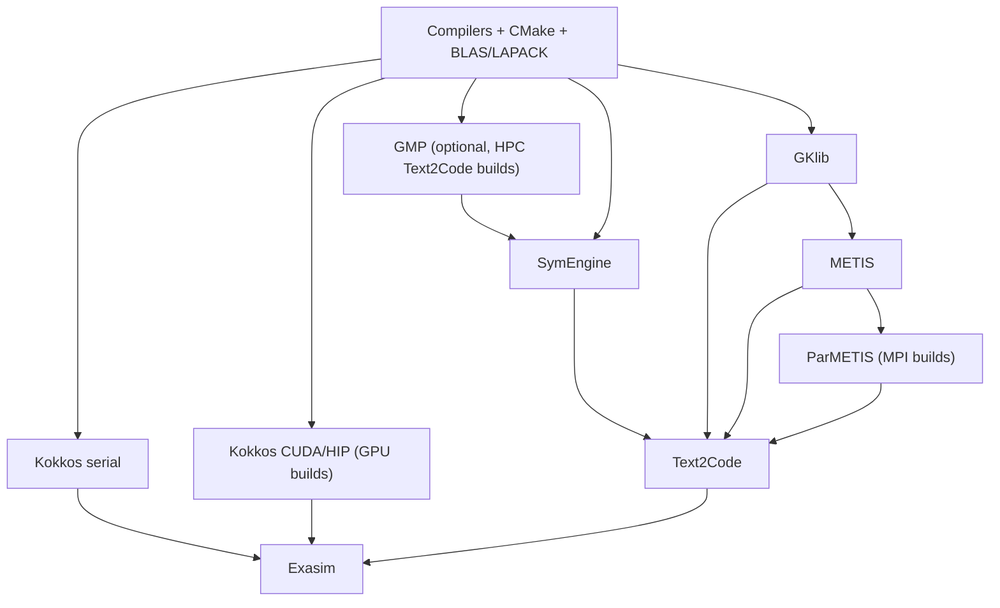

# Manual Dependency Installation

Manual installation is the fallback path. Use it only when the Superbuild does
not work for your system or when a cluster requires explicit site-managed
dependencies.

!!! warning "Install in order"
    The dependencies are ordered. Installing them out of order is a common
    source of failed builds and wrong CMake package discovery.

## Dependency Sequence

## Dependency Roles

| Component | Purpose | Can skip when |
| --- | --- | --- |
| GKlib | Utility layer required by METIS. | Never for METIS/ParMETIS workflows. |
| METIS | Serial graph partitioning. | Only if using a non-METIS build path. |
| ParMETIS | MPI graph partitioning. | Non-MPI-only builds. |
| Kokkos serial | CPU backend portability. | Never for CPU builds. |
| Kokkos CUDA | NVIDIA GPU backend. | No NVIDIA GPU support needed. |
| Kokkos HIP | AMD GPU backend. | No AMD GPU support needed. |
| GMP | Integer backend for some SymEngine builds. | Using Boost multiprecision SymEngine path. |
| SymEngine | Symbolic backend for Text2Code. | Only if Text2Code is not needed. |
| Text2Code | Generates model kernels/input data from text descriptions. | Only if using installed built-ins or hand-written models exclusively. |

## Manual Build Instructions

The historical shared manual steps are documented in
[Common dependencies](common.md). Platform-specific manual variants are in:

- [Linux CPU](linux-cpu.md)
- [Linux NVIDIA GPU](linux-nvidia.md)
- [Linux AMD GPU](linux-amd.md)
- [HPC build chain](hpc.md)

For new users, prefer [CPU Installation via Superbuild](superbuild-cpu.md)
unless you have a specific reason to manage these dependencies yourself.

