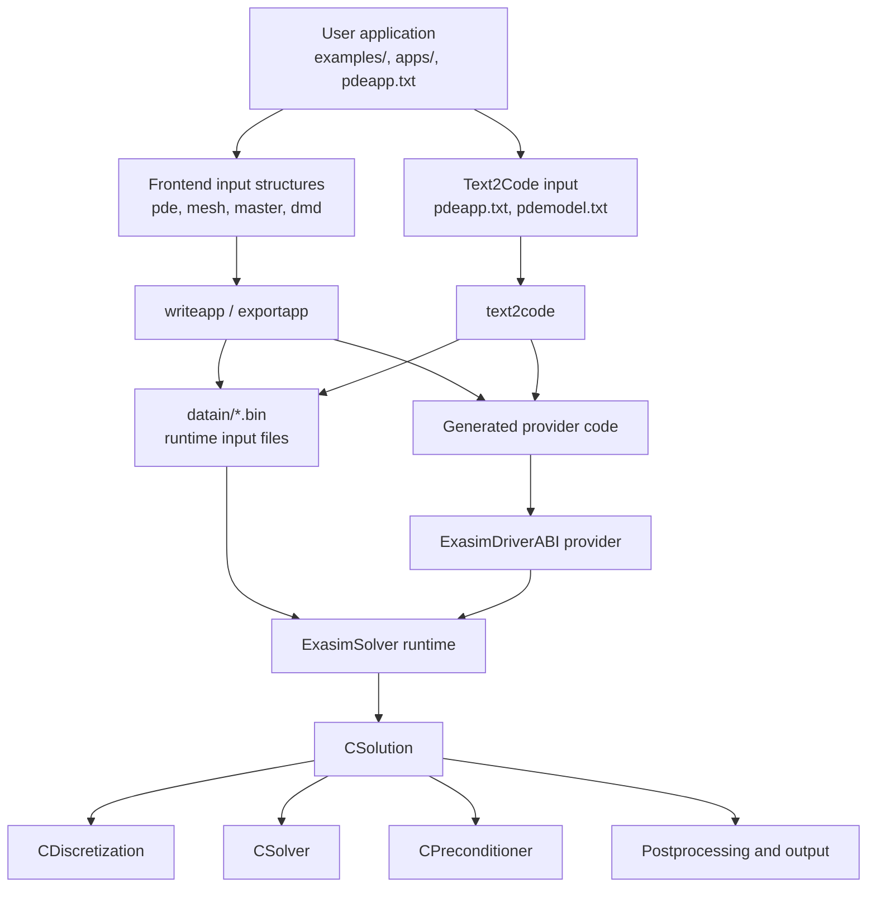
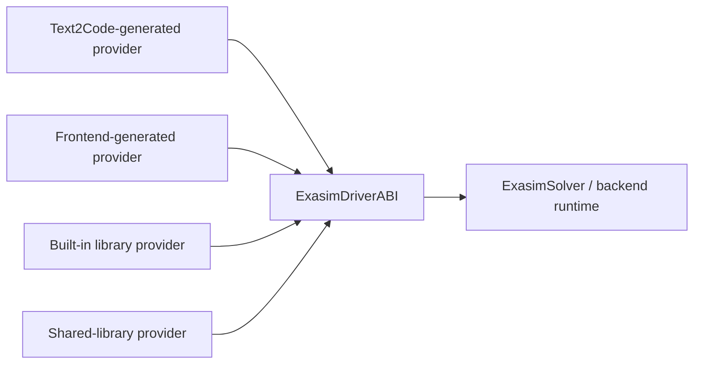
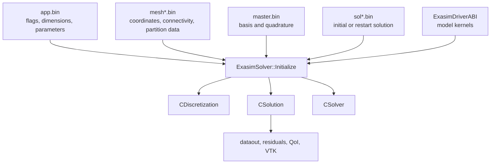
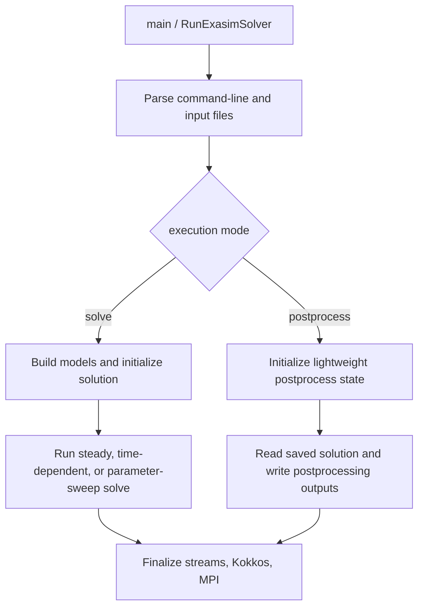

# Architecture

Exasim is organized around a stable backend runtime and several ways to
author PDE applications. The implementation is designed so that MATLAB,
Python, Julia, Text2Code, built-in libraries, shared libraries, and
standalone C++ applications eventually drive the same solver classes and
runtime data structures.

## Design Philosophy

### Separate physics from numerics

Physics-specific code is supplied through a model provider. The backend
expects model callbacks for fluxes, sources, boundary terms, initial
conditions, visualization fields, equations of state, and related kernels.
The discretization, time integration, Newton/GMRES solvers, preconditioners,
MPI communication, and output logic are implemented in the backend and are
not duplicated for each application.

### Separate frontends from the backend

Frontends own user input, mesh setup, preprocessing, code generation,
compilation commands, and output fetching. The backend owns runtime
execution. This separation is why the same generated executable can be run
from MATLAB, Python, Julia, Text2Code, or directly from the command line.

### Prefer generated kernels over runtime interpretation

Exasim uses code generation to turn model definitions into C++ kernels. This
keeps runtime loops close to the numerical kernels and avoids evaluating
symbolic expressions dynamically during a solve.

### Keep execution modes additive

Solve, postprocess, built-in-library, shared-library, frontend-generated,
Text2Code-generated, CPU, GPU, and MPI workflows are selected by flags,
providers, and CMake options. They should not fork the numerical algorithm
unless the underlying discretization requires it.

## Major Layers

| Layer | Main locations | Responsibility |
| --- | --- | --- |
| Applications | `apps/`, `examples/` | User-facing cases and standalone driver examples. |
| Frontends | `frontends/Matlab`, `frontends/Python`, `frontends/Julia` | User APIs, preprocessing orchestration, code generation, compile/run helpers. |
| Text2Code | `text2code/`, `apps/*/pdeapp.txt` | Text-file PDE application parsing and generated model code. |
| CMake app templates | `cmake/frontend-app`, `cmake/frontend-app-combined` | Installed templates for generated standalone applications. |
| Public C++ API | `include/ExasimSolver.hpp`, `include/ExasimSolverSetup.hpp` | Runtime entry points and provider selection. |
| Backend | `backend/` | Discretization, solvers, preprocessing, postprocessing, MPI, GPU data movement. |
| Install/package logic | `CMakeLists.txt`, `install/CMakeLists.txt`, `install/` | Superbuild, installed package targets, runtime data, frontend setup. |
| Tests and CI | `tests/`, `.github/workflows/` | Hygiene, package consumers, frontend tests, smoke builds, docs builds. |

## Provider Architecture

The backend does not call a MATLAB, Python, Julia, or Text2Code function
directly. Instead, a provider fills an `ExasimDriverABI` object with function
pointers to the model kernels.

Provider selection is centralized in `include/ExasimSolverSetup.hpp`. The
compile-time macros `_TEXT2CODE`, `_SHAREDLIBRARY`, `_BUILTINLIBRARY`,
`_BUILTINMODEL`, `_KOKKOSKERNEL`, and frontend provider macros select which
ABI getter is used. This keeps application modes independent from the solver
implementation.

## Runtime Data Flow

The runtime consumes binary input files and provider callbacks:

The most important runtime objects are:

| Object | Role |
| --- | --- |
| `appstruct` | Application flags, dimensions, physics parameters, solver settings. |
| `meshstruct` | Element geometry, connectivity, partition metadata. |
| `masterstruct` | Reference element, basis, and quadrature data. |
| `solstruct` | Solution fields such as `udg`, `wdg`, `uh`, coordinates, and auxiliary data. |
| `commonstruct` | Runtime dimensions, counters, paths, backend flags, MPI rank metadata. |
| `CSolution` | High-level solve, output, postprocess, and time integration ownership. |
| `CDiscretization` | Residuals, element operators, geometry, and model-kernel evaluation. |
| `CSolver` | Newton, pseudo-time, and GMRES solve state. |
| `CPreconditioner` | Preconditioner storage and application. |

## Solve and Postprocess Execution

`ExasimSolver` owns the outer execution mode. Solve mode initializes models,
opens output streams, and advances the solution. Postprocess mode reads saved
solution data and writes derived outputs without rerunning the solver.

## Implementation Boundaries

| Do this | Avoid this |
| --- | --- |
| Add new user input in frontends and Text2Code consistently. | Hard-code frontend-only behavior in backend solver loops. |
| Add provider features through the ABI when they are model callbacks. | Calling generated files by relative paths from backend code. |
| Keep generated artifacts out of source control unless intentionally curated. | Treating generated C++ as the primary source of truth. |
| Use execution flags in runtime structs for behavior that must survive standalone execution. | Depending on MATLAB/Python/Julia state at runtime. |
| Update CPU, CUDA, HIP, and MPI paths when changing runtime data ownership. | Assuming host-only memory when GPU builds are enabled. |

## Related Documentation

- User workflows: [Application Modes](../usage-modes/index.md)
- PDE formulation concepts: [Physics Models](../physics-models/index.md)
- Numerical algorithms: [Theory](../theory/index.md)
- Frontend user guide: [Frontends](../frontends/index.md)
- C++ API user guide: [Driving the solver](../driving-the-solver.md)
