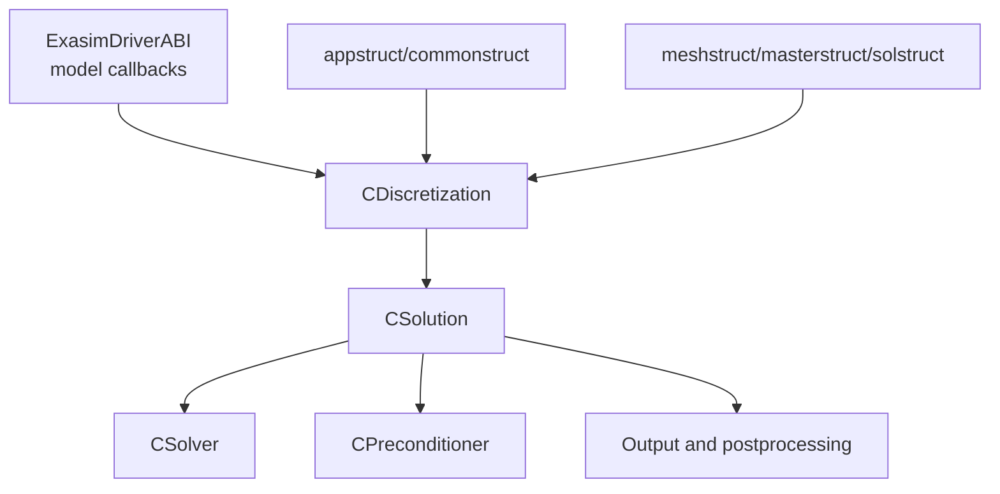

# Backend Internals

The backend implements Exasim's numerical runtime. All frontend and
standalone application modes eventually call into these C++ components.

## Backend Ownership

The backend owns:

- Runtime binary readers and writers.
- Runtime structs and memory allocation.
- Geometry and element operator setup.
- LDG/HDG residuals, Jacobians, and auxiliary evaluations.
- Newton, pseudo-time, DIRK, and GMRES orchestration.
- Preconditioner setup and application.
- Solution, QoI, visualization, and postprocessing output.
- CPU/GPU memory movement.
- MPI communication and rank-local execution.

## Important Runtime Classes

| Class | Main location | Role |
| --- | --- | --- |
| `ExasimSolver` | `backend/Main/ExasimSolver.cpp`, `include/ExasimSolver.hpp` | Top-level runtime owner: parse inputs, initialize models, run solve/postprocess/sweeps. |
| `CSolution` | `backend/Solution/` | Owns high-level solve loops, saved solution I/O, postprocessing, and output streams. |
| `CDiscretization` | `backend/Discretization/` | Owns residual evaluation, geometry, DG/HDG operators, and model-kernel calls. |
| `CSolver` | `backend/Solver/` | Owns Newton/GMRES vectors, linear solves, and system updates. |
| `CPreconditioner` | `backend/Preconditioning/` | Owns preconditioner matrices, factors, and application routines. |

## Important Runtime Structs

Most backend kernels operate on raw-pointer structs defined in
`backend/Common/common.h`.

| Struct | Meaning |
| --- | --- |
| `appstruct` | Application flags, dimensions, time settings, physics parameters, model parameters. |
| `commonstruct` | Runtime dimensions, backend flags, MPI rank info, paths, counters, output flags. |
| `meshstruct` | Element and face connectivity, coordinates, partition metadata. |
| `masterstruct` | Basis functions and quadrature data. |
| `solstruct` | Solution fields and coordinates. |
| `resstruct` | Residuals, matrices, temporary operator storage. |
| `tempstruct` | Scratch arrays shared across element kernels and output routines. |
| `sysstruct` | Linear solver vectors and system-level storage. |

These structs are performance-sensitive. Preserve memory ownership and data
layout conventions when changing them.

## Model ABI

Generated and built-in model functions are exposed through
`ExasimDriverABI`. This avoids templating the entire runtime on every
provider mode and allows standalone apps to select provider implementations
with compile-time macros.

Typical callback families include:

- Kokkos kernels such as flux, source, boundary, initialization, EOS,
  visualization, and QoI functions.
- HDG model callbacks for flux/source/boundary terms.
- CPU initialization helpers.
- Built-in, shared-library, Text2Code, and frontend-generated providers.

When adding a model callback, update the ABI, all provider implementations,
and any generated provider code together.

## Discretization Boundary

`CDiscretization` is the boundary between model callbacks and numerical
operators. It should know how to:

- Evaluate model fluxes/sources on element data.
- Construct or apply residuals and Jacobians.
- Evaluate auxiliary variables such as `q` consistently for LDG and HDG.
- Manage scratch buffers needed by output and postprocessing.

It should not know frontend-specific concepts such as MATLAB `pde` structs.

## Solution and Output Boundary

`CSolution` owns high-level execution and file output. Examples include:

- Saved solution files.
- Residual histories.
- QoI files.
- ParaView/VTK outputs.
- CG output fields.
- Postprocess-mode solution reads.

Postprocessing code must avoid truncating files that it later needs to read.
Constructors and output-stream setup should therefore be execution-mode
aware.

## Memory Ownership Rules

| Rule | Reason |
| --- | --- |
| Allocate runtime arrays through existing allocation helpers. | Keeps CPU/CUDA/HIP behavior consistent. |
| Do not store frontend-language objects in backend structs. | Standalone apps must run without MATLAB/Python/Julia. |
| Refresh device arrays when host runtime parameters change. | Prevents stale GPU data in sweeps and restarts. |
| Keep temporary-buffer aliasing explicit. | Many routines intentionally reuse scratch memory. |
| Avoid hidden file opens in postprocess-only constructors. | Prevents truncating saved solve outputs. |

## Adding Backend Features

For backend changes, identify which layer owns the state:

| Feature type | Likely storage |
| --- | --- |
| User option needed at runtime | `appstruct` or `commonstruct`, plus binary input files. |
| Solver-only temporary | `sysstruct`, `resstruct`, or `tempstruct`. |
| Mesh/partition metadata | `meshstruct` or DMD preprocessing files. |
| Model callback | `ExasimDriverABI` and providers. |
| Installed API | `include/` headers and exported CMake targets. |

Then update CPU, GPU, MPI, frontend, Text2Code, and tests as applicable.

## Related Pages

- [Runtime](runtime.md)
- [GPU implementation](gpu-implementation.md)
- [MPI implementation](mpi-implementation.md)
- [Theory](../theory/index.md)
