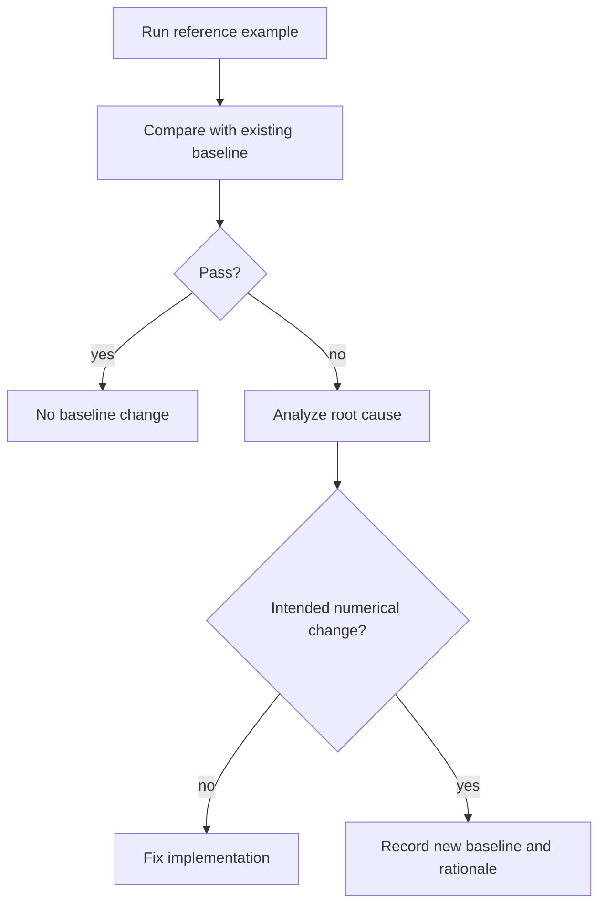

# Baselines

Baselines are reference outputs used to decide whether a code change preserves
expected numerical behavior. They are most useful when they compare physical
or numerical quantities that are stable across platforms and parallel
decompositions.

## What Baselines Are For

Baselines answer two questions:

1. Did the code still run to completion?
2. Did the computed result remain within an acceptable numerical tolerance?

They should not encode accidental details such as rank ordering,
machine-specific floating-point roundoff, or local build paths.

## Preferred Baseline Signals

| Signal | Strength | Notes |
| --- | --- | --- |
| Manufactured-solution error | Strongest | Validates numerical correctness directly. |
| Analytical benchmark quantity | Strong | Good for canonical PDE examples. |
| QoI or integral output | Strong if owned-only | Must avoid ghost-element double counting in MPI. |
| Element-ID-aligned relative norm | Strong | Partition-invariant if element IDs are available. |
| Residual history | Useful | Sensitive to solver tolerances and floating-point ordering. |
| Raw binary equality | Weak across platforms | Useful only for deterministic same-platform checks. |

## Partition-Invariant Comparisons

MPI changes element ordering and local ownership. A robust comparison should
match data by global element ID before computing a norm:

```text
relative L2 = sqrt(sum_e ||u_current(e) - u_reference(e)||^2
                   / sum_e ||u_reference(e)||^2)
```

This is preferable to comparing `outudg_np0.bin` byte-for-byte.

## Updating Baselines

Only update a baseline after confirming that the change is intended. A good
baseline update should include:

- Reason for the numerical change.
- Solver options and backend used to regenerate the output.
- Platform and compiler context if relevant.
- Evidence that CPU/GPU or serial/MPI differences are acceptable.
- Documentation updates if user-visible output changed.

Do not update baselines to hide an unexplained regression.

## Baseline Workflow



## Baselines and Hardware Differences

Expected differences can come from:

- BLAS/LAPACK implementation.
- FMA and vectorization choices.
- GPU backend arithmetic.
- MPI reduction ordering.
- Nonlinear solver tolerances.

Use tolerances that admit expected floating-point drift while still catching
real solver bugs. If a tolerance must be loose, document why.

## Source-Control Policy

Baseline files can be large. Prefer compact reference quantities when
possible. If binary baseline data is necessary:

- Keep only required files.
- Avoid generated build directories.
- Avoid machine-specific paths.
- Document how to regenerate the data.

## Related Pages

- [Testing](testing.md)
- [Known divergences](known-divergences.md)
- [CI and validation](ci-and-validation.md)
