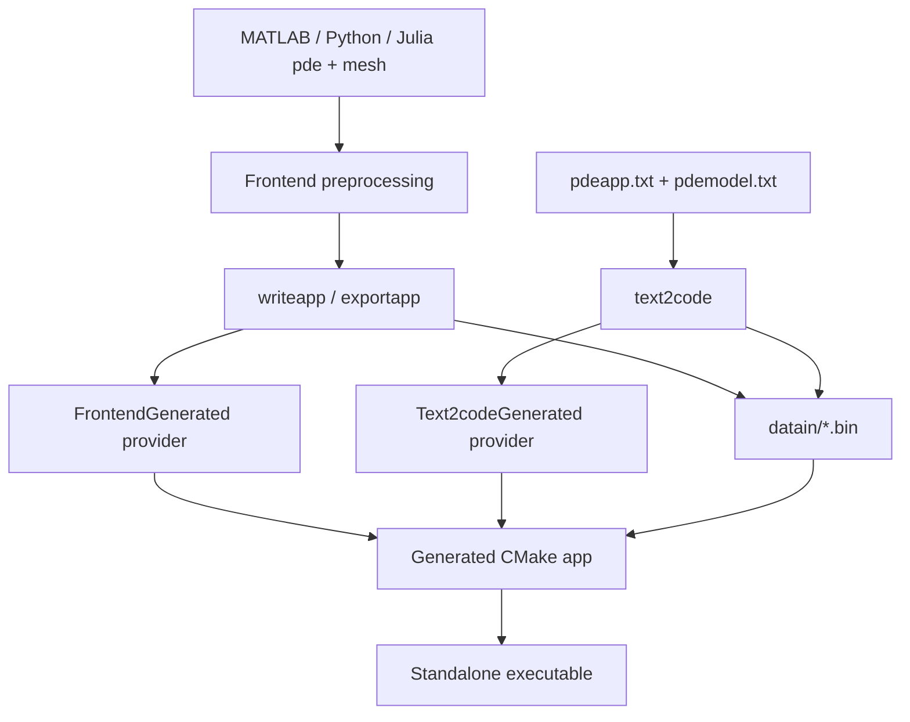
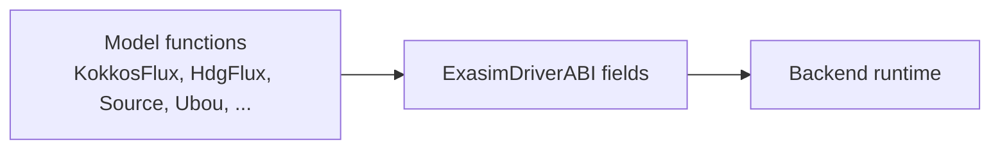

# Code Generation Pipeline

Exasim relies on code generation to convert user-facing PDE descriptions into
C++ model providers that can be compiled into standalone or library-based
applications. The generated provider supplies model callbacks to the backend
through `ExasimDriverABI`.

## Main Code-Generation Paths



Both paths must agree on runtime file formats and provider semantics.

## Frontend-Driven Generation

The frontends construct `pde`, `mesh`, `master`, and `dmd` structures, then
write backend input files. Important implementation points:

- `initializepde` establishes defaults.
- `preprocessing` builds mesh/master/DMD data.
- `writeapp` serializes runtime inputs such as flags, dimensions, paths,
  solver parameters, and physical parameters.
- `cmakecompile` builds the generated executable.
- `runcode` launches solve or postprocess mode.
- `exportapp` writes a standalone C++ application that can run without the
  frontend language at runtime.

Generated frontend applications commonly use templates from
`cmake/frontend-app` or `cmake/frontend-app-combined`.

## Text2Code Generation

Text2Code starts from text files:

| File | Role |
| --- | --- |
| `pdeapp.txt` | Application configuration: mesh, solver, execution, postprocessing, sweeps, paths. |
| `pdemodel.txt` | PDE model description: variables, fluxes, sources, boundary terms, initial conditions. |

The `text2code` executable parses these files, writes or updates runtime
input files, and generates model provider code when requested by the
application. See [Text2Code Applications](../text2code-applications/index.md)
for user syntax; this page focuses on implementation ownership.

## Provider Files

Generated provider code is intentionally thin. Its job is to map model
functions into the ABI expected by the backend.



Provider-related source locations include:

| Location | Purpose |
| --- | --- |
| `include/ExasimSolverSetup.hpp` | Selects the active provider based on compile-time macros. |
| `backend/Model/Text2codeGenerated/` | Text2Code-generated model implementation and provider support. |
| `backend/Model/FrontendGenerated/` | Frontend-generated provider support. |
| `backend/Model/BuiltIn/` | Built-in model library support and registry generation. |
| `apps/builtinlibrary/` | Standalone executable using the built-in dynamic-library ABI path. |
| `apps/sharedlibrary/` | Standalone executable using user-supplied shared-library kernels. |

## Runtime Files

The generated executable reads binary files rather than frontend objects:

| File family | Runtime meaning |
| --- | --- |
| `app.bin` | Application dimensions, flags, parameters, output settings, and paths. |
| `mesh*.bin` | Mesh coordinates, connectivity, boundary and partition data. |
| `master.bin` | Reference element and quadrature data. |
| `sol*.bin` | Initial, restart, or saved solution state. |
| `physicsparamcases.bin` | Optional runtime parameter-sweep cases. |

The frontend and Text2Code paths must keep these formats compatible. A
change to a binary format must update all writers, all readers, tests, and
documentation.

## Standalone Application Flow

Generated C++ apps typically follow this structure:

```cpp
#include "ExasimSolverSetup.hpp"

int main(int argc, char** argv)
{
    return RunExasimSolver(argc, argv);
}
```

`RunExasimSolver` parses command-line arguments, selects solve or
postprocess mode, initializes the active provider, and dispatches into
`ExasimSolver`.

## Generated Artifacts and Source Control

Generated model files should not be treated as the source of truth unless
they are curated templates or intentional reference files. Before committing
generated C++:

1. Confirm whether the file is generated by Text2Code or a frontend.
2. Confirm whether `.gitignore` already excludes it.
3. Prefer committing the input (`pdeapp.txt`, `pdemodel.txt`, frontend
   example) and the generator change instead of generated outputs.

## Compatibility Rules

- Existing single-case `physicsparam` applications must keep working when
  sweep files are absent.
- Frontend-generated and Text2Code-generated standalone applications must
  consume the same runtime data formats.
- GPU backends must refresh device copies when generated runtime data changes.
- MPI backends must preserve rank-local file naming and ownership.
- Public installed headers must remain usable by external CMake consumers.

## Useful Checks

```bash
cmake --build Exasim-build -j8
cmake --install Exasim-build
bash tests/run-consumer-tests.sh Exasim-build /tmp/exasim-consumers /tmp/exasim-install
```

Use the consumer tests when changes affect installed targets, public headers,
or generated application CMake files.
