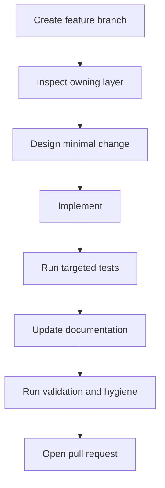

# Development Workflow

This page describes the recommended workflow for changing Exasim itself.

## Standard Contributor Flow



## Before Editing

1. Identify whether the behavior belongs to a frontend, Text2Code, backend,
   install/package logic, app example, or documentation.
2. Inspect the existing implementation and neighboring code style.
3. Check whether generated files are source artifacts or outputs.
4. List CPU, GPU, MPI, postprocess, and standalone-app implications.
5. Prefer the smallest patch that preserves existing workflows.

## Implementation Expectations

| Change type | Expected follow-up |
| --- | --- |
| New `pde` option | Update MATLAB, Python, Julia, Text2Code, binary serialization, docs, and tests. |
| Runtime struct change | Update readers, writers, CPU/GPU copies, MPI assumptions, and ABI compatibility. |
| Provider callback change | Update all providers and generated code paths. |
| Installed target/header change | Run consumer tests and update CMake reference docs. |
| Numerical algorithm change | Add regression coverage and document assumptions. |
| Documentation-only change | Run `mkdocs build --strict` and hygiene checks. |

## Local Validation Sequence

Use the smallest useful checks first, then expand:

```bash
git diff --check
python3 -m mkdocs build --strict --clean
bash tests/check-hygiene.sh
cmake --build Exasim-build -j8
ctest --test-dir Exasim-build --output-on-failure
```

The exact build directory depends on how Exasim was configured locally.

## Pull Request Expectations

A good Exasim pull request should explain:

- Motivation and user impact.
- Affected layers.
- CPU/GPU/MPI implications.
- File-format or API compatibility.
- Tests run and tests not run.
- Known limitations.

Do not mix unrelated solver, frontend, example, and documentation changes
unless they are required for one coherent feature.

## AI-Assisted Development

AI coding assistants are useful for navigating Exasim, but they must respect
the same implementation boundaries as human contributors.

Recommended workflow for AI agents:

1. Read this Internals section before editing.
2. Locate the owning layer with `rg` and file inspection.
3. State assumptions about data layout, memory ownership, and solver state.
4. Make minimal patches.
5. Avoid editing generated files unless the task explicitly requires it.
6. Run targeted validation and report what was not tested.

For prompt examples and user-facing guidance, see
[Using AI Tools](../using-ai-tools/index.md).

## Handling Generated Files

Generated files are easy to modify accidentally. Before editing a generated
file, ask whether the correct source of truth is:

- A frontend generator.
- Text2Code parser or templates.
- CMake installed app template.
- Built-in model registry generation.
- A curated manually maintained provider file.

Fix the generator when possible.

## Numerical Review Checklist

For solver changes, explicitly check:

- Conservation and consistency.
- Boundary flux behavior.
- Initial and restart solution semantics.
- CPU/GPU agreement.
- Serial/MPI agreement.
- Steady and time-dependent behavior.
- Postprocess behavior if saved solution files are involved.

## Related Pages

- [Coding guidelines](coding-guidelines.md)
- [Testing](testing.md)
- [CI and validation](ci-and-validation.md)
- [Known divergences](known-divergences.md)
