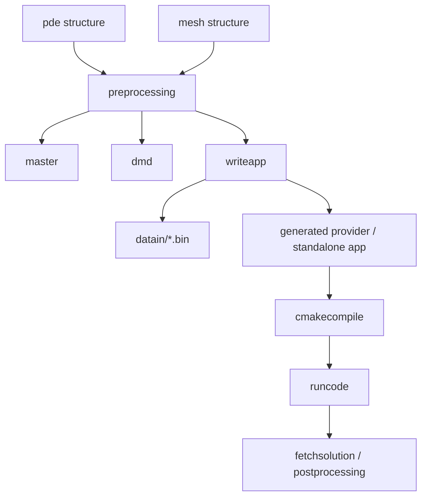

# Frontend Internals

The MATLAB, Python, and Julia frontends provide language-specific APIs for
building Exasim applications, but they share the same conceptual pipeline:

## Common Frontend Responsibilities

| Responsibility | Description |
| --- | --- |
| Defaults | Initialize `pde` fields so examples remain concise and backward compatible. |
| Validation | Detect malformed options before launching the C++ backend when possible. |
| Mesh setup | Build or import mesh coordinates, elements, boundary expressions, and tags. |
| Preprocessing | Construct master elements, connectivity, DMD partition data, and initial data. |
| Serialization | Write backend input files with the same format expected by C++. |
| Code generation | Generate provider files and standalone app files when needed. |
| Compilation | Configure and build the CMake application in the selected build directory. |
| Execution | Run solve or postprocess mode with CPU/GPU/MPI options. |
| Fetching | Read solution files and residual histories back into frontend objects. |

## Core Data Structures

| Structure | Owned by | Runtime relationship |
| --- | --- | --- |
| `pde` | User/frontend | Serialized mostly into `app.bin`; controls physics, numerics, paths, execution mode. |
| `mesh` | User/frontend | Serialized into mesh files; defines geometry, connectivity, and boundaries. |
| `master` | Preprocessing | Serialized into `master.bin`; defines basis and quadrature data. |
| `dmd` | Preprocessing | Serialized into rank-local mesh/DMD data for MPI. |
| `sol` | Frontend postprocessing | Reconstructed from backend output files. |

User-facing descriptions of these structures belong in
[Frontends](../frontends/index.md). This page documents their implementation
role.

## MATLAB Frontend

The MATLAB frontend is the oldest and often the reference implementation for
new frontend behavior.

Important locations:

| Location | Role |
| --- | --- |
| `frontends/Matlab/Preprocessing/initializepde.m` | Default `pde` fields. |
| `frontends/Matlab/Preprocessing/preprocessing.m` | Mesh/master/DMD generation and data preparation. |
| `frontends/Matlab/Gencode/` | Code generation, CMake compile helpers, exportapp support. |
| `frontends/Matlab/Postprocessing/` | Frontend execution workflow and solution fetching. |
| `frontends/Matlab/Utilities/exasimapptest.m` | MATLAB-driven integration test entry point. |

When adding a new `pde` option, update initialization, serialization, any
exportapp path, and tests.

## Python Frontend

The Python frontend mirrors the MATLAB workflow using package code under
`frontends/Python/exasim`.

Important locations:

| Location | Role |
| --- | --- |
| `frontends/Python/exasim/Preprocessing/` | Defaults, preprocessing, binary input generation. |
| `frontends/Python/exasim/Gencode/` | Code generation, compile helpers, exportapp support. |
| `frontends/Python/exasim/Postprocessing/` | Run/fetch helper logic. |

Python changes should preserve array layout compatibility with MATLAB and
C++ binary readers.

## Julia Frontend

The Julia frontend lives under `frontends/Julia/Exasim` and follows the same
high-level stages.

Important locations:

| Location | Role |
| --- | --- |
| `frontends/Julia/Exasim/src/Preprocessing/` | Defaults and preprocessing. |
| `frontends/Julia/Exasim/src/Gencode/` | Code generation, compile helpers, exportapp support. |
| `frontends/Julia/Exasim/src/Postprocessing/` | Execution and output fetching. |
| `frontends/Julia/Exasim/src/config.jl` | Install-prefix discovery and environment configuration. |

## Cross-Frontend Feature Checklist

For a new user-facing option, check:

1. Default value in all three frontends.
2. Write path into `app.bin` or associated runtime files.
3. Text2Code parser and `pdeapp.txt` reference if the option should work
   without a language frontend.
4. Generated/exported standalone app behavior.
5. C++ runtime reader and `commonstruct` or `appstruct` storage.
6. CPU and GPU data refresh if the value affects runtime arrays.
7. MPI rank-local paths and output file naming if the value affects I/O.
8. Documentation and regression tests.

## Frontend Sweeps Versus Standalone Sweeps

Parameter sweeps have two execution paths:

- Frontend-driven sweeps loop in MATLAB/Python/Julia, update `physicsparam`,
  write case-specific outputs, run the executable, and fetch each solution.
- Standalone sweeps are driven by runtime input files such as
  `physicsparamcases.bin`; the C++ executable loops internally.

Both paths should write compatible case directories and metadata. The
frontend loop should remain available even when standalone sweep support is
added.

## Common Failure Modes

| Symptom | Likely frontend-side cause |
| --- | --- |
| Backend reads stale option | Field initialized but not serialized by `writeapp`. |
| Standalone export differs from frontend run | `exportapp` path missing a generated file or runtime input. |
| Python/Julia example fails but MATLAB passes | Option propagated only in MATLAB reference implementation. |
| CMake finds wrong Exasim package | Frontend compile helper or environment prefix mismatch. |
| Sweep output is overwritten | Case-specific dataout path not applied before execution. |

## Related Pages

- [Code generation](code-generation.md)
- [Runtime](runtime.md)
- [Testing](testing.md)
- [Frontend user documentation](../frontends/index.md)
