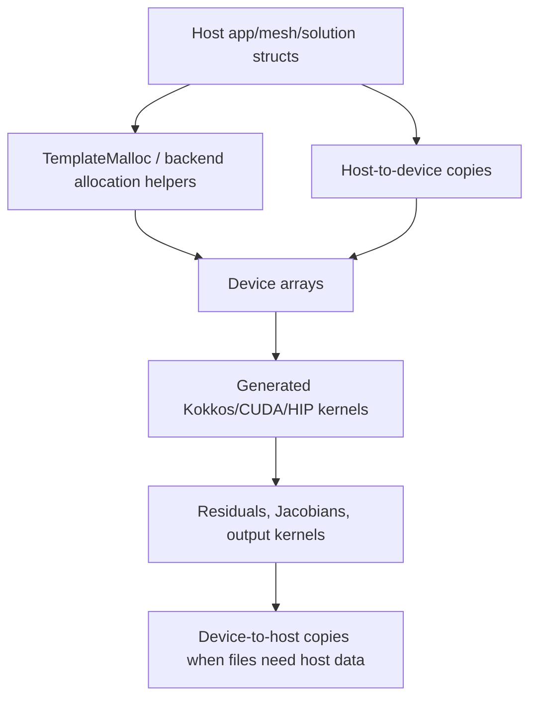

# GPU Implementation

Exasim supports GPU execution through CUDA and HIP builds, with Kokkos used
for performance-portable kernels and device execution support. GPU behavior
must remain consistent with CPU behavior across generated providers,
standalone apps, MPI runs, postprocessing, and parameter sweeps.

## Build-Time Selection

GPU backends are selected by CMake options and compile definitions. Common
runtime macros include:

| Macro | Meaning |
| --- | --- |
| `_CUDA` | CUDA backend is enabled. |
| `_HIP` | HIP backend is enabled. |
| `KOKKOS_DEPENDENCE` | Kokkos-dependent kernels and headers are active. |
| `_MPI` | MPI execution is enabled; may be combined with CUDA or HIP. |

Generated apps should link the correct Exasim imported targets rather than
manually guessing GPU libraries.

## GPU Runtime Flow



## Memory Ownership

Use existing backend allocation and copy helpers. They encode backend-specific
behavior and keep CPU/GPU code paths aligned.

| Pattern | Guidance |
| --- | --- |
| Runtime arrays | Allocate through backend helpers, not direct `malloc` in GPU-sensitive code. |
| Parameters updated between cases | Copy host updates to device before kernels run. |
| Temporary arrays | Reuse existing `tempstruct`, `resstruct`, or `sysstruct` storage when safe. |
| Output arrays | Copy back only data required for file I/O or host-side postprocessing. |

## Generated Kernels

Generated model functions may be called on device. Keep provider signatures
and data layout stable. Avoid adding host-only dependencies to generated
kernels or ABI callbacks.

When modifying model callbacks, verify:

1. CPU provider compiles.
2. CUDA provider compiles.
3. HIP provider compiles.
4. MPI+GPU link line uses the intended imported targets.
5. Device copies are refreshed after any runtime update.

## Parameter Sweeps on GPU

Parameter sweeps are a common stale-memory risk. For each case:

1. The host-side active physics parameter vector is updated.
2. `app.physicsparam` is updated.
3. The device-side parameter array is refreshed before model kernels run.
4. The output path is changed before files are written.

Do not rely on rebuilding models for every case if only runtime parameters
changed. That creates unnecessary work and hides missing device-copy bugs.

## GPU and MPI

MPI+GPU builds combine rank-local domain decomposition with device-resident
kernel execution. Communication paths may require host-visible buffers
depending on the MPI implementation and backend. When changing solver vectors
or halo exchange, check both CPU MPI and GPU MPI builds.

## Performance Considerations

GPU changes should consider:

- Global memory traffic and coalescing.
- Kernel launch count.
- Temporary allocation frequency.
- Host-device synchronization.
- Register pressure in generated kernels.
- Reuse of batched dense linear algebra.

Correctness has priority over performance, but avoid changes that force
unnecessary host-device copies in inner Newton/GMRES loops.

## Validation Checklist

For GPU-sensitive changes:

```bash
cmake -S Exasim -B Exasim-build-cuda -DEXASIM_CUDA=ON
cmake --build Exasim-build-cuda -j8

cmake -S Exasim -B Exasim-build-hip -DEXASIM_HIP=ON
cmake --build Exasim-build-hip -j8
```

Use the platform-appropriate commands and architecture flags. Compare CPU and
GPU outputs with numerical tolerances rather than raw byte equality.

## Common Bugs

| Symptom | Likely cause |
| --- | --- |
| First sweep case correct, later cases wrong | Device physics parameters not refreshed. |
| CPU works, GPU compile fails | Host-only function or include added to generated kernel path. |
| HIP link uses wrong compiler | CMake target not propagating HIP language/link options. |
| GPU postprocess crashes | Postprocess-only allocation skipped a buffer needed by output kernels. |

## Related Pages

- [Backend](backend.md)
- [Runtime](runtime.md)
- [MPI implementation](mpi-implementation.md)
- [GPU computing theory](../theory/gpu-computing.md)
