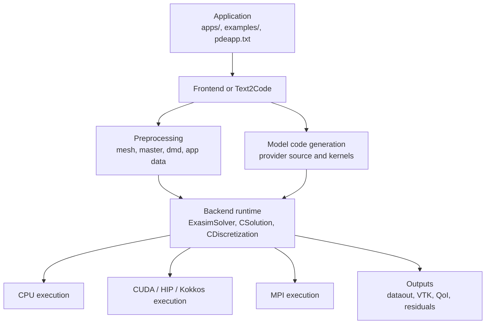

# Internals

The Internals section is the implementation guide for contributors,
advanced users, maintainers, and AI coding assistants working on Exasim
itself. It explains how the repository is organized, how frontends and
Text2Code produce solver inputs, how generated model code is connected to
the backend runtime, and how CPU, GPU, and MPI execution paths are
validated.

This section intentionally focuses on implementation details. User-facing
setup instructions belong in [Installation](../install/index.md), PDE
formulation concepts belong in [Physics Models](../physics-models/index.md),
and numerical-method derivations belong in [Theory](../theory/index.md).

## Intended Audience

| Audience | Use this section to |
| --- | --- |
| Contributors | Find where to implement features, run tests, and update docs. |
| Advanced users | Understand generated files, runtime data flow, and package layout. |
| Maintainers | Review architecture, CI expectations, and validation strategy. |
| AI coding agents | Inspect the correct layers before making minimal, safe changes. |

## Architecture at a Glance

The key implementation idea is separation of concerns:

- Frontends and Text2Code describe applications and write runtime inputs.
- Generated or built-in model providers supply physics callbacks through a
  common ABI.
- The backend runtime owns discretization, solvers, preconditioning,
  postprocessing, GPU memory, and MPI communication.
- Application modes choose which provider is linked, not a different solver.

## Internals Map

| Page | What it covers |
| --- | --- |
| [Architecture](architecture.md) | Design philosophy, major layers, provider model, and data flow. |
| [Repository structure](repository-structure.md) | What each top-level directory owns. |
| [Code generation](code-generation.md) | Frontend, Text2Code, exportapp, and generated C++ application flow. |
| [Frontends](frontends.md) | MATLAB, Python, and Julia implementation responsibilities. |
| [Backend](backend.md) | Runtime classes, structs, solver components, and model ABI. |
| [Runtime](runtime.md) | Startup, solve, postprocess, and parameter-sweep execution. |
| [GPU implementation](gpu-implementation.md) | CUDA/HIP/Kokkos build paths and memory ownership rules. |
| [MPI implementation](mpi-implementation.md) | Domain decomposition, communicators, rank-local data, and output. |
| [Testing](testing.md) | Local tests, frontend tests, consumer tests, and documentation checks. |
| [Baselines](baselines.md) | Numerical baselines and comparison policy. |
| [Known divergences](known-divergences.md) | How to track expected and unexpected numerical differences. |
| [Development workflow](development-workflow.md) | Contributor workflow and AI-assisted development guidance. |
| [Coding guidelines](coding-guidelines.md) | Minimal-change, GPU-aware, MPI-aware coding rules. |
| [MATLAB → C++ utilities](matlab-to-cpp-utilities.md) | Tracker for porting MATLAB solution-maneuvering utilities to the backend. |
| [CI and validation](ci-and-validation.md) | Current GitHub Actions workflows and local equivalents. |
| [References](references.md) | Source files and related documentation entry points. |

## Contributor Rule of Thumb

Before changing code, identify the layer that owns the behavior:

| Symptom or feature | Start here |
| --- | --- |
| `pde` field not written correctly | Frontend preprocessing and writeapp paths. |
| `pdeapp.txt` keyword not parsed | Text2Code and C++ preprocessing parsers. |
| Generated app does not compile | CMake frontend-app templates and provider headers. |
| Solver produces wrong residuals | Backend discretization, generated model provider, and driver ABI. |
| GPU uses stale data | Backend host/device copies and model initialization. |
| MPI output differs from serial | DMD, partition ownership, halo communication, and rank-local output. |
| Postprocessing truncates or misses files | Runtime execution mode, `CSolution`, and output routines. |

## See Also

- [Quickstart](../getting-started/quickstart.md)
- [Frontends](../frontends/index.md)
- [Application Modes](../usage-modes/index.md)
- [Text2Code Applications](../text2code-applications/index.md)
- [Physics Models](../physics-models/index.md)
- [Theory](../theory/index.md)
- [Using AI Tools](../using-ai-tools/index.md)
