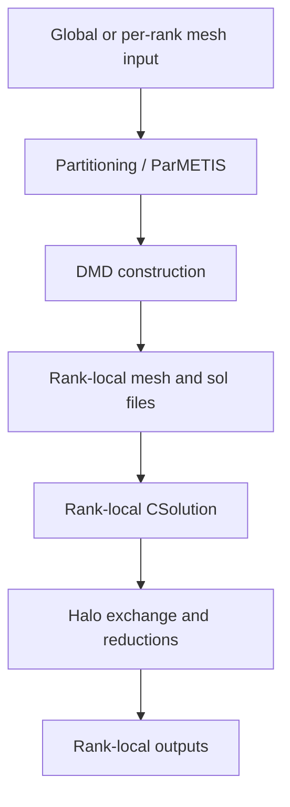

# MPI Implementation

MPI support is based on rank-local mesh partitions, DMD metadata, rank-local
input/output files, and explicit communication in preprocessing and runtime
solver paths.

## MPI Runtime Overview



## Communicators

`ExasimSolver` initializes MPI state and stores communicator metadata. Common
concepts include:

| Concept | Meaning |
| --- | --- |
| Global rank | Rank in the full solve communicator. |
| Shared-memory rank | Rank local to a node or shared-memory communicator. |
| `EXASIM_COMM_WORLD` | Runtime communicator used by Exasim. |
| `EXASIM_COMM_LOCAL` | Local communicator used for node-local grouping. |

Changes to MPI initialization must preserve correct Kokkos and file-I/O
ordering.

## Domain Decomposition

Domain decomposition is built in C++ preprocessing, especially under
`backend/Preprocessing/`. DMD data describes:

- Local owned elements.
- Neighboring ranks.
- Send and receive element lists.
- Boundary and interface metadata.
- Rank-local indexing required by runtime kernels.

ParMETIS support is used when available for load-balanced partitioning.

## Rank-Local Files

MPI runs write and read rank-local files. Common file names include suffixes
such as `_np0.bin`, `_np1.bin`, and so on. The output path must be consistent
across ranks, while each rank writes only its own data.

When adding output files:

1. Include the rank suffix when the data is rank-local.
2. Use barriers or rank-ordered writes when a shared file is produced.
3. Avoid multiple ranks writing the same file unless the routine is explicitly
   collective-safe.

## Runtime Communication

Runtime communication appears in solver vectors, halo updates, reductions,
and coupled-interface paths. The exact communication pattern depends on LDG,
HDG, preconditioner choice, and output operation.

| Area | Typical MPI concern |
| --- | --- |
| Discretization | Ghost/owned element distinction and face-neighbor data. |
| Solver vectors | Send/receive buffers and global norms. |
| Preconditioning | Local versus overlapped domains and reductions. |
| QoI/output | Avoid double-counting ghost elements. |
| Postprocessing | Read the correct rank-local saved records. |

Numerical derivations belong in [Theory](../theory/index.md); this page
focuses on implementation boundaries.

## MPI and Parameter Sweeps

For standalone parameter sweeps, all ranks must agree on:

- Number of cases.
- Active case index.
- Active physics parameter vector.
- Case-specific output directory.

The sweep manifest and per-case metadata should be produced consistently
without rank races.

## Common MPI Bugs

| Symptom | Likely cause |
| --- | --- |
| Serial passes, MPI residual differs strongly | Ghost elements included where owned-only data is expected. |
| Some ranks missing output files | Rank-local path or suffix logic is wrong. |
| MPI hangs at shutdown | Communicator mismatch or missing collective call. |
| Periodic MPI differs from serial | Periodic node IDs, face matching, or DMD neighbor metadata incorrect. |
| QoI too large in MPI | Owned+ghost elements are both being integrated. |

## Validation Checklist

```bash
mpirun -np 2 build/exasimapp datain/ dataout/out
mpirun -np 4 build/exasimapp datain/ dataout/out
```

For numerical validation, prefer partition-invariant checks such as QoI
comparisons or element-ID-based solution comparisons. Raw output ordering may
differ by rank count and partitioning.

## Related Pages

- [Backend](backend.md)
- [Runtime](runtime.md)
- [Known divergences](known-divergences.md)
- [Parallel computing theory](../theory/parallel-computing.md)
