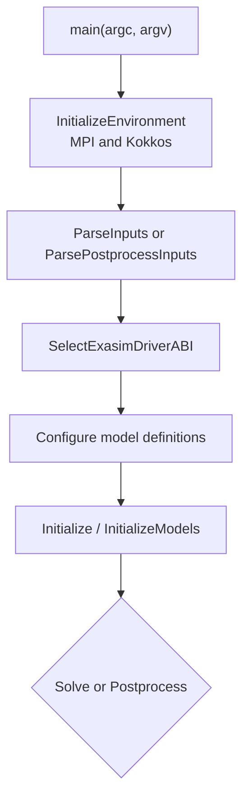
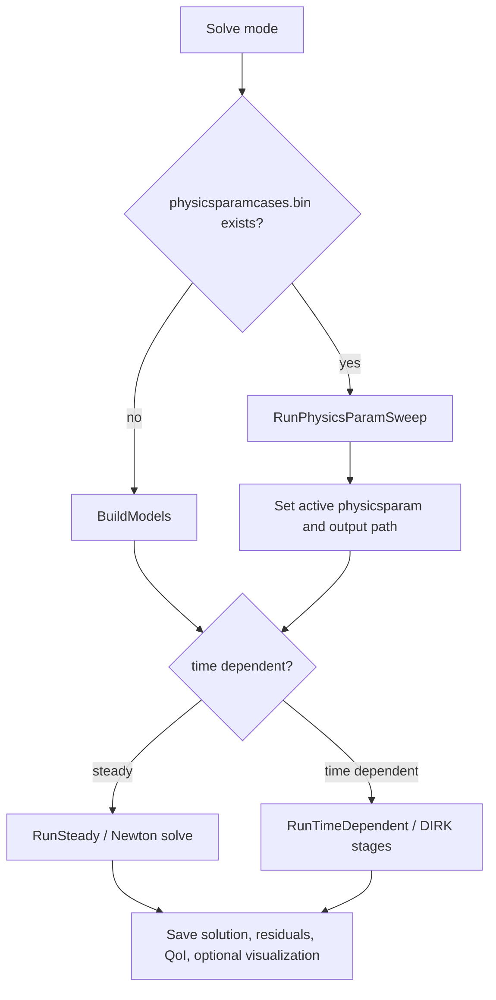
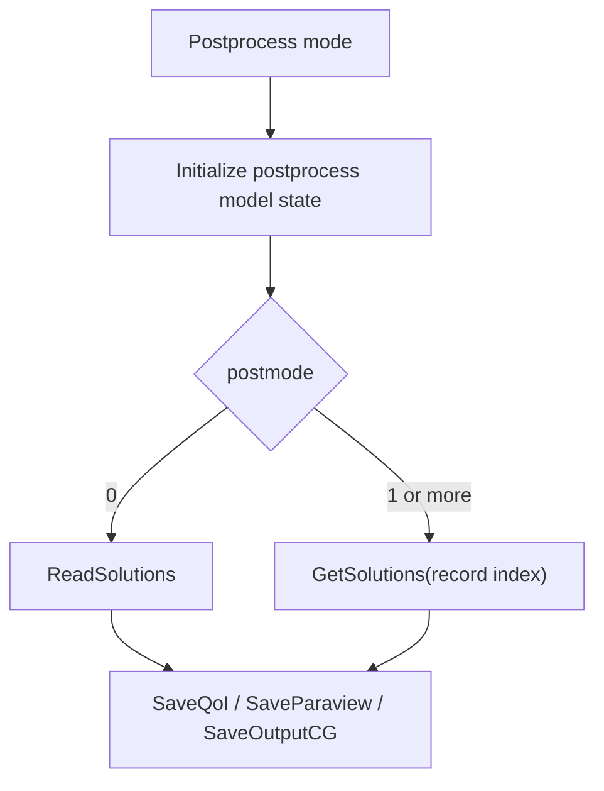

# Runtime Architecture

The runtime starts in a generated or hand-written C++ executable and ends in
backend solver classes. The central object is `ExasimSolver`.

## Entry Points

Common executable entry points include:

| Entry point | Typical source |
| --- | --- |
| Generated frontend app | `cmake/frontend-app/*.in` templates. |
| Text2Code app | App source generated from `pdeapp.txt`/`pdemodel.txt`. |
| Built-in library app | `apps/builtinlibrary/exasimapp.cpp`. |
| Shared-library app | `apps/sharedlibrary/exasimsharedapp.cpp`. |
| Standalone postprocessor | `backend/Postprocessing/exasim_postprocess.cpp`. |

Most paths include `ExasimSolverSetup.hpp` and call a helper such as
`RunExasimSolver`.

## Initialization Flow

The runtime initializes MPI and Kokkos once, configures model providers,
loads runtime input files, and constructs model-specific `CSolution`
instances.

## Solve Flow

Parameter sweeps are runtime-controlled. When a sweep file is present, the
standalone executable loops over cases without regeneration or recompilation.
The active physics parameter vector must update both host and device copies
before each case runs.

## Postprocess Flow

Postprocess mode reads saved solution records and writes derived output. It
should not run the nonlinear solver or truncate saved solution files.

## Execution Modes

Runtime mode is selected by command-line arguments and serialized frontend
settings. The frontend field `pde.executionmode` controls whether generated
executables are launched for normal solve behavior or postprocessing. The C++
runtime also accepts explicit solve/postprocess command modes in standalone
apps.

| Mode | Runtime behavior |
| --- | --- |
| Solve | Build models, initialize solution, solve, and write solver outputs. |
| Postprocess | Read saved solution records and write postprocessing outputs. |

Output-control flags such as `saveParaview` belong in runtime structs so
they survive standalone execution.

## Time-Dependent Solve

For time-dependent problems, `CSolution` advances stages and steps using the
configured temporal scheme. At each stage the solver updates source terms,
assembles residuals or linear systems, runs Newton/GMRES as needed, and then
updates the solution. Saved solution and postprocessing output frequency are
controlled by runtime fields such as `saveSolFreq`.

Detailed numerical theory belongs in
[Temporal discretization](../theory/temporal-discretization.md).

## Steady and Pseudo-Time Solve

Steady solves run Newton/GMRES until convergence or configured iteration
limits. Pseudo-time continuation paths use the same backend classes but
different runtime flags and update strategy.

## Runtime Output Paths

`common.filein` and `common.fileout` determine input and output roots.
Parameter sweeps append deterministic case directories such as
`paramcase_0001/`. MPI ranks write rank-local files, usually with `_np<rank>`
suffixes.

## Finalization

The runtime closes output streams and finalizes Kokkos and MPI only after all
models and cases are complete. Avoid early returns that skip finalization in
error paths.

## Debugging Runtime Issues

| Symptom | Check |
| --- | --- |
| App starts but uses wrong provider | Compile macros and `SelectExasimDriverABI`. |
| Postprocess produces empty output | `executionmode`, `postmode`, saved solution records, and output flags. |
| Sweep second case uses first case parameters | Host/device physics parameter refresh. |
| MPI ranks clobber files | Rank-local output path and file suffix logic. |
| GPU crash after parameter update | Device allocation and copy path for modified runtime arrays. |

## Related Pages

- [Backend](backend.md)
- [Code generation](code-generation.md)
- [GPU implementation](gpu-implementation.md)
- [MPI implementation](mpi-implementation.md)
