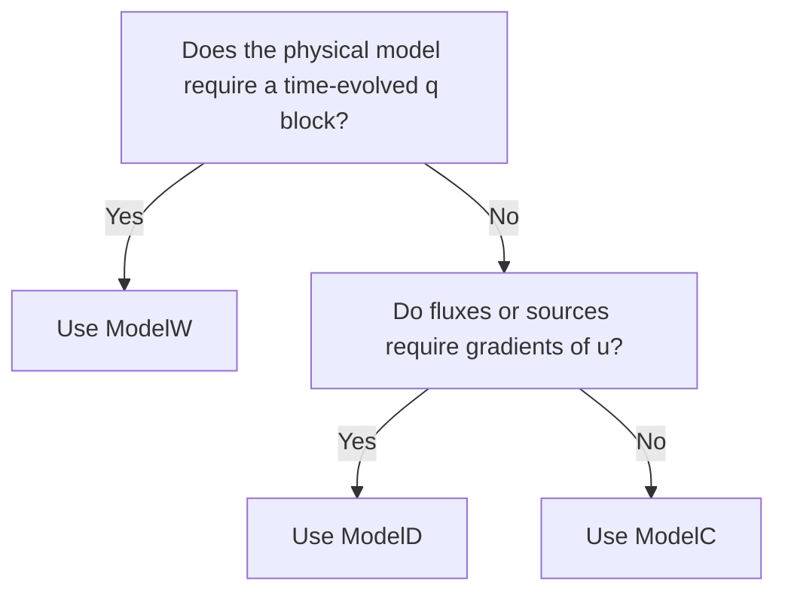

# Comparing ModelC, ModelD, And ModelW

Selecting the correct model type is one of the most important formulation
choices in Exasim. It controls the packed solution layout, the meaning of `q`,
and which initialization data are required.

| Feature | `ModelC` | `ModelD` | `ModelW` |
| --- | --- | --- | --- |
| `q` variable | No | Yes | Yes |
| Auxiliary PDE | None | \(q+\nabla u=0\) | \(\partial q/\partial t+\nabla u=0\) |
| Diffusion support | Indirect / user-defined | Natural | Possible but not the primary purpose |
| Wave propagation | Limited | Possible through reformulation | Primary use |
| Time evolution of `q` | No | No | Yes |
| Primary application | Convection / first-order systems | Diffusion / mixed systems | Wave systems |
| Preprocessing state size | `nc = ncu` | `nc = ncu * (nd + 1)` | `nc = ncu * (nd + 1)` |
| Backend flags | `wave = 0` | `wave = 0` | `wave = 1`, `tdep = 1` |

## Decision Tree

## Practical Guidance

- Start with `ModelC` for pure transport or inviscid conservation laws.
- Move to `ModelD` when gradients, diffusion, viscosity, conductivity, or HDG
  mixed variables are needed.
- Use `ModelW` only when the auxiliary block is physically time evolved.
- Add `w`, `v`, EOS, and AV only when the physics requires those extensions.
