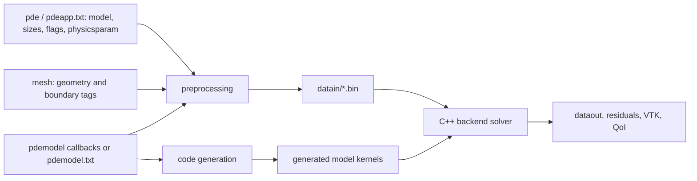

# Physics Models

This section is the conceptual and implementation reference for representing
PDE systems in Exasim. It explains the three primary model classes, the
optional closure and auxiliary mechanisms around them, and how those concepts
map to frontend callbacks, Text2Code functions, and generated C++ model
methods.

Exasim decomposes a PDE model into these pieces:

| Symbol / object | Meaning in Exasim |
| --- | --- |
| \(x\) | Spatial coordinates. |
| \(t\) | Time. |
| \(u\) | Primary solution variables, with `ncu` components. |
| \(q\) | Auxiliary PDE variables packed after `u` for `ModelD` and `ModelW`. |
| \(w\) | Auxiliary state variables stored in `wdg`, sized by `initw` / `Initw`. |
| \(v\) | External or auxiliary nodal variables stored in `odg`, sized by `initv` / `Initv`. |
| \(\mu\) | Model parameters from `physicsparam`; Text2Code usually names this vector `mu`. |
| \(F\) | Volume flux from `flux` / `Flux`. |
| \(S\) | Volume source from `source` / `Source`. |
| AV | Artificial-viscosity stabilization data from `avfield` / `Avfield` and AV flags. |

The primary PDE formulation is selected by `pde.model` or the `model` key in
`pdeapp.txt`:

| Model | Purpose | State layout |
| --- | --- | --- |
| [`ModelC`](modelc.md) | Convection and first-order systems. | `uq = u`, `nc = ncu`, `ncq = 0`. |
| [`ModelD`](modeld.md) | Diffusion, mixed, and gradient-dependent systems. | `uq = [u, q]`, `nc = ncu * (nd + 1)`. |
| [`ModelW`](modelw.md) | Wave-propagation systems. | `uq = [u, q]`, `tdep = 1`, `wave = 1`. |

Optional extensions are documented separately because they are not separate
primary model classes:

- [Auxiliary equations through `w`](auxiliary-equations.md).
- [Equations of state](equations-of-state.md).
- [External variables through `v`](external-variables.md).
- [Artificial viscosity](artificial-viscosity.md).
- [Multiphysics problems](multiphysics.md).
- [Multi-model problems](multi-model.md).

## Component Interaction

The model callbacks are local functions evaluated at element, face, or
initialization points. They do not own the mesh or solver state.

## Source-Verified Naming

The same physics concepts have different names at different API layers:

| Concept | MATLAB/Python/Julia callback | Text2Code function | C++ model contract |
| --- | --- | --- | --- |
| Volume flux | `flux` | `Flux` | `flux` |
| Volume source | `source` | `Source` | `source` |
| Time derivative / mass | `mass` | `Tdfunc` | `tdfunc` |
| Boundary state | `ubou` | `Ubou` | `ubou` |
| LDG boundary flux | `fbou` | `Fbou` | `fbou` |
| HDG boundary flux | `fbouhdg` | `FbouHdg` | `fbou_hdg` |
| Auxiliary `w` source | `sourcew` | `Sourcew` | `sourcew` |
| Equation of state | `eos` | `EoS` | `eos` |
| Initial `u` | `initu` | `Initu` | `initu` |
| Initial `q` / packed `u,q` | `initq` | `Initq` / `Inituq` | `initq` / `initudg` |
| Initial `w` | `initw` | `Initw` / `Initwdg` | `initwdg` |
| Initial `v` | `initv` | `Initv` / `Initodg` | `initodg` |
| Artificial viscosity field | `avfield` | `Avfield` | `avfield` |
| Interface fluxes | `fint`, `fext` | `Fint`, `Fext` | coupling interface methods |

Text2Code requires `Flux`, `Source`, `Tdfunc`, `Ubou`, `Fbou`, and `FbouHdg`
in default `exasim` mode. Optional functions are emitted when listed in the
`outputs` declaration; otherwise Text2Code generates empty/default stubs where
supported.

## Choosing A Model

| Question | Recommended choice |
| --- | --- |
| Does the PDE need only first-order fluxes in `u`? | `ModelC`. |
| Do fluxes depend on gradients, viscosity, diffusion, or mixed variables? | `ModelD`. |
| Is the gradient-like block itself time evolved for a wave system? | `ModelW`. |
| Do you need chemistry, turbulence variables, or material internal state? | Add `w` through `initw` and `sourcew`. |
| Do you need prescribed or externally coupled nodal fields? | Add `v` through `initv` or mesh-provided `odg`/`vdg`. |
| Do you need pressure, temperature, transport, or closure values? | Add an `eos` / `EoS` callback. |
| Do you need shock regularization? | Use AV flags and/or `avfield`, then include the AV field in the flux. |

## Current Implementation Limits

- `ModelC`, `ModelD`, and `ModelW` are implemented sizing and solver-mode
  choices, not complete physics libraries by themselves.
- EOS, AV, auxiliary equations, and coupling are callback mechanisms. Exasim
  provides hooks and examples; the model author supplies the physics.
- Multiphysics and multi-model workflows are supported by packing variables,
  using auxiliary/external fields, and configuring multiple model definitions.
  The coupling law and update strategy remain application-specific.

## See Also

- [pdemodel abstraction](../frontends/pdemodel.md)
- [Text2Code `pdemodel.txt` guide](../text2code-applications/pdemodel.md)
- [pdeapp.txt field reference](../reference/pdeapp.md)
- [Model contract](../reference/model-contract.md)
- [Worked examples](examples.md)
