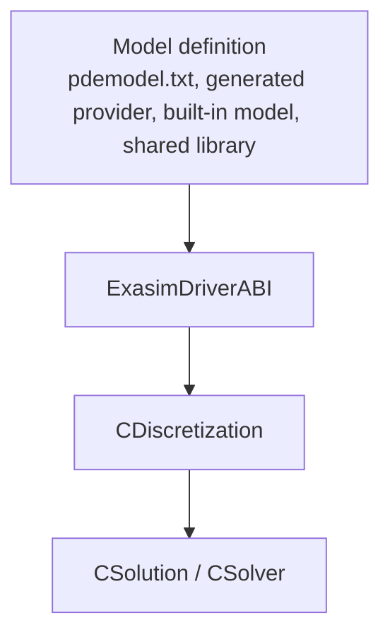

# Model Contract

The model contract is the interface between user-defined physics and Exasim's
runtime. A model can be generated by Text2Code, generated by a frontend,
provided by the built-in library, loaded through a shared library, or written
directly in C++.

All paths ultimately provide model callbacks through `ExasimDriverABI` or
through the templated `ModelDefaults`-style C++ contract.

## Runtime Contract Overview

## Data Layout

Backend driver functions use flattened arrays:

| Runtime symbol | Meaning | Typical shape |
| --- | --- | --- |
| `xdg` | Coordinates at points | `ng * ncx` |
| `udg` | Solution and gradient/auxiliary state | `ng * nc` |
| `odg` | External/other-DG field `v` | `ng * nco` |
| `wdg` | Auxiliary state `w` | `ng * ncw` |
| `uhg` | HDG trace state on faces | `ng * ncu` |
| `nlg` | Face normal | `ng * nd` |
| `tau` | Stabilization parameters | implementation-dependent length |
| `uinf` | Reference/free-stream values | model-dependent length |
| `param` | Physics parameters `mu` | `nparam` |

At each point, generated kernels gather local arrays and call the model
function. Output arrays are written back in the same point-major loop used by
the generated provider.

## ABI Function Families

`include/driver_abi.hpp` defines the low-level provider ABI. Major function
families include:

| ABI family | Examples | Purpose |
| --- | --- | --- |
| Element value functions | `KokkosFlux`, `KokkosSource`, `KokkosTdfunc` | Volume point evaluations. |
| Element global functions | `KokkosSourcew`, `KokkosAvfield`, `KokkosEoS` | Element fields that need element/node context. |
| Boundary functions | `KokkosFbou`, `KokkosUbou`, `KokkosQoIboundary` | Face/boundary evaluations with boundary ID. |
| Boundary Jacobians | `KokkosFbouJac`, `KokkosUbouJac` | Boundary derivative callbacks. |
| Coupled-face functions | `KokkosFhat`, `KokkosUhat`, `KokkosStab` | Coupled/interface numerical flux hooks. |
| Initial-condition functions | `KokkosInitu`, `KokkosInitq`, `KokkosInitudg`, `KokkosInitwdg`, `KokkosInitodg` | Initial solution fields. |
| HDG Jacobians | `HdgFlux`, `HdgSource`, `HdgFbou`, `HdgEoS` | Matrix-based HDG residual/Jacobian assembly. |

## Templated C++ Model Defaults

`include/modeldefaults.hpp` provides `ModelDefaults<Self>` for templated model
authors. It supplies zero or identity defaults for many optional functions so
models can override only what they use.

Required compile-time fields for direct C++ model use include:

| Field | Meaning |
| --- | --- |
| `nd` | Spatial dimension. |
| `ncu` | Number of primary unknowns. |
| `ncw` | Number of auxiliary `w` variables. |
| `nparam` | Number of physics parameters. |
| `nco` | Number of `v`/`odg` variables; default `0` in `ModelDefaults`. |
| `ntau` | Number of stabilization entries; default `1` in `ModelDefaults`. |

## Required Versus Optional Functions

For Text2Code `codeformat exasim`, these outputs are required:

- `Flux`
- `Source`
- `Tdfunc`
- `Ubou`
- `Fbou`
- `FbouHdg`

Generated code creates empty/default implementations for many optional
callbacks when they are not requested. Direct C++ models using
`ModelDefaults` similarly get defaults for optional functions.

For HDG solves, Jacobian callbacks must be correct for Newton to converge. A
zero default may compile but produce a singular or ineffective linearization.

## Shape Conventions

| Quantity | Convention |
| --- | --- |
| `uq` | Packed state. For ModelD/HDG-style models, `uq[0:ncu-1]` is `u`, followed by gradient components. |
| Flux output | Size `ncu * nd`. |
| Source output | Size `ncu`. |
| Boundary output | Size `ncu`. |
| `Sourcew` output | Size `ncw`. |
| `VisScalars` output | Size `nsca`. |
| `VisVectors` output | Size `3 * nvec` in visualization storage, with physical dimension handled by driver. |
| `VisTensors` output | Tensor component count controlled by visualization code. |
| `QoIvolume` output | Size `nvqoi`. |

## Validation

Exasim validates some interface errors early:

- Missing required `pdeapp.txt` keys.
- Missing required `pdemodel.txt` outputs in `exasim` mode.
- Inconsistent `physicsparamcases` row lengths.

Other errors appear during compile or solve:

- Missing provider symbols.
- ABI field not populated.
- Incorrect Jacobians causing Newton/GMRES failure.
- Mismatched output sizes causing memory errors or incorrect fields.

## Implementation Notes for AI Agents

When generating or modifying model code:

1. Preserve exact function names and argument order.
2. Keep `physicsparam` ordering consistent across `pdeapp`, model code, and
   documentation.
3. Do not invent boundary-condition IDs; they are application-defined.
4. For HDG, generate value functions and Jacobian functions consistently.
5. Validate with a small solve before changing examples or baselines.

## See Also

- [Model functions](model-functions.md)
- [pdemodel reference](pdemodel.md)
- [Physics Models](../physics-models/index.md)
- [Internals: backend](../internals/backend.md)
