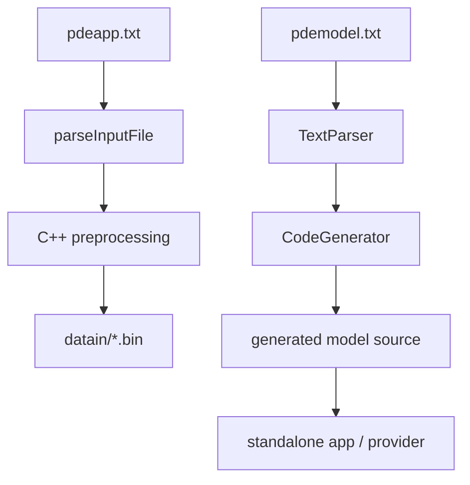

# Text2Code Reference

`text2code` is the installed executable that converts `pdeapp.txt` and
`pdemodel.txt` into Exasim runtime inputs and generated C++ model code.

Use:

```bash
/path/to/exasim-prefix/bin/text2code pdeapp.txt
```

If your install layout places executables under `local/bin`, use:

```bash
/path/to/exasim-prefix/local/bin/text2code pdeapp.txt
```

The exact path depends on the install prefix used with CMake.

## Pipeline



## Input Files

| File | Required | Purpose |
| --- | --- | --- |
| `pdeapp.txt` | Yes | Application settings, mesh path, solver options, parameter sweeps. |
| `pdemodel.txt` | Yes for generated models | Symbolic model functions. |
| `mesh.bin` | Usually yes | Binary mesh input referenced by `meshfile`. |
| Optional field files | No | `xdgfile`, `udgfile`, `vdgfile`, `wdgfile`, `uhatfile`, `partitionfile`. |

## `pdeapp.txt` Format

See [pdeapp reference](pdeapp.md) for the full key table.

Important parser details:

- Required keys are checked explicitly.
- Lists use `[...]`.
- `physicsparamcases` is parsed as a matrix.
- Scalar floating fields must include `.` or `e`.
- Unknown scalar keys can be parsed into generic maps, but only recognized keys
  are transferred into the `PDE` struct.

## `pdemodel.txt` Format

See [pdemodel reference](pdemodel.md) for declarations and function syntax.

Text2Code requires these outputs in default `exasim` mode:

```text
outputs Flux, Source, Tdfunc, Ubou, Fbou, FbouHdg
```

Most practical models also define one or more initial-condition functions such
as `Initu`, `Inituq`, `Initw`, or `Initv`.

## Generated Outputs

Depending on `pdeapp.txt` options, Text2Code may produce:

| Output | Controlled by | Meaning |
| --- | --- | --- |
| `datain/` | `gendatain = 1` | Runtime binary input bundle. |
| Generated C++ model files | `gencode = 1` | Provider/model source code. |
| `physicsparamcases.bin` | `physicsparamcases` present | Standalone parameter-sweep cases. |
| Mesh/solution binaries | `writemeshsol = 1` | Runtime mesh and initial solution files. |

## Minimal Command Sequence

```bash
cd apps/navierstokes/naca0012steady
/path/to/exasim-prefix/bin/text2code pdeapp.txt
cmake -S . -B build -DExasim_DIR=/path/to/exasim-prefix
cmake --build build -j
build/exasimapp datain/ dataout/out
```

If the package config is installed under a standard CMake prefix, passing the
install prefix through `Exasim_DIR` or `CMAKE_PREFIX_PATH` may not be needed.

## Standalone header-only app (`--emit-app`)

```bash
/path/to/exasim-prefix/bin/text2code pdeapp.txt --emit-app myapp --app-name myapp --model-id 100
```

Writes a self-contained, C++-driven app into `myapp/`:

| File | Purpose |
| --- | --- |
| `myapp.cc` | Driver: builds `CSolution<PdeModel>` from `datain/` and solves via `exasim::petsc::solve_steady`. |
| `generated/my_model.hpp` | The concrete templated model (also `model_sizes.hpp`). |
| `CMakeLists.txt`, `build.sh` | Build against a petsc-enabled Exasim install. |
| `README.md` | Build/run instructions. |

The app has **no** runtime-loaded `.so` model ABI and **no** hand-rolled PETSc
solver code — the whole solve lives in `<exasim/petsc.hpp>`.

> **HDG-only (current limitation).** The generated app solves through the exported HDG
> PETSc operator (`exasim::petsc::solve_steady`, the condensed trace system), so it
> requires HDG preprocessing: set `discretization = "hdg"` (`hybrid = 1`) in `pdeapp.txt`.
> `text2code --emit-app` **refuses** an LDG-configured model (with a clear message) unless
> `--allow-ldg` is passed, and `solve_steady` raises on a non-HDG problem at runtime. For
> LDG, use the existing frontend / `ExasimSolver` runtime path (or `exportapp`) instead.
> The scaffold is also **CPU/PETSc-only** for now — no GPU (CUDA/HIP) backend is generated.

Build + run:

```bash
EXASIM_INSTALL=/path/to/petsc-enabled-exasim ./myapp/build.sh
mpirun -np 1 myapp/build/myapp datain/ dataout/out
```

The same scaffold is available from the Python codegen: `python -m pyt2c pdemodel.txt
--emit-app myapp` (and `--from-header generated/my_model.hpp` to scaffold from an
existing model header with no `.txt` input).

## Parameter Sweeps

When `physicsparamcases` is present, Text2Code writes the shared sweep file
used by standalone C++ apps. The generated executable runs all cases without
rerunning Text2Code or recompiling.

See [Parameter sweeps](parameter-sweeps.md).

## AI-Assisted Text2Code Authoring

When using Codex, Claude, Copilot, ChatGPT, or similar tools to generate
Text2Code inputs, provide:

- The target model type (`ModelC`, `ModelD`, or `ModelW`).
- Exact state ordering.
- `physicsparam` ordering.
- Boundary IDs and geometry.
- Required outputs and visualization/QoI fields.
- A nearby working example path.

Then validate by running Text2Code, compiling the app, and running a small
case. See [Using AI Tools](../using-ai-tools/index.md).

## Common Errors

| Error | Cause | Fix |
| --- | --- | --- |
| Missing required key | `pdeapp.txt` lacks a required parser key. | Add the key listed in the error. |
| Missing required model output | `pdemodel.txt` omits one of the six core outputs. | Add the function and list it in `outputs`. |
| `std::stod` parse failure | Malformed numeric list or expression. | Check brackets, commas, semicolons, and `repeat(...)`. |
| Sweep row mismatch | `physicsparamcases` row width differs from `physicsparam`. | Make every row the same length. |
| Generated app link error | Wrong Exasim package or backend variant. | Check `find_package(Exasim)` and linked targets. |
