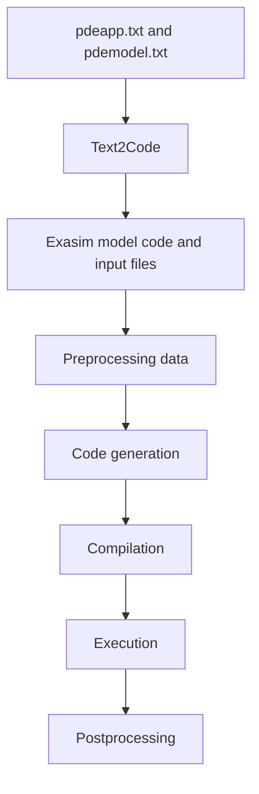

# Text2Code Applications

Text2Code lets users describe an Exasim PDE application with plain text files
and generate the backend inputs and model kernels needed to run a solver. The
two primary files are:

- `pdeapp.txt`: application, mesh, discretization, solver, runtime, and output
  configuration.
- `pdemodel.txt`: symbolic PDE model definitions such as fluxes, source terms,
  boundary terms, initial conditions, visualization fields, and QoI integrands.

Use Text2Code when you want a frontend-free workflow, a reproducible text input
deck, or a compact application description that can be moved to an HPC system
without MATLAB, Python, or Julia.

## Workflow



In practice, `/path/to/exasim-prefix/local/bin/text2code pdeapp.txt` parses both
text files, builds mesh/master and decomposition data, optionally generates
model C++ kernels, and writes the binary `datain/` bundle used by Exasim
applications.

## When To Use Text2Code

Text2Code is useful when:

- you want all PDE and solver configuration in version-controlled text files;
- you want to run on a cluster without installing frontend languages;
- you want a reproducible app input deck for regression testing;
- you need to generate a built-in or external model from symbolic equations;
- you want parameter sweeps controlled by runtime input files.

Interactive MATLAB, Python, and Julia workflows remain the better choice when
you need exploratory scripting, frontend mesh utilities, or rapid plotting.

## Section Roadmap

- [pdeapp.txt guide](pdeapp.md): how to configure applications, solvers,
  execution modes, sweeps, outputs, and HPC settings.
- [pdemodel.txt guide](pdemodel.md): how to write symbolic PDE models,
  callbacks, variables, and generated outputs.
- [PDE modeling guide](modeling-guide.md): practical model-building examples.
- [Application setup guide](application-setup.md): steady, transient, MPI, GPU,
  parameter sweep, restart, and postprocessing configurations.
- [Workflow and troubleshooting](workflow.md): how to run `text2code`, inspect
  generated artifacts, and debug common failures.
- [Advanced topics](advanced.md): multiphysics, parameterized models, HPC
  workflows, coupling, and language extension guidance.
- [Reference gateway](reference.md): links to complete keyword and grammar
  references.

## Minimal Example

From a source tree with Exasim installed under `/path/to/exasim-prefix`, a
complete Text2Code-generated app workflow is:

```bash
cd apps/navierstokes/naca0012steady
/path/to/exasim-prefix/local/bin/text2code pdeapp.txt
cmake -S . -B build -DExasim_DIR=/path/to/exasim-prefix
cmake --build build -j
build/exasimapp datain/ dataout/out
```

This sequence:

1. reads `pdeapp.txt` and discovers `pdemodel.txt`;
2. writes or updates `datain/`;
3. generates model code when requested by the app file;
4. configures and builds the standalone `exasimapp`;
5. runs the app with `datain/` as input and `dataout/out` as the output prefix.

For a smaller scalar example, use `apps/poisson/poisson2d` with the same command
pattern.

## Relationship To Other Exasim Documentation

- [Frontend preprocessing](../frontends/preprocessing.md) explains the related
  frontend path from `pde`, `mesh`, and `pdemodel` objects to backend files.
- [pdemodel abstraction](../frontends/pdemodel.md) explains the host-language
  equivalent of `pdemodel.txt`.
- [pdeapp.txt fields](../reference/pdeapp.md) is the complete keyword
  reference.
- [pdemodel.txt syntax](../reference/pdemodel.md) is the complete DSL
  reference.
- [Parameter sweeps](../usage-modes/parameter-sweeps.md) covers shared sweep
  output semantics.
- [Postprocessing](../usage-modes/postprocessing.md) covers solve-time and
  standalone postprocessing.

## See Also

- [text2code reference](../reference/text2code.md)
- [External built-in model](../usage-modes/external-builtin.md)
- [CMake targets and options](../reference/cmake.md)
