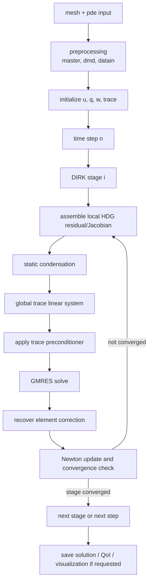
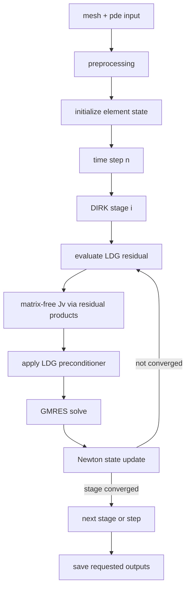

# Worked Algorithmic Flow

This page summarizes how Exasim combines discretization, time integration,
Newton iteration, GMRES, and preconditioning in a full solve.

## Time-Dependent HDG Workflow



Key points:

- The nonlinear unknown for the condensed solve is the trace correction.
- Element unknowns are recovered locally after the trace solve.
- The preconditioner acts on the trace-space linear system.
- Output is controlled by solve/postprocess flags and time-step frequency.

## Steady HDG Workflow

For steady problems, the DIRK stage loop is absent:

```text
preprocess -> initialize -> assemble HDG residual/Jacobian
           -> static condensation -> GMRES + preconditioner
           -> recover element state -> Newton convergence
```

## Time-Dependent LDG Workflow



Key points:

- The Krylov system is over element state unknowns.
- Matrix-vector products generally reuse residual evaluation.
- The full global Jacobian is not stored in the matrix-free path.

## Parameter Sweeps And Warm Starts

For a physics-parameter sweep, the compiled executable can run several cases:

```text
read physicsparamcases -> for each case:
  update physicsparam -> initialize or warm-start -> solve -> write paramcase_XXXX/
```

When warm start is enabled, the first case uses standard initialization and each
later case starts from the previous converged solution. This is a continuation
strategy; it is most reliable when adjacent parameter values are close.

## Postprocessing Workflow

Standalone postprocessing reads saved solution files, reconstructs the fields
needed by visualization/QoI/output callbacks, and writes derived products
without rerunning the full solve.

```text
read datain + saved solution -> reconstruct u/q/w/trace
                             -> evaluate QoI/visualization/output
                             -> write dataout products
```

See [Postprocessing](../usage-modes/postprocessing.md) for user-facing details.
