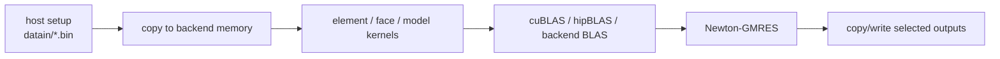

# GPU Computing

Exasim supports GPU execution through installed CUDA and HIP package variants
and generated Kokkos-style model kernels. GPU execution is most effective when
the simulation performs substantial element-local work per byte transferred.

## Execution Model

The backend allocates runtime arrays through backend-aware allocation helpers
and keeps large solution, residual, mesh, and temporary arrays resident on the
active backend when possible. Generated model functions provide Kokkos-prefixed
callbacks such as flux, source, boundary, output, QoI, and visualization kernels.

## CUDA And HIP

The installed Exasim package exports CPU and GPU library variants. CUDA builds
target NVIDIA GPUs; HIP builds target AMD GPUs. The selected executable links to
the matching library target and uses the compiler/runtime for that backend.

## What Should Stay On The GPU

For performance, the following should remain backend-resident during a solve:

- solution arrays (`udg`, `wdg`, `uh`, and related work arrays);
- residual and Krylov vectors;
- element and face geometry data;
- local matrix blocks for HDG;
- preconditioner storage;
- generated model-kernel input/output arrays.

Host-device transfers should occur at setup, output, restart/postprocessing, or
explicit parameter updates, not inside every quadrature or element loop.

## LDG On GPUs

LDG matrix-free GMRES repeatedly evaluates residuals and matrix-vector products.
This is GPU-friendly when residual kernels are sufficiently arithmetic-heavy,
but performance can suffer if residual differencing introduces many small kernel
launches or synchronization points.

## HDG On GPUs

HDG performs more local matrix work and trace-system operations. It can achieve
high arithmetic intensity in local element kernels and dense linear algebra, but
memory use for element matrices and preconditioner blocks must be monitored.

## Performance Guidance

- Increase polynomial order only when the extra arithmetic improves accuracy or
  amortizes memory movement.
- Avoid frequent output in GPU runs; writing requires host-visible data.
- Compare CPU and GPU residual histories for small cases before trusting a new
  GPU model.
- For parameter sweeps, ensure each case updates both host-side and device-side
  physics parameters.
- Use backend-specific profilers such as Nsight Systems/Compute or `rocprof`
  when investigating performance.

## Correctness Guidance

GPU bugs often appear as stale data or backend mismatch rather than arithmetic
errors. Check:

- all case-dependent parameters are copied to device memory;
- initialization callbacks run after parameter updates when required;
- output buffers are copied back before file writes;
- CUDA/HIP executable is linked against the matching Exasim package variant;
- MPI rank-to-GPU mapping is correct on multi-GPU systems.
