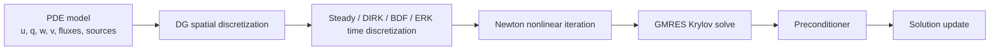

# Theory

This section explains the numerical methods and solver technology behind
Exasim. It connects the mathematical PDE model to the generated C++ backend:
spatial discretization, time integration, nonlinear solution, linear Krylov
solution, preconditioning, MPI parallelism, and GPU execution.

The requested source document `Exasim.tex` was not present in the repository or
attached files when this section was revised. The content here is therefore
grounded in the current Exasim implementation, the existing internal LDG notes,
and the public configuration fields documented in the reference pages.

## Numerical Pipeline

Exasim transforms a user PDE model into a sequence of algebraic problems:

The main choices are:

| Layer | Exasim concept | Main user-facing controls |
| --- | --- | --- |
| PDE model | `ModelC`, `ModelD`, `ModelW`, callbacks, generated kernels | `model`, `modelfile`, `physicsparam` |
| Spatial discretization | LDG or HDG-style DG discretization | `discretization`, `hybrid`, `spatialScheme` |
| Time integration | steady solve, DIRK, BDF, ERK selectors | `tdep`, `temporalscheme`, `torder`, `nstage`, `dt` |
| Nonlinear solve | Newton iteration | `NewtonIter`, `NewtonTol`, `NLiter`, `NLtol` |
| Linear solve | GMRES and related Krylov controls | `GMRESiter`, `GMRESrestart`, `GMREStol` |
| Preconditioning | local, Schwarz, polynomial, reduced-basis controls | `preconditioner`, `ppdegree`, `RBdim` |
| Parallelism | MPI domain decomposition | `mpiprocs`, generated `dmd`, partition files |
| GPU execution | CUDA/HIP/Kokkos backend variants | build options and installed package target |

## How To Use This Section

| Page | Purpose |
| --- | --- |
| [DG methods](dg-methods.md) | Common DG ideas: broken polynomial spaces, numerical fluxes, conservation, and high-order accuracy. |
| [LDG](ldg.md) | LDG formulation used by Exasim, including matrix-free Newton-GMRES. |
| [HDG](hdg.md) | HDG formulation, trace variables, static condensation, and matrix-based trace solves. |
| [Temporal discretization](temporal-discretization.md) | Steady-state and time-dependent workflows, with emphasis on DIRK stage equations. |
| [Nonlinear solvers](nonlinear-solvers.md) | Newton residuals, Jacobians, updates, and convergence controls. |
| [Linear solvers](linear-solvers.md) | GMRES, restarted Krylov methods, and LDG/HDG matrix-vector products. |
| [Preconditioning](preconditioning.md) | Implemented preconditioner families and practical selection guidance. |
| [Parallel computing](parallel-computing.md) | MPI decomposition, communication patterns, and distributed-memory implications. |
| [GPU computing](gpu-computing.md) | CUDA/HIP/Kokkos execution model and memory-movement considerations. |
| [Scalability](scalability.md) | Strong/weak scaling, arithmetic intensity, memory footprint, and practical tradeoffs. |
| [Algorithmic flow](algorithmic-flow.md) | End-to-end HDG and LDG solve workflows. |
| [LDG implementation deep dive](ldg-formulation.md) | Detailed LDG weak form and residual construction. |
| [Block-diagonal Jacobian](block-diagonal-jacobian.md) | Exact element-block Jacobian of the LDG residual path. |
| [References](references.md) | Background literature and implementation references. |

## Relationship To Other Documentation

- Use [Physics Models](../physics-models/index.md) to decide how to represent a
  PDE system in terms of `u`, `q`, `w`, `v`, EOS, AV, and coupling terms.
- Use [Frontend Configuration](../frontends/configuration.md) and
  [pdeapp.txt fields](../reference/pdeapp.md) to set solver options.
- Use [Application Modes](../usage-modes/index.md) to choose a built-in,
  shared-library, frontend, parameter-sweep, or postprocessing workflow.
- Use [Internals](../internals/architecture.md) when debugging backend object
  construction, generated files, and runtime data flow.
