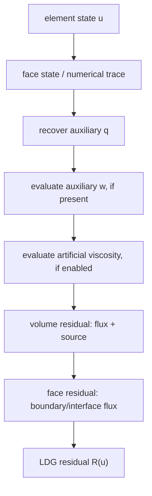

# Local Discontinuous Galerkin

Local Discontinuous Galerkin (LDG) rewrites PDEs with gradients as first-order
systems by introducing an auxiliary gradient-like variable \(q\). With the sign
convention used in the Physics Models documentation, a diffusion-type model is

\[
q + \nabla u = 0,
\]

\[
\frac{\partial u}{\partial t}
+ \nabla \cdot F(u,q,w,v,x,t;\mu)
= S(u,q,w,v,x,t;\mu).
\]

Some internal implementation notes use the opposite sign convention
\(q-\nabla u=0\). The sign is a convention as long as the flux and source
definitions are consistent with the generated model.

## Why LDG Is Useful

LDG keeps the discretization close to the original DG structure:

- \(q\) is recovered from local element and face data.
- The \(u\) residual is assembled from volume fluxes, sources, and face terms.
- Matrix-vector products can be computed without forming the full Jacobian.
- The implementation is well suited to generated residual kernels and GPU
  execution.

## Exasim LDG Residual Path

The detailed residual construction is documented in
[LDG implementation deep dive](ldg-formulation.md). At a high level, an LDG
residual evaluation performs:

The model contract supplies pointwise terms such as `flux`, `source`, `fbou`,
`ubou`, `initu`, `initq`, and optional EOS/AV/visualization callbacks.

## Matrix-Free Newton-GMRES

For nonlinear LDG problems, Exasim solves

\[
R(U)=0
\]

by Newton iteration. The linearized Newton correction satisfies

\[
J(U^k)\Delta U = -R(U^k).
\]

In the LDG path, GMRES uses matrix-vector products

\[
J(U)v \approx \frac{R(U+\epsilon v)-R(U)}{\epsilon},
\]

or derivative-aware paths when enabled by the build. This avoids storing the
full global Jacobian. The user-facing controls include `matvecorder`,
`matvectol`, `GMRESrestart`, `GMRESiter`, `GMREStol`, `preconditioner`,
`ppdegree`, and `RBdim`.

## Block-Diagonal Jacobian

Exasim includes an implementation-level derivation of the exact element-block
LDG Jacobian. This is useful for understanding local preconditioning and the
chain rule through the LDG residual pipeline. See
[Block-diagonal Jacobian](block-diagonal-jacobian.md).

## Advantages And Limitations

| Aspect | LDG behavior |
| --- | --- |
| Global unknowns | Element-local state unknowns are globally iterated. |
| Matrix storage | Full global Jacobian need not be stored for matrix-free GMRES. |
| Memory footprint | Lower matrix memory than assembled methods, but Krylov vectors still scale with state DOFs. |
| Preconditioning | Local and Schwarz-style preconditioners are important for robustness. |
| GPU use | Residual and matrix-vector products are dominated by element and face kernels. |
| Solver iterations | May require more Krylov iterations than a well-preconditioned assembled trace system. |

## When To Choose LDG

Choose LDG when:

- you want matrix-free implicit solves;
- the full state system is manageable;
- residual evaluation is cheap relative to matrix assembly/storage;
- the target backend benefits from repeated local operator evaluations;
- you are developing or debugging a new PDE model and want a direct DG path.

For diffusion-dominated problems with many element interior unknowns, compare
against [HDG](hdg.md), which reduces the globally coupled system to trace
unknowns.
