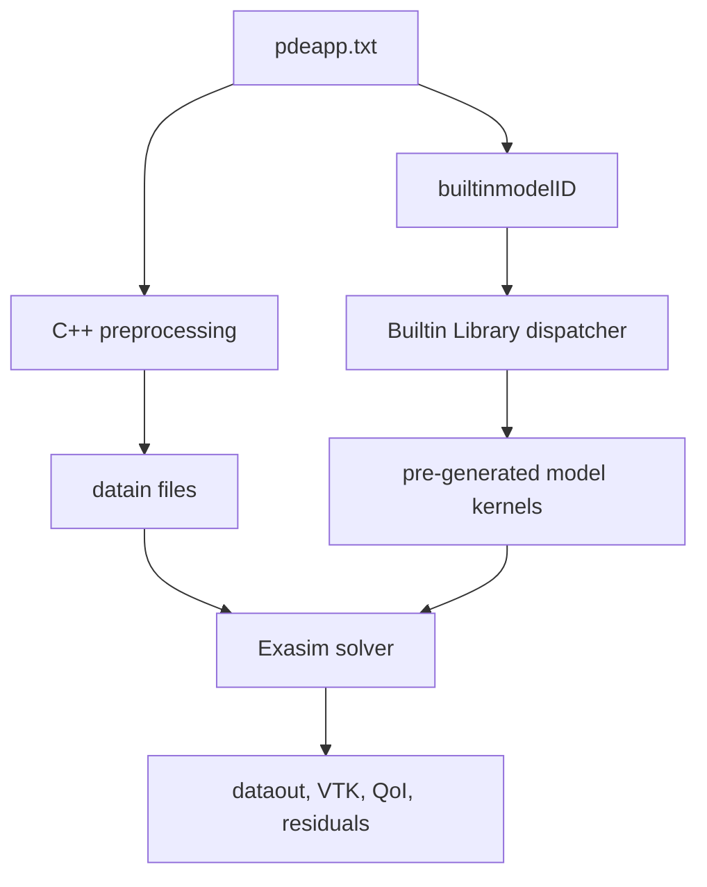

# Builtin Library

The Exasim Builtin Library is the installed library of pre-generated PDE model
kernels. It lets a C++ application select a model by `builtinmodelID` in
`pdeapp.txt` and run without regenerating model kernels at application build
time.

Use this page as the primary guide for selecting, configuring, running, and
extending the Builtin Library.

## Introduction And Motivation

The Builtin Library exists to make common Exasim models available as installed,
compiled code. Instead of writing a new `pdemodel.txt`, generating kernels, and
linking a custom provider, users can select one of the registered built-in model
IDs and focus on mesh, solver, boundary, parameter, and output configuration.

Advantages:

- Faster setup for supported physics.
- No model-code generation at the user application build step.
- Stable ABI through `Exasim::builtinmodel`.
- Reuse of tested model kernels installed with Exasim.
- Portable C++ workflows for clusters where MATLAB, Python, or Julia are not
  available.

Typical use cases:

- Running the checked-in Poisson and Navier-Stokes applications under `apps/`.
- Building C++ consumers that select a known PDE by `builtinmodelID`.
- Running parameter sweeps over `physicsparam` without changing model code.
- Comparing solver, preconditioner, MPI, CPU, GPU, and postprocessing settings
  against a known model implementation.

Use a built-in model when the governing equations, state ordering, boundary
logic, and parameter vector match one of the installed IDs. Create a custom
model when you need a new equation set, different variable ordering, different
boundary physics, geometry-dependent model changes, or new source/closure laws
not already represented by a built-in model.

For the numerical methods used to solve built-in applications, see
[Theory](../theory/index.md), especially [HDG](../theory/hdg.md),
[LDG](../theory/ldg.md), and [Preconditioning](../theory/preconditioning.md).

## Relationship To Text2Code And Preprocessing



The build-time relationship is:

- the Exasim install builds `libbuiltinmodelserial.a`,
  `libbuiltinmodelcuda.a`, or `libbuiltinmodelhip.a`;
- models are registered by `backend/Model/BuiltIn/CMakeLists.txt`;
- each registered model has a namespaced wrapper `exasim_model_<ID>`;
- `builtin_model_registry.h` is generated by CMake and consumed by
  `libbuiltinmodel.cpp`;
- the runtime dispatcher selects the model implementation from
  `builtinmodelID`.

`pdeapp.txt` is still required. It provides the mesh file, solver settings,
`physicsparam`, boundary-condition IDs, output settings, and the selected
`builtinmodelID`. `pdemodel.txt` is not needed at user build time for a pure
built-in run, but the source `pdemodel<ID>.txt` files are kept in
`backend/Model/BuiltIn/` for regeneration and inspection.

## Architecture

The installed built-in target is linked into C++ apps through
`Exasim::builtinmodel`. The app also links Exasim headers and one solver library
variant.

```cmake
find_package(Exasim REQUIRED COMPONENTS cpumpi)
target_link_libraries(myapp PRIVATE
  Exasim::headers
  Exasim::cpumpilib
  Exasim::builtinmodel)
```

The executable must include the built-in provider:

```cpp
#include "ExasimSolverSetup.hpp"
#include <exasim/builtinlibprovider.hpp>
```

At runtime, the solver reads `pdeapp.txt`, preprocesses the mesh/input data, and
uses `builtinmodelID` to dispatch to the corresponding kernel set.

## Registered Builtin Model IDs

The current default registry contains IDs 1 through 15. The table below is
derived from `backend/Model/BuiltIn/pdeapp<ID>.txt` and
`pdemodel<ID>.txt`.

| ID | Model family | Dimension | State | Parameter count | Time support | Main capabilities |
| --- | --- | --- | --- | --- | --- | --- |
| 1 | Poisson / scalar diffusion | 2D | `ncu=1`, `uq(3)` | `mu(1)` | Steady | Flux, source, HDG boundary, interface hooks, visualization, QoI. |
| 2 | Poisson / scalar diffusion | 3D | `ncu=1`, `uq(4)` | `mu(2)` | Steady | 3D scalar diffusion with HDG boundary support. |
| 3 | Axisymmetric scalar diffusion | 2D | `ncu=1`, `uq(3)` | `mu(1)` | Steady | Radial/axisymmetric flux weighting. |
| 4 | Reacting compressible Navier-Stokes / five-species air | 2D | `ncu=8`, `v(1)`, `w(1)` | `mu(12)`, `eta(18)` | Transient-capable | Chemistry/thermodynamics, EoS, `Sourcew`, visualization tensors. |
| 5 | ALE compressible Euler vortex | 2D moving map | `ncu=4`, `uq(4)` | `mu(6)` | Transient | ALE mapping, Euler flux, visualization, QoI. |
| 6 | Linear elasticity / vector diffusion-style model | 2D | `ncu=2`, `uq(6)` | `mu(2)` | Steady | Vector-valued flux, external interface output, vector/tensor visualization. |
| 7 | Compressible Navier-Stokes Mach-8 cylinder-style model | 2D | `ncu=4`, `uq(12)`, `v(2)` | app uses 17 values | Steady | NS flux, heat flux helpers, interface hooks, visualization. |
| 8 | Poisson / scalar diffusion application variant | 2D | `ncu=1`, `uq(3)` | `mu(1)` | Steady | Interface hooks, visualization, QoI. |
| 9 | Coupled two-field Poisson / diffusion variant | 2D | `ncu=2`, `uq(6)`, `v(2)` | `mu(2)` | Steady | Two scalar fields, `Initv`, interface hooks, visualization, QoI. |
| 10 | Poisson / scalar diffusion application variant | 3D | `ncu=1`, `uq(4)` | `mu(3)` | Steady | 3D scalar diffusion with visualization and interface hooks. |
| 11 | Compressible Navier-Stokes hypersonic/axisymmetric-style model | 2D | `ncu=4`, `uq(12)`, `v(1)` | app uses 11-12 values | Steady | NS flux/source, heat flux helpers, interface hooks, visualization. |
| 12 | Compressible Navier-Stokes NACA0012 model | 2D | `ncu=4`, `uq(12)` | `mu(8)` | Steady and transient apps | NACA farfield/wall style boundary model, visualization. |
| 13 | Axisymmetric Poisson / Orion-style scalar model | 2D | `ncu=1`, `uq(3)` | `mu(4)` | Steady | Axisymmetric scalar model with QoI. |
| 14 | 3D Poisson / isothermal-quality scalar model | 3D | `ncu=1`, `uq(4)` | `mu(3)` | Steady | 3D scalar diffusion with visualization. |
| 15 | 3D Poisson / cone scalar model | 3D | `ncu=1`, `uq(4)` | `mu(5)` | Steady | 3D scalar diffusion cone application model. |

!!! note "Burgers, generic convection-diffusion, and Euler-only models"
    The current default built-in registry does not expose separate generic
    Burgers, generic convection-diffusion, or Euler-only model IDs. Use
    [External built-in model](external-builtin.md) or a custom
    [`pdemodel.txt`](../text2code-applications/pdemodel.md) for those equation sets unless you intentionally
    adapt one of the existing IDs.

## Checked-In Builtin Applications

The `apps/` directory contains runnable input decks that use the built-in model
library.

| Application | Builtin ID | Equations / assumptions | Typical use | Key parameters | Input files |
| --- | --- | --- | --- | --- | --- |
| `apps/poisson/poisson2d` | 1 | 2D scalar Poisson/diffusion, HDG | Basic scalar test and QoI/visualization | `mu=[kappa]`, `tau` | `pdeapp.txt`, `pdemodel.txt`, `grid.bin` |
| `apps/poisson/lshape` | 1 | 2D scalar Poisson on L-shaped domain | Singular geometry/scalar solve | `mu=[kappa]` | same directory |
| `apps/poisson/poisson3d` | 2 | 3D scalar Poisson/diffusion | 3D scalar baseline | `mu=[kappa,...]` | same directory |
| `apps/poisson/orion` | 13 | Axisymmetric scalar Poisson-like model | Orion-style scalar geometry | `mu(4)` | same directory |
| `apps/poisson/isoq3d` | 14 | 3D scalar diffusion variant | 3D isothermal-quality geometry | `mu(3)` | same directory |
| `apps/poisson/cone` | 15 | 3D scalar diffusion cone variant | Cone scalar case | `mu(5)` | same directory |
| `apps/navierstokes/naca0012steady` | 12 | 2D compressible Navier-Stokes, steady | Airfoil steady solve | `[gamma, Re, Pr, M, rho, rhou, rhov, rhoE]` | same directory |
| `apps/navierstokes/naca0012unsteady` | 12 | 2D compressible Navier-Stokes, transient | Airfoil transient solve | same layout as ID 12 | same directory |
| `apps/navierstokes/nsmach8` | 7 | 2D hypersonic Navier-Stokes cylinder-style model | Mach-8 benchmark-style case | app-specific `mu` vector | same directory |
| `apps/navierstokes/isoq` | 11 | 2D compressible Navier-Stokes with wall/source model | Isothermal/hypersonic-style case | app-specific `mu` vector | same directory |
| `apps/navierstokes/orion` | 11 | 2D compressible Navier-Stokes Orion-style case | Hypersonic geometry | app-specific `mu` vector | same directory |
| `apps/navierstokes/sharpb2` | 11 | 2D compressible Navier-Stokes sharp body | Hypersonic sharp-body case | app-specific `mu` vector | same directory |
| `apps/navierstokes/reactingsharpb2` | 4 | 2D reacting five-species air Navier-Stokes | Reacting hypersonic sharp body | `mu(12)`, `eta(18)`, `w`, `v` | same directory |

Some app directories also include `pdemodel.txt` even when the runtime selects a
built-in ID. Treat those model files as the source/reference for regeneration
or custom variants; the pure built-in workflow dispatches through
`builtinmodelID`.

## Choosing Builtin vs Custom Model

Use a built-in model if:

- your equation set appears in the tables above;
- the `physicsparam` ordering matches your desired physics;
- the boundary-condition IDs match or can be reused;
- you want to compare solvers, mesh, MPI, GPU, or postprocessing without
  changing model kernels.

Create a custom model if:

- you need a new PDE, source term, closure, or boundary condition;
- your state vector ordering differs;
- the number of physical parameters differs from the selected ID;
- you need geometry-dependent equations not represented by the built-in;
- you need to inspect or change generated kernels.

For custom models, use [External built-in model](external-builtin.md),
[Shared library](shared-library.md), or the [`pdemodel.txt` guide](../text2code-applications/pdemodel.md).

## Selecting A Builtin Model In `pdeapp.txt`

The core selection is:

```text
model = "ModelD";
modelfile = "pdemodel.txt";
discretization = "hdg";
builtinmodelID = 12;
```

Required app-level inputs still include mesh, discretization, platform, MPI
rank count, polynomial order, quadrature order, physics parameters,
stabilization, boundary conditions, and boundary expressions.

Example NACA0012 steady app selection:

```text
model = "ModelD";
modelfile = "pdemodel.txt";
meshfile = "grid.bin";
discretization = "hdg";
platform = "cpu";
builtinmodelID = 12;
mpiprocs = 4;
porder = 4;
pgauss = 8;
ncu = 4;
tau = [3];
dt = [0.0];
physicsparam = [1.4, 1000, 0.72, 0.2, 1, 1, 0, 45.1429];
boundaryconditions = [1, 2];
```

## Role Of `pdemodel.txt` With Builtin Models

In a pure built-in run, the installed library already contains the generated
kernels, so users do not need to generate from `pdemodel.txt`. However,
`pdemodel.txt` remains useful for:

- documenting the model equations;
- regenerating built-in kernels during the Exasim build;
- creating an external/custom variant;
- checking output function names and parameter ordering;
- copying a model as a starting point for custom development.

The model source files under `backend/Model/BuiltIn/pdemodel<ID>.txt` are the
canonical regeneration sources for the installed built-ins. The app-local
`pdemodel.txt` files under `apps/` document the corresponding application.

## Common `pdeapp.txt` Settings For Builtins

| Category | Common keys | Notes |
| --- | --- | --- |
| Mesh | `meshfile`, `xdgfile`, `udgfile`, `vdgfile`, `wdgfile` | Some Navier-Stokes apps provide initial or geometry data files. |
| Discretization | `discretization`, `porder`, `pgauss`, `tau` | Current checked-in built-in apps use HDG. |
| Solver | `NewtonIter`, `NewtonTol`, `GMRESiter`, `GMRESrestart`, `GMREStol`, `preconditioner` | Tune for physics stiffness and mesh size. |
| Time | `dt`, `time`, `torder`, `nstage`, `saveSolFreq` | Positive `dt` entries make a transient solve. |
| Runtime | `platform`, `mpiprocs`, `neb`, `nfb` | Must match installed CPU/GPU and MPI package variant. |
| Output | `saveParaview`, `nsca`, `nvec`, `nten`, `nvqoi`, `saveResNorm` | Counts must match available built-in output functions. |
| Sweep | `physicsparamcases`, `physicsparamwarmstart` | Sweeps are supported when the model dimensions and mesh stay fixed. |

## Tutorial: Poisson Builtin

This tutorial uses `apps/poisson/poisson2d`, which selects built-in model ID 1.

Governing equation:

\[
-\nabla \cdot (\kappa \nabla u) = f.
\]

Key files:

```text
apps/poisson/poisson2d/pdeapp.txt
apps/poisson/poisson2d/pdemodel.txt
apps/poisson/poisson2d/grid.bin
```

Run Text2Code preprocessing/model-data generation if needed:

```bash
cd apps/poisson/poisson2d
/path/to/exasim-prefix/local/bin/text2code pdeapp.txt
```

Build and run a standalone app:

```bash
cmake -S . -B build -DExasim_DIR=/path/to/exasim-prefix
cmake --build build -j
mpirun -np 2 build/exasimapp pdeapp.txt
```

If your app wrapper expects explicit `datain` and output-prefix arguments, use:

```bash
build/exasimapp datain/ dataout/out
```

Postprocess by enabling `saveParaview = 1` and appropriate visualization counts
or by running the app's supported `postprocess` command. See
[Postprocessing](postprocessing.md).

## Tutorial: Compressible Navier-Stokes Builtin

This tutorial uses `apps/navierstokes/naca0012steady`, which selects built-in
model ID 12.

Governing equations: 2D compressible Navier-Stokes with conservative state
\([\rho,\rho u,\rho v,\rho E]\), gradients in `uq(12)`, ideal-gas closure, and
airfoil wall/farfield boundary logic.

Key `physicsparam` entries for this app:

```text
physicsparam = [gamma, Re, Pr, Minf, rho_inf, rhou_inf, rhov_inf, rhoE_inf];
```

Complete workflow:

```bash
cd apps/navierstokes/naca0012steady
/path/to/exasim-prefix/local/bin/text2code pdeapp.txt
cmake -S . -B build -DExasim_DIR=/path/to/exasim-prefix
cmake --build build -j
build/exasimapp datain/ dataout/out
```

For MPI:

```bash
mpirun -np 4 build/exasimapp datain/ dataout/out
```

For a transient airfoil case, use `apps/navierstokes/naca0012unsteady`, which
uses the same built-in ID with positive `dt` entries and `saveSolFreq`.

## Tutorial: Reacting Navier-Stokes Builtin

`apps/navierstokes/reactingsharpb2` selects built-in model ID 4. It includes:

- `ncu = 8`;
- `ncv = 1`;
- `ncw = 1`;
- `physicsparam` with 12 entries;
- `externalparam` with 18 entries;
- `Sourcew`, `EoS`, `Initw`, scalar/vector/tensor visualization outputs.

This model is more sensitive to parameter and auxiliary-field consistency than
the scalar examples. Start with the checked-in app file unchanged, run a small
CPU/MPI case, then modify parameters incrementally.

## Parameter Sweeps With Builtins

Built-in models support the same runtime sweep mechanism as other standalone
apps when only `physicsparam` changes:

```text
physicsparam = [1.4, 0.72, 500.0];
physicsparamcases = [
  1.4, 0.72, 500.0;
  1.4, 0.72, 1000.0;
  1.4, 0.72, 1500.0
];
physicsparamwarmstart = 1;
```

Each case writes to `dataout/paramcase_0001/`, `paramcase_0002/`, and so on.
See [Parameter sweeps](parameter-sweeps.md).

## Generated Code And Inspection

The installed built-in library is compiled from:

```text
backend/Model/BuiltIn/pdeapp<ID>.txt
backend/Model/BuiltIn/pdemodel<ID>.txt
backend/Model/BuiltIn/model<ID>/
```

At CMake build time, `exasim_add_builtin_model()` either regenerates kernels
with `text2code` or uses checked-in kernels. `exasim_finalize_builtin_models()`
generates `builtin_model_registry.h`, which lists registered model wrappers and
the dispatch macro consumed by `libbuiltinmodel.cpp`.

Inspect:

- `backend/Model/BuiltIn/pdemodel<ID>.txt` for equations;
- `backend/Model/BuiltIn/model<ID>/KokkosFlux.cpp` for generated flux kernels;
- `backend/Model/BuiltIn/libbuiltinmodel.cpp` for dispatcher functions;
- the build tree `generated/model<ID>/` when CMake regenerates kernels.

## Extending Or Customizing Builtins

Safe customizations:

- change `physicsparam` values;
- change solver tolerances and preconditioners;
- change mesh and polynomial order if dimensions remain compatible;
- enable/disable supported outputs;
- add `physicsparamcases` sweeps.

Requires a custom/external model:

- adding new source terms;
- changing boundary condition formulas;
- changing state ordering or number of variables;
- adding new material laws;
- changing the number or meaning of model parameters;
- adding unsupported visualization/QoI outputs.

Recommended path for customization:

1. Copy the closest `apps/...` directory.
2. Copy the corresponding `pdemodel.txt`.
3. Edit and validate the custom model.
4. Build it as an [External built-in model](external-builtin.md) or
   [Shared library](shared-library.md).

## Troubleshooting

| Problem | Likely cause | Fix |
| --- | --- | --- |
| Unknown `builtinmodelID` | ID is not registered in the installed library. | Use IDs 1-15 from the installed build or rebuild Exasim with the desired model. |
| Wrong number of physics parameters | `physicsparam` length does not match model assumptions. | Start from the matching checked-in app file and modify values without changing length. |
| Boundary behavior is wrong | `boundaryconditions` do not match the model's boundary logic. | Use the app's original boundary IDs or inspect `FbouHdg`/`Ubou`. |
| No VTK output | `saveParaview = 0` or output counts are zero. | Set `saveParaview = 1` and use supported `nsca/nvec/nten` values. |
| Text2Code generation changes do not affect runtime | The app is dispatching to installed `builtinmodelID`. | Rebuild/install the built-in library or use an external/custom model. |
| MPI run cannot find rank files | `mpiprocs` used for preprocessing differs from launch rank count. | Regenerate `datain` with the intended `mpiprocs`. |
| GPU build/link fails | Installed Exasim lacks matching CUDA/HIP built-in library. | Install/build Exasim with the required GPU backend. |
| Nonlinear solve diverges after parameter change | Parameter moved outside stable regime or initial condition is poor. | Use smaller continuation steps, warm-start sweeps, or relax solver settings. |

## Verification Status

This page is based on:

- `backend/Model/BuiltIn/CMakeLists.txt`;
- `backend/Model/BuiltIn/pdeapp1.txt` through `pdeapp15.txt`;
- `backend/Model/BuiltIn/pdemodel1.txt` through `pdemodel15.txt`;
- checked-in apps under `apps/poisson/` and `apps/navierstokes/`.

I did not rerun every listed application as part of this documentation update.
For release validation, run representative scalar, Navier-Stokes, reacting, MPI,
GPU, parameter-sweep, and postprocessing cases.

## See Also

- [Text2Code overview](../text2code-applications/index.md)
- [pdeapp.txt guide](../text2code-applications/pdeapp.md)
- [pdemodel.txt guide](../text2code-applications/pdemodel.md)
- [External built-in model](external-builtin.md)
- [Shared library](shared-library.md)
- [Parameter sweeps](parameter-sweeps.md)
- [Postprocessing](postprocessing.md)
