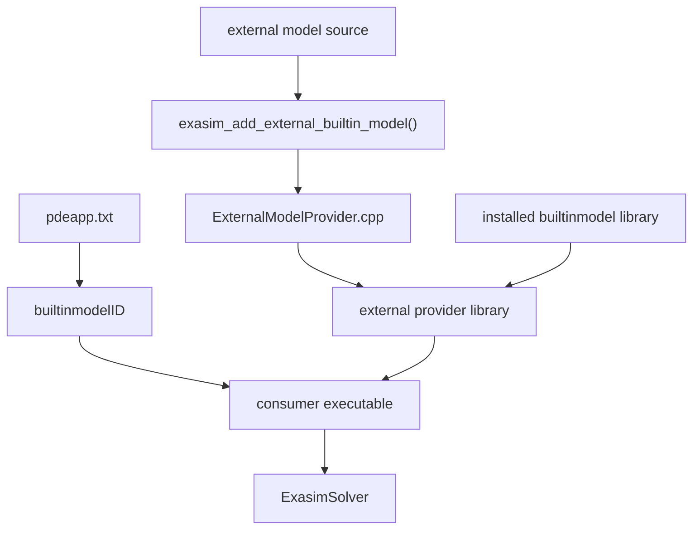

# External Built-in Library Applications

External built-in models let an out-of-tree CMake project register **new
`builtinmodelID` values** without modifying or reinstalling Exasim's built-in
model library. The registered model behaves like a normal built-in model at
runtime: `pdeapp.txt` selects it with `builtinmodelID`, the solver receives an
`ExasimDriverABI` provider, and all Exasim preprocessing, solve, postprocess,
MPI, CPU, CUDA, and HIP infrastructure remains unchanged.

Use this workflow when you want the runtime behavior of the
[Built-in Library](builtin.md), but the model should live outside the installed
Exasim source tree.

## Motivation

The installed Builtin Library is efficient and convenient, but extending it
directly requires editing Exasim source files and rebuilding the installed
package. External built-in models solve that problem by generating a small
provider library in the consumer project.

The provider library:

- intercepts one or more user-selected model IDs;
- dispatches those IDs to external model kernels;
- falls through to the installed Exasim built-in dispatchers for all other IDs;
- exposes the same `getBuiltInLibraryExasimDriverABI()` symbol that built-in
  applications already use.

This gives users a low-friction path for new model development while preserving
the stable built-in model interface.

## Relationship To Other Text2Code Modes



| Mode | Where model kernels live | How model is selected | Typical use |
| --- | --- | --- | --- |
| Builtin Library | Installed Exasim package | `builtinmodelID = 1..15` or other installed IDs | Reuse registered Exasim models. |
| External Builtin Library | Out-of-tree consumer build | New `builtinmodelID`, for example `100` | Add a new built-in-style model without changing Exasim. |
| Shared Library | Generated `libt2cmodel*` dynamic library | Text2Code shared model provider | Runtime-loaded custom model library. |
| Frontend app | Exported/generated app directory | Generated frontend provider | MATLAB/Python/Julia-driven apps. |

Use external built-in mode when:

- you want `builtinmodelID` dispatch semantics;
- you need fallthrough to the installed built-ins;
- the model should be built by a downstream CMake project;
- you want to register one or more new model IDs in one executable.

Use shared-library mode instead when the model should be a separately generated
`libt2cmodel*` library selected by the shared Text2Code provider.

## Core CMake Helper

The installed Exasim package exports:

```cmake
exasim_add_external_builtin_model(...)
```

through `ExasimExternalModel.cmake`. It is available after:

```cmake
find_package(Exasim REQUIRED COMPONENTS cpumpi)
```

The helper creates a provider target whose generated translation unit is:

```text
<build>/exasim_external_models/<target>/ExternalModelProvider.cpp
```

That provider includes the selected external model sources, builds a complete
`ExasimDriverABI` table, and links the installed `Exasim::builtinmodel*` target
for fallthrough dispatch.

## Supported Model Sources

Exactly one source form is required.

| Form | CMake argument | What it means | Best for |
| --- | --- | --- | --- |
| Text2Code input | `PDEMODEL <pdeapp.txt>` | Runs installed `text2code` at build time and generates kernels from a `pdeapp`/`pdemodel` pair. | Out-of-tree model development from text files. |
| Hand-written model | `SOURCES model.hpp model.cpp` | Uses a hand-written model implementation in namespace `exasim_model_<ID>`. | Expert users maintaining custom C++ kernels. |
| Pre-generated kernels | `KERNELS <dir>` or `KERNELS_DIRS <dirs...>` | Uses an existing directory of generated kernel `.cpp` files. | Frontend-generated or cached kernels. |

The singular `ID` and `KERNELS` arguments are convenience forms for one model.
The plural `IDS`, `PDEMODEL`, and `KERNELS_DIRS` list forms support multiple
external models in one provider.

## Model ID Selection

External built-ins use the same integer ID mechanism as installed built-ins.
Choose IDs that do not collide with installed IDs. In the current Exasim tree,
the default installed Builtin Library registers IDs 1 through 15, so examples
usually use IDs such as 100 and 101:

```text
builtinmodelID = 100;
```

At runtime:

- if `builtinmodelID` matches an external ID, the external provider dispatches
  to `exasim_model_<ID>`;
- otherwise, it calls the installed built-in dispatcher for that kernel.

This fallthrough behavior lets one executable run both external and installed
built-in models, as long as the selected IDs are registered by the linked
provider or installed package.

## Minimal Consumer Project

The tested consumer example is:

```text
tests/consumers/external-model/
  CMakeLists.txt
  main.cpp
  pdeapp.txt
  pdeapp100.txt
  pdeapp101.txt
  pdemodel100.txt
  pdemodel101.txt
  grid.bin
  xdg.bin
  partition.bin
```

The important CMake structure is:

```cmake
cmake_minimum_required(VERSION 3.16)
project(exasim_consumer_external_model CXX)
set(CMAKE_CXX_STANDARD 20)

option(EXASIM_MPI "MPI variant" ON)
if(EXASIM_MPI)
  set(EXASIM_VARIANT cpumpi)
else()
  set(EXASIM_VARIANT cpu)
endif()

find_package(Exasim REQUIRED COMPONENTS ${EXASIM_VARIANT})
find_package(Kokkos REQUIRED)
find_package(MPI REQUIRED)

exasim_add_external_builtin_model(TARGET ext_model_100
  IDS 100 101
  PDEMODEL ${CMAKE_CURRENT_SOURCE_DIR}/pdeapp100.txt
           ${CMAKE_CURRENT_SOURCE_DIR}/pdeapp101.txt)

add_executable(consumer_external_model main.cpp)
target_compile_definitions(consumer_external_model PRIVATE _BUILTINLIBRARY)
if(EXASIM_MPI)
  target_compile_definitions(consumer_external_model PRIVATE _MPI)
endif()

target_link_libraries(consumer_external_model PRIVATE
  Exasim::headers Exasim::pre ext_model_100 Kokkos::kokkos MPI::MPI_CXX)
```

The consumer links `ext_model_100`, not `Exasim::builtinmodel` directly. The
external target provides `getBuiltInLibraryExasimDriverABI()` and links the
installed built-in library transitively.

!!! warning "Do not also link `Exasim::builtinmodel`"
    The external provider defines the same provider symbol used by the built-in
    provider. Linking both directly can create duplicate symbol or wrong-provider
    link-order behavior. Link only the external provider target.

## Minimal `main.cpp`

The executable is intentionally the same shape as a built-in app, except it does
not include `builtinlibprovider.hpp`. The external provider target supplies the
provider symbol.

```cpp
#include <exasim/ExasimSolverSetup.hpp>

int main(int argc, char** argv)
{
#ifdef HAVE_MPI
    MPI_Comm comm = MPI_COMM_WORLD;
#else
    MPI_Comm comm = MPI_COMM_NULL;
#endif
    ExasimSolver solver;
    return RunExasimSolver(solver, argc, argv, comm);
}
```

## Minimal Runtime `pdeapp.txt`

The runtime app file selects the external model ID:

```text
model = "ModelD";
modelfile = "pdemodel100.txt";
meshfile = "grid.bin";
discretization = "hdg";
platform = "cpu";

builtinmodelID = 100;
gendatain = 0;
mpiprocs = 2;

ncu = 1;
ncv = 0;
ncw = 0;
nsca = 2;
nvec = 1;
nten = 0;
nsurf = 1;
nvqoi = 2;

physicsparam = [1];
boundaryconditions = [1, 1, 1, 1];
boundaryexpressions = ["abs(y)<1e-8", "abs(x-1)<1e-8",
                       "abs(y-1)<1e-8", "abs(x)<1e-8"];
```

The `pdeapp100.txt` and `pdeapp101.txt` files passed to
`exasim_add_external_builtin_model(... PDEMODEL ...)` are build-time model
generation inputs. The runtime `pdeapp.txt` is the solve input. They can be the
same file in simple projects, but the test keeps them separate so the provider
can register multiple IDs while the run selects one ID.

## Build And Run

```bash
export EXASIM_PREFIX=/path/to/exasim-prefix
cd /path/to/Exasim/tests/consumers/external-model

cmake -S . -B build -DExasim_DIR=$EXASIM_PREFIX
cmake --build build -j
mpirun -np 2 build/consumer_external_model pdeapp.txt
```

For non-MPI:

```bash
cmake -S . -B build-nompi -DExasim_DIR=$EXASIM_PREFIX -DEXASIM_MPI=OFF
cmake --build build-nompi -j
build-nompi/consumer_external_model pdeapp.txt
```

The `PDEMODEL` path runs Text2Code during the CMake build. The generated files
are placed under:

```text
build/exasim_external_models/ext_model_100/
  ExternalModelProvider.cpp
  model100/
    model.hpp
    model.cpp
    generated kernel .cpp files
  model101/
    model.hpp
    model.cpp
    generated kernel .cpp files
```

## Text2Code Variant

Use the `PDEMODEL` form when your external model is described by text files:

```cmake
exasim_add_external_builtin_model(TARGET ext_model_100
  ID 100
  PDEMODEL ${CMAKE_CURRENT_SOURCE_DIR}/pdeapp100.txt)
```

The helper:

1. copies the `pdeapp` content into the generated model directory;
2. rewrites `exasimpath` so Text2Code uses the current Exasim install;
3. copies the matching `pdemodel*.txt` file if present beside the `pdeapp`;
4. runs `${Exasim_TEXT2CODE} <generated-pdeapp> --out-dir <modeldir> --gen-only`;
5. compiles the generated model through `ExternalModelProvider.cpp`.

For multiple Text2Code models:

```cmake
exasim_add_external_builtin_model(TARGET ext_models
  IDS 100 101 102
  PDEMODEL ${CMAKE_CURRENT_SOURCE_DIR}/pdeapp100.txt
           ${CMAKE_CURRENT_SOURCE_DIR}/pdeapp101.txt
           ${CMAKE_CURRENT_SOURCE_DIR}/pdeapp102.txt)
```

The `IDS` and `PDEMODEL` lists must have the same length.

## Hand-Written Source Variant

Use `SOURCES` when you already maintain C++ model sources:

```cmake
exasim_add_external_builtin_model(TARGET ext_model_100
  ID 100
  SOURCES ${CMAKE_CURRENT_SOURCE_DIR}/model100.hpp
          ${CMAKE_CURRENT_SOURCE_DIR}/model100.cpp)
```

Requirements:

- `SOURCES` supports a single ID;
- the code must define functions in namespace `exasim_model_100`;
- the function signatures must match the Exasim model contract;
- all required Kokkos, CPU initialization, HDG, output, QoI, and visualization
  entry points must be available.

This form is more brittle than `PDEMODEL` because the user is responsible for
maintaining ABI-compatible function signatures.

## Pre-Generated Kernel Variant

Use `KERNELS` when another tool has already generated the full kernel `.cpp`
set:

```cmake
exasim_add_external_builtin_model(TARGET ext_model_100
  ID 100
  KERNELS ${CMAKE_CURRENT_SOURCE_DIR}/kernels)
```

For multiple models:

```cmake
exasim_add_external_builtin_model(TARGET frontend_models
  IDS 100 101
  KERNELS_DIRS "${kernels100}" "${kernels101}")
```

The directory must contain the generated files expected by the model template,
such as:

```text
KokkosFlux.cpp
KokkosFhat.cpp
KokkosFbou.cpp
KokkosSource.cpp
KokkosInitu.cpp
HdgFlux.cpp
HdgFbou.cpp
HdgSource.cpp
KokkosVisScalars.cpp
KokkosQoIvolume.cpp
```

For several models, the helper copies each kernel directory into its own
`model<ID>/` directory to avoid include-name collisions.

## Static Versus Shared Provider Targets

By default, the helper builds a static provider target:

```cmake
exasim_add_external_builtin_model(TARGET ext_model_100
  ID 100
  PDEMODEL pdeapp100.txt)
```

Use `SHARED` to build a shared provider library:

```cmake
exasim_add_external_builtin_model(TARGET ext_model_100
  ID 100
  PDEMODEL pdeapp100.txt
  SHARED)
```

| Provider type | Behavior |
| --- | --- |
| Static default | Links `Exasim::builtinmodel*` and `Kokkos::kokkos`; simplest for normal C++ consumers. |
| `SHARED` | Builds a dynamic provider and applies Kokkos include/compile flags; useful for frontend dynamic-model paths. |

On Apple platforms, the shared provider uses dynamic lookup for unresolved
symbols so it can resolve through the final executable and linked Exasim
libraries.

## CPU, CUDA, HIP, And MPI

The external provider target links whichever installed built-in model target is
available from `find_package(Exasim)`. The consumer still chooses the Exasim
solver variant through `find_package(Exasim REQUIRED COMPONENTS <variant>)`.

| Variant | Typical CMake choice |
| --- | --- |
| CPU, no MPI | `find_package(Exasim REQUIRED COMPONENTS cpu)` |
| CPU + MPI | `find_package(Exasim REQUIRED COMPONENTS cpumpi)` |
| CUDA/HIP, no MPI | `find_package(Exasim REQUIRED COMPONENTS gpu)` |
| CUDA/HIP + MPI | `find_package(Exasim REQUIRED COMPONENTS gpumpi)` |

The model kernels must be compatible with the selected backend. For Text2Code
and generated-kernel paths, this normally follows the same generated model
contract used by Exasim's built-in and shared-library workflows.

MPI is controlled by the consumer executable. If the executable is built with
`_MPI` and linked against MPI, run it with the expected launcher:

```bash
mpirun -np 4 build/consumer_external_model pdeapp.txt
```

All ranks must see the same generated provider, `datain/`, mesh files, and
output directory.

## Runtime Parameter Sweeps

External built-in apps use the same `ExasimSolver` path as built-in apps, so
runtime `physicsparamcases` sweeps are supported under the same restrictions:

- the run must be solve mode;
- the standalone sweep is for single-model runs;
- every case must have the same `physicsparam` length;
- mesh and model dimensions must remain fixed;
- GPU runs refresh backend `app.physicsparam` storage for each case.

Example:

```text
builtinmodelID = 100;
physicsparam = [1.0];
physicsparamcases = [0.5; 1.0; 2.0];
physicsparamwarmstart = 1;
```

The executable writes per-case outputs under:

```text
dataout/
  physicsparam_sweep_manifest.txt
  paramcase_0001/
    physicsparam.txt
    physicsparam_metadata.txt
    out*.bin
  paramcase_0002/
  paramcase_0003/
```

See [Parameter Sweeps](parameter-sweeps.md).

## Postprocessing

External built-in apps can use the same solve/postprocess split as other
`ExasimSolver` consumers if the app wrapper supports it. A minimal wrapper that
only calls `RunExasimSolver` runs solve mode. To support explicit postprocess
mode, follow the pattern used by `apps/builtinlibrary/exasimapp.cpp` or
`apps/sharedlibrary/exasimsharedapp.cpp`, which dispatches:

```text
exasimapp solve pdeapp.txt
exasimapp postprocess pdeapp.txt
```

Postprocessing must use input/output data compatible with the original solve:
same model dimensions, mesh, rank layout, and backend assumptions.

## How Fallthrough Dispatch Works

The generated `ExternalModelProvider.cpp` defines wrapper functions such as
`extKokkosFlux`, `extKokkosSource`, `extHdgFlux`, and `extcpuInitu`.

Each wrapper follows this pattern:

```cpp
if (modelnumber == 100)
    return exasim_model_100::KokkosFlux(...);
if (modelnumber == 101)
    return exasim_model_101::KokkosFlux(...);
return ::builtinKokkosFlux(...);
```

The exact wrappers are generated for the full ABI table. This is why one
provider can support external IDs and still run installed built-in IDs.

## Generated Files To Inspect

When debugging, inspect:

| Path | What to check |
| --- | --- |
| `build/exasim_external_models/<target>/ExternalModelProvider.cpp` | Generated ABI provider and dispatch ID list. |
| `build/exasim_external_models/<target>/model<ID>/model.hpp` | Namespace and model declarations for that ID. |
| `build/exasim_external_models/<target>/model<ID>/model.cpp` | Includes generated or supplied kernels. |
| `build/exasim_external_models/<target>/model<ID>/.text2code.stamp` | Text2Code generation dependency stamp. |
| `build/CMakeCache.txt` | Resolved `Exasim_DIR`, `Exasim_TEXT2CODE`, backend variant. |
| `build/CMakeFiles/<target>.dir/link.txt` | Link order and selected provider/builtin libraries. |

## Configuration Reference

| Argument | Required? | Description |
| --- | --- | --- |
| `TARGET` | yes | Name of the generated provider library target. |
| `ID` | one of `ID`/`IDS` | Single external model ID. |
| `IDS` | one of `ID`/`IDS` | List of external model IDs. |
| `PDEMODEL` | one source form | One or more `pdeapp*.txt` files used for Text2Code generation. |
| `SOURCES` | one source form | Hand-written source files for one model namespace. |
| `KERNELS` | one source form | Single directory of pre-generated kernels. |
| `KERNELS_DIRS` | one source form | List of kernel directories parallel to `IDS`. |
| `SHARED` | optional | Build a shared provider library instead of the default static provider. |

| Exported package variable | Purpose |
| --- | --- |
| `Exasim_TEXT2CODE` | Installed `text2code` executable used by the `PDEMODEL` path. |
| `Exasim_TEXT2CODE_ROOT` | Exasim root/prefix written into generated `pdeapp.txt` for Text2Code. |
| `Exasim_BUILTIN_DIR` | Installed model template directory used to instantiate `model.hpp` and `model.cpp`. |
| `Exasim_CMAKE_DIR` | Directory containing `ExternalModelProvider.cpp.in`. |

## Common Errors And Fixes

| Symptom | Likely cause | Fix |
| --- | --- | --- |
| `TARGET is required` | Missing `TARGET` argument. | Add `TARGET <provider-name>`. |
| `ID (or IDS) is required` | No external model ID was provided. | Add `ID 100` or `IDS 100 101`. |
| `one of PDEMODEL, SOURCES, or KERNELS/KERNELS_DIRS is required` | No model source form was selected. | Choose exactly one source form. |
| `IDS and PDEMODEL must have the same length` | Multi-model lists are not parallel. | Provide one `pdeapp*.txt` per ID. |
| `text2code not found` | Exasim package was installed without Text2Code or path is wrong. | Reinstall with Text2Code support or set `Exasim_TEXT2CODE`. |
| `KERNELS directory not found` | Path to generated kernels is wrong. | Pass an existing directory containing generated kernel `.cpp` files. |
| Duplicate `getBuiltInLibraryExasimDriverABI` symbol | Consumer links both external provider and `Exasim::builtinmodel`. | Remove direct `Exasim::builtinmodel` link. |
| `Unknown builtinmodelID` at runtime | Selected ID is neither external nor installed. | Set `builtinmodelID` to an ID registered by the provider or installed library. |
| Wrong kernels run | ID collision with an installed or another external model. | Use a unique external ID and verify generated `EXASIM_EXT_MODEL_IDS`. |
| GPU build fails in generated kernels | Backend/compiler/Kokkos mismatch. | Use a matching Exasim package variant and regenerate kernels for that backend. |

## Best Practices

- Use high external IDs, such as 100 and above, to avoid collisions with
  installed built-in IDs.
- Prefer the `PDEMODEL` form during development because Text2Code maintains the
  kernel signatures.
- Use `KERNELS_DIRS` for frontend-generated multi-model applications.
- Keep the runtime `pdeapp.txt` and build-time `pdeapp<ID>.txt` consistent in
  dimensions: `ncu`, `ncw`, discretization, model type, and physics parameters
  must match the generated model.
- Rebuild the consumer project after changing `pdemodel.txt`, generated kernels,
  or hand-written sources.
- Inspect `ExternalModelProvider.cpp` when debugging dispatch or ID selection.

## See Also

- [Built-in library applications](builtin.md)
- [Shared library applications](shared-library.md)
- [Text2Code workflow](../text2code-applications/workflow.md)
- [pdeapp.txt reference](../text2code-applications/pdeapp.md)
- [pdemodel.txt reference](../text2code-applications/pdemodel.md)
- [CMake reference](../reference/cmake.md)
- [Model Contract](../reference/model-contract.md)
- [Parameter Sweeps](parameter-sweeps.md)
- [Postprocessing](postprocessing.md)
