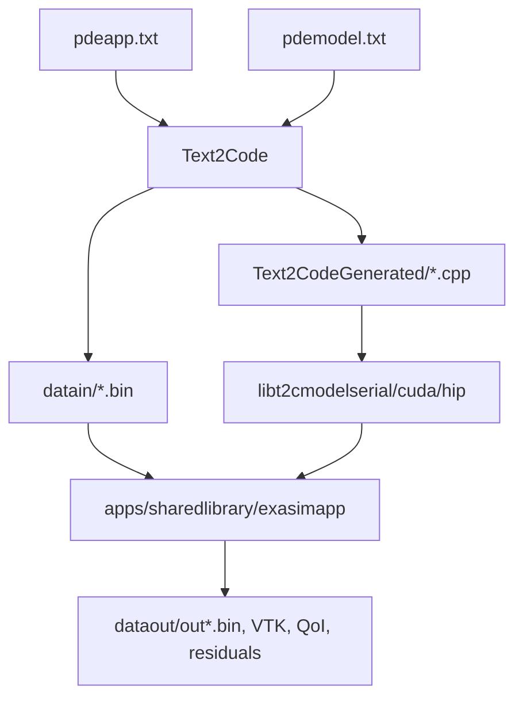

# Shared Library Applications

The shared-library workflow separates the **PDE model kernels** from the
**Exasim solver executable**. Text2Code generates the model kernels from
`pdemodel.txt`, compiles them into a dynamic library, and the
`apps/sharedlibrary` executable links that library through Exasim's driver ABI.

Use this mode when the numerical solver, mesh preprocessing, MPI layout, and
runtime configuration stay fixed enough to reuse one executable, but the model
implementation should remain replaceable at runtime.

## Why This Mode Exists

Most Exasim application workflows combine several concerns:

- preprocessing reads `pdeapp.txt` and writes `datain/*.bin`;
- Text2Code converts `pdemodel.txt` into C++ kernel files;
- CMake builds an executable that links the solver and model;
- the executable runs solve or postprocess mode.

The shared-library workflow keeps those pieces modular. The heavy Exasim
libraries are installed once. The generated model is compiled into one of:

| Backend | Generated model library |
| --- | --- |
| CPU / serial Kokkos | `libt2cmodelserial.{so,dylib}` |
| CUDA Kokkos | `libt2cmodelcuda.{so,dylib}` |
| HIP Kokkos | `libt2cmodelhip.{so,dylib}` |

The shared app then links the matching model library and calls the same
`ExasimSolver` facade used by other standalone applications.

!!! note "Relationship to the Builtin Library"
    The Builtin Library and shared-library mode both provide an
    `ExasimDriverABI` table to the solver. The Builtin Library dispatches to
    registered built-in model IDs. The shared-library workflow dispatches to the
    Text2Code-generated functions in `libt2cmodel*`. Use builtins when an
    existing built-in model is sufficient. Use shared-library mode when the
    model comes from a custom `pdemodel.txt`.

## Architecture



The important source files are:

| File | Role |
| --- | --- |
| `apps/sharedlibrary/exasimsharedapp.cpp` | Small app wrapper. Selects solve or postprocess mode and calls `ExasimSolver`. |
| `apps/sharedlibrary/CMakeLists.txt` | Selects CPU/CUDA/HIP variant and links the matching `libt2cmodel*` library. |
| `include/sharedlibprovider.hpp` | Validates the model ABI table and exposes it to the solver. |
| `backend/Model/Text2codeGenerated/libt2cmodel.cpp` | Includes generated kernels and exports `GetText2CodeExasimDriverABI()`. |
| `text2code/text2code/CodeCompiler.cpp` | Builds `libt2cmodelserial`, `libt2cmodelcuda`, and/or `libt2cmodelhip`. |

## When To Use Shared-Library Mode

Use shared-library mode when:

- you have a custom `pdemodel.txt`;
- you want a standalone C++ executable without MATLAB, Python, or Julia at
  runtime;
- the model may be regenerated independently from the solver app;
- you want the same executable interface for CPU, CUDA, HIP, MPI, solve mode,
  postprocess mode, and physics-parameter sweeps.

Use a different mode when:

- a registered built-in model already covers the physics; use
  [Built-in library applications](builtin.md);
- you want the model compiled directly into a self-contained frontend app; use
  the frontend `exportapp` workflow;
- you need to modify Exasim solver internals rather than only model kernels.

## End-To-End Workflow

From an installed Exasim tree:

```bash
export EXASIM_PREFIX=/path/to/exasim-prefix
cd /path/to/Exasim/apps/navierstokes/reactingsharpb2
$EXASIM_PREFIX/bin/text2code pdeapp.txt

cd /path/to/Exasim/apps/sharedlibrary
cmake -S . -B build -DExasim_DIR=$EXASIM_PREFIX
cmake --build build -j

mpirun -np 4 build/exasimapp ../navierstokes/reactingsharpb2/pdeapp.txt
```

This workflow does three distinct things:

1. `text2code` reads the application input, generates model kernels, writes
   `datain/`, and builds the Text2Code model library into the Exasim library
   directory.
2. CMake configures `apps/sharedlibrary` against the installed Exasim package.
3. `build/exasimapp` reads the app input, initializes `ExasimSolver`, loads the
   linked model ABI, and runs the simulation.

The model library is generated into the library directory selected by
Text2Code. The lookup order in the current implementation is:

| Source | Meaning |
| --- | --- |
| `EXASIMLIB_DIR` | Explicit directory for `libt2cmodel*`. |
| `$EXASIM_PREFIX/lib` | Default when `EXASIM_PREFIX` is set. |
| `<exasimpath>/lib` | Fallback based on the app's Exasim path. |

If your install uses `lib64`, configure the app with `-DExasim_DIR=$EXASIM_PREFIX`
or set `EXASIM_APP_PREFIX` explicitly so `apps/sharedlibrary/CMakeLists.txt`
can search both `lib` and `lib64`.

## Build Configuration

`apps/sharedlibrary/CMakeLists.txt` exposes the same backend selection options
as other standalone apps:

| Option | Default | Effect |
| --- | --- | --- |
| `EXASIM_MPI` | `ON` | Links the MPI-enabled Exasim preprocessing/solver variant. |
| `EXASIM_CUDA` | `OFF` | Links the CUDA Exasim variant and searches for `libt2cmodelcuda`. |
| `EXASIM_HIP` | `OFF` | Links the HIP Exasim variant and searches for `libt2cmodelhip`. |

CUDA and HIP are mutually exclusive:

```bash
cmake -S . -B build-cpu -DExasim_DIR=$EXASIM_PREFIX
cmake --build build-cpu -j

cmake -S . -B build-cuda -DExasim_DIR=$EXASIM_PREFIX -DEXASIM_CUDA=ON
cmake --build build-cuda -j

cmake -S . -B build-hip -DExasim_DIR=$EXASIM_PREFIX -DEXASIM_HIP=ON
cmake --build build-hip -j
```

The selected CMake variant determines which generated model library must exist:

| CMake settings | Exasim variant | Required model library |
| --- | --- | --- |
| `EXASIM_MPI=OFF`, no GPU | `cpu` | `libt2cmodelserial` |
| `EXASIM_MPI=ON`, no GPU | `cpumpi` | `libt2cmodelserial` |
| `EXASIM_CUDA=ON`, `EXASIM_MPI=OFF` | `gpu` | `libt2cmodelcuda` |
| `EXASIM_CUDA=ON`, `EXASIM_MPI=ON` | `gpumpi` | `libt2cmodelcuda` |
| `EXASIM_HIP=ON`, `EXASIM_MPI=OFF` | `gpu` | `libt2cmodelhip` |
| `EXASIM_HIP=ON`, `EXASIM_MPI=ON` | `gpumpi` | `libt2cmodelhip` |

## How Text2Code Builds The Model Library

Text2Code compiles `backend/Model/Text2codeGenerated/libt2cmodel.cpp`. That
translation unit includes the generated kernels, wraps them in the
`text2code_shared_lib` namespace, and exports:

```cpp
extern "C" const ExasimDriverABI* GetText2CodeExasimDriverABI();
```

The ABI table contains function pointers for:

- Kokkos volume, boundary, source, stabilization, output, monitor, QoI, and
  visualization kernels;
- CPU initialization kernels;
- HDG kernels for fluxes, sources, boundary terms, and interface terms.

`include/sharedlibprovider.hpp` checks the ABI version, struct size, and
required function pointers before the solver uses the model. If the model
library was built against an incompatible Exasim header, the app stops with a
clear ABI error instead of running with mismatched function pointers.

## Runtime Commands

The app supports explicit mode selection:

```bash
build/exasimapp solve /path/to/pdeapp.txt
build/exasimapp postprocess /path/to/pdeapp.txt
```

For backward compatibility, omitting the mode is the same as `solve`:

```bash
build/exasimapp /path/to/pdeapp.txt
```

With MPI:

```bash
mpirun -np 4 build/exasimapp solve ../navierstokes/reactingsharpb2/pdeapp.txt
mpirun -np 4 build/exasimapp postprocess ../navierstokes/reactingsharpb2/pdeapp.txt
```

Solve mode writes the normal binary solution, residual, and optional
postprocessing outputs configured by `pdeapp.txt`. Postprocess mode reuses the
saved data and writes visualization/QoI/output-CG products according to the
postprocessing options.

See [Postprocessing](postprocessing.md) for the meaning of
`executionmode`, `postmode`, `saveParaview`, and visualization settings.

## Input Files And Output Locations

The shared app uses the same input contract as other Text2Code standalone apps.
The `pdeapp.txt` path is passed on the command line. Preprocessing derives:

| Path | Purpose |
| --- | --- |
| `datain/` | Binary app, mesh, master, solution, and decomposition data. |
| `dataout/out` | Default output prefix used by solver output files. |
| `dataout/paramcase_0001/out` | Output prefix for parameter-sweep case 1. |
| `dataout/physicsparam_sweep_manifest.txt` | Sweep manifest when `physicsparamcases` is present. |

For single-case runs, no special output restructuring happens. For
`physicsparamcases`, the standalone executable detects
`datain/physicsparamcases.bin` and runs each case sequentially under
`dataout/paramcase_####/`.

## Parameter Sweeps

Shared-library mode supports the runtime physics-parameter sweep implemented in
`ExasimSolver`. Add `physicsparamcases` to `pdeapp.txt`:

```text
physicsparam = [1000.0, 0.0];
physicsparamcases = [
  500.0,  0.0;
  1000.0, 0.0;
  1500.0, 0.0;
  2000.0, 0.0
];
physicsparamwarmstart = 1;
```

Then regenerate input data and the model library:

```bash
$EXASIM_PREFIX/bin/text2code pdeapp.txt
```

At runtime, `build/exasimapp` detects `datain/physicsparamcases.bin` and runs
the cases internally. The file format is shared with frontend export workflows:

| Entry | Type | Meaning |
| --- | --- | --- |
| header value 1 | `Float64` | number of cases |
| header value 2 | `Float64` | number of parameters per case |
| payload | `Float64` | case-major parameter values |

Restrictions in the current solver implementation:

- standalone sweep is supported for solve mode only;
- standalone sweep is supported for single-model runs;
- every row must have the same number of parameters as `physicsparam`;
- mesh, discretization sizes, and model dimensions must stay fixed across cases.

See [Parameter Sweeps](parameter-sweeps.md) for frontend and
standalone sweep details.

## CPU And GPU Notes

The generated shared model library must match the backend used by the executable.
Do not build a HIP app and link `libt2cmodelserial`, or build a CPU app and link
`libt2cmodelcuda`.

For CUDA and HIP, Text2Code uses the matching Kokkos build directory and emits a
backend-specific dynamic library. GPU architecture can be controlled with:

| Backend | Environment variables |
| --- | --- |
| CUDA | `EXASIM_CUDA_ARCH`, `CUDAARCH`, `EXASIM_GPU_ARCH` |
| HIP | `EXASIM_HIP_ARCH`, `HIPARCH`, `EXASIM_GPU_ARCH` |

During parameter sweeps, the solver updates the host-side active
`physicsparam` values and copies them into the backend `app.physicsparam`
storage before each case. This avoids stale CPU/GPU parameter data between
cases.

## MPI Notes

MPI behavior is controlled by the Exasim package variant and `EXASIM_MPI`.
Use `mpirun` or the system scheduler to launch the built executable:

```bash
mpirun -np 8 build/exasimapp solve /path/to/pdeapp.txt
```

The model library is shared by all ranks. Every rank must be able to access the
same Exasim install prefix, generated model library, `datain/`, and output
directory. On clusters, keep the install prefix on a shared filesystem or stage
the same files onto each node.

## Relationship To Frontend Workflows

MATLAB, Python, and Julia frontends commonly generate model kernels and use a
shared-library style app internally. In that workflow users usually do not call
`apps/sharedlibrary` directly. The frontend:

- writes or updates model kernel sources;
- writes `datain/*.bin`;
- builds the model provider;
- runs the executable;
- reads `dataout/` back into frontend structures.

The manual `apps/sharedlibrary` workflow is useful when you want the same
runtime behavior without requiring a frontend language at execution time.

## Complete Example: Reacting Navier-Stokes App

This example builds and runs a Text2Code-generated shared model for an existing
application:

```bash
export EXASIM_PREFIX=/path/to/exasim-prefix
export EXASIM_ROOT=/path/to/Exasim

cd $EXASIM_ROOT/apps/navierstokes/reactingsharpb2
$EXASIM_PREFIX/bin/text2code pdeapp.txt

cd $EXASIM_ROOT/apps/sharedlibrary
cmake -S . -B build -DExasim_DIR=$EXASIM_PREFIX -DEXASIM_MPI=ON
cmake --build build -j

mpirun -np 4 build/exasimapp solve ../navierstokes/reactingsharpb2/pdeapp.txt
```

If `pdeapp.txt` enables ParaView output, inspect the generated `.vtu` or
`.pvtu` files in the app's `dataout/` directory.

## Complete Example: Postprocess Existing Results

After a solve has written binary solution data:

```bash
cd /path/to/Exasim/apps/sharedlibrary
mpirun -np 4 build/exasimapp postprocess ../navierstokes/reactingsharpb2/pdeapp.txt
```

Postprocess mode should be used with input data generated by the same app
configuration, mesh, model dimensions, MPI partitioning assumptions, and backend
variant. If the saved files were produced with different dimensions or rank
layout, postprocessing can fail or produce inconsistent output.

## Generated Files To Inspect

When debugging a shared-library app, inspect these files first:

| File or directory | What to check |
| --- | --- |
| `backend/Model/Text2codeGenerated/*.cpp` | Generated model kernels. |
| `backend/Model/Text2codeGenerated/libt2cmodel.cpp` | ABI provider translation unit. |
| `$EXASIM_PREFIX/lib/libt2cmodelserial.*` | CPU model library built by Text2Code. |
| `$EXASIM_PREFIX/lib/libt2cmodelcuda.*` | CUDA model library, if CUDA Kokkos is available. |
| `$EXASIM_PREFIX/lib/libt2cmodelhip.*` | HIP model library, if HIP Kokkos is available. |
| `apps/sharedlibrary/build/CMakeCache.txt` | Resolved `Exasim_DIR`, `EXASIM_APP_PREFIX`, and backend options. |
| `apps/sharedlibrary/build/CMakeFiles/exasimapp.dir/link.txt` | Final link line and selected model library. |

On systems using `lib64`, substitute `$EXASIM_PREFIX/lib64`.

## Configuration Reference

| Setting | Location | Description |
| --- | --- | --- |
| `EXASIM_PREFIX` | environment | Install prefix used by Text2Code and frontend setup. |
| `EXASIMLIB_DIR` | environment | Overrides where Text2Code writes `libt2cmodel*`. |
| `EXASIM_CUDA_ARCH` | environment | CUDA architecture flag used while building `libt2cmodelcuda`. |
| `EXASIM_HIP_ARCH` | environment | HIP offload architecture used while building `libt2cmodelhip`. |
| `Exasim_DIR` | CMake | Exasim package prefix or `lib/cmake/Exasim` directory. |
| `EXASIM_APP_PREFIX` | CMake | Explicit prefix searched for `libt2cmodel*`. |
| `EXASIM_MPI` | CMake | Enables MPI app variant. |
| `EXASIM_CUDA` | CMake | Enables CUDA app variant. |
| `EXASIM_HIP` | CMake | Enables HIP app variant. |
| `_SHAREDLIBRARY` | compile definition | Selects the shared Text2Code model provider path. |

## Troubleshooting

| Symptom | Likely cause | Fix |
| --- | --- | --- |
| `Could not find shared model library t2cmodelserial` | `text2code` was not run, or wrote the library into a different directory. | Run `$EXASIM_PREFIX/bin/text2code pdeapp.txt`; check `EXASIMLIB_DIR`, `$EXASIM_PREFIX/lib`, and `$EXASIM_PREFIX/lib64`. |
| ABI table is incomplete or incompatible | Model library and Exasim headers/libraries come from different builds. | Rebuild and reinstall Exasim, rerun Text2Code, then rebuild `apps/sharedlibrary`. |
| Undefined symbols for `shared...` or kernel functions | The model provider library is missing required generated kernels or wrong provider path was used. | Regenerate the model with Text2Code and verify `libt2cmodel.cpp` includes the generated files. |
| CPU app links a GPU model library, or GPU app links serial model library | Backend mismatch between CMake options and generated library. | Reconfigure `apps/sharedlibrary` with the correct `EXASIM_CUDA` or `EXASIM_HIP` option and rerun Text2Code for that backend. |
| Runtime cannot locate `.so` or `.dylib` | RPATH or library path does not include the model library directory. | Rebuild the app so CMake records the correct RPATH, or set the platform library path on the compute nodes. |
| Parameter sweep is ignored | `datain/physicsparamcases.bin` was not generated. | Add `physicsparamcases` to `pdeapp.txt` and rerun Text2Code. |
| Parameter sweep fails in postprocess mode | Runtime sweeps are solve-mode only. | Run sweep in solve mode, then postprocess generated case directories separately. |
| MPI ranks disagree about input/output files | `datain/` or output paths are not visible consistently across ranks. | Use a shared filesystem or stage identical files to every node. |

## See Also

- [Text2Code overview](../text2code-applications/index.md)
- [Workflow and troubleshooting](../text2code-applications/workflow.md)
- [Built-in library applications](builtin.md)
- [External built-in applications](external-builtin.md)
- [Parameter Sweeps](parameter-sweeps.md)
- [Postprocessing](postprocessing.md)
- [Model Contract](../reference/model-contract.md)
